# Development Log

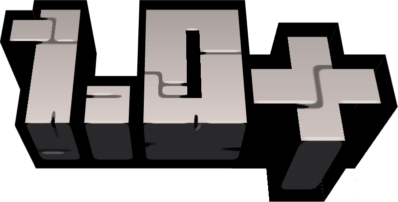

Minecraft 1.0+, continued through larger updates and smaller feature parts. This log follows the project by update, then by feature, rather than as a day-by-day diary.

## Update #1

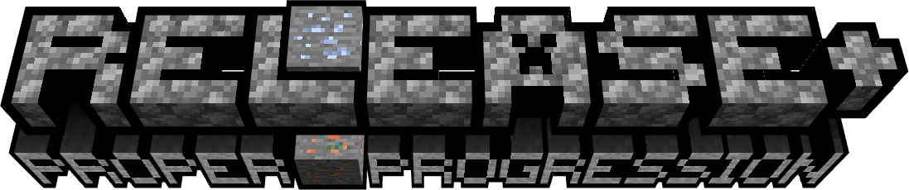

**Status:** In development. Parts 1 and 2 are feature-complete for now. Part 3 is in progress. Tested in singleplayer. Not tested in multiplayer.

Proper Progression rebuilds early-game progression and then expands it with utility equipment that still feels at home in Release 1.0.

---

### Part 1

A Minecraft 1.0 adaptation of [Beds, but Endgame](https://github.com/passziff/beds-but-endgame).

- A Bedside Table beside the head of the bed is required to sleep
- Beds still set the player's respawn point when sleep is denied
- A Glowstone Lamp on a Bedside Table prevents nightmares
- Nightmares wake the player and block sleeping again until daytime
- F6 cycles the time of day in singleplayer Creative
- F7 can temporarily switch a singleplayer Creative session to Survival for testing and back again

#### Bedside Table

The Bedside Table is the main requirement for sleeping and sits beside the head of the bed.

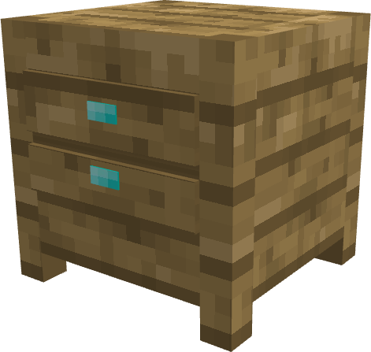

*Bedside Table placed beside a bed.*

Recipe

#### Glowstone Lamp

A Glowstone Lamp placed on the Bedside Table prevents nightmares.

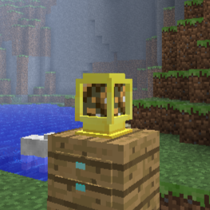

*Glowstone Lamp on a Bedside Table.*

Recipe

Current nightmare balance

| Setting | Current value |
| --- | ---: |
| Nightmare chance | 40% |
| No nightmare when dawn is within | 1200 ticks |
| Time advanced by a nightmare | 600 ticks |
| Full sleep before nightmare check | 100 ticks |

A nightmare locks sleeping again until daytime. A Glowstone Lamp on the Bedside Table prevents it.

---

### Part 2

This part rebuilds the early mining ladder around Flint, Stone and Copper, while tightening the progression into Iron, Gold and Diamond.

#### Flint progression

Flint forms the first tool tier before Stone. Only Flint Pickaxes and Axes replace their wooden equivalents.

*Flint Pebbles naturally placed across different surfaces.*

- Flint can be placed as small pebbles
- Flint Pebbles generate naturally on the surface and around exposed underground sediment
- Breaking a Flint Pebble returns one Flint
- All Stone tools require smelted Stone instead of Cobblestone

##### Flint Pebbles

There are three variants for visual diversity.

Current Flint Pebble generation

- Shoreline Flint is limited to 25% of eligible shoreline chunks
- Underground Flint is limited to at most 2 pebbles per chunk
- Underground generation favors gravel, then dirt/sand and sediment-adjacent stone
- Isolated ordinary cave stone does not generate Flint Pebbles

##### Flint tools

*Flint Pickaxe and Flint Axe.*

Tool views and recipes

Flint tool stats

Flint keeps the old Wood-tier statistics:

| Stat | Flint |
| --- | ---: |
| Harvest level | 0 |
| Durability | 59 |
| Mining speed | 2.0 |
| Material damage bonus | 0 |
| Enchantability | 15 |

#### Stone progression

Cobblestone must be smelted into Stone before Stone tools can be crafted.

Current pickaxe harvest progression

| Tier | Harvest level | Unlocks |
| --- | ---: | --- |
| Flint | 0 | Stone / basic mining |
| Stone | 1 | Copper |
| Copper | 2 | Iron |
| Iron | 3 | Gold |
| Gold | 4 | Diamond |
| Diamond | 5 | Obsidian |

#### Copper progression

Copper forms a complete tool and armor tier between Stone and Iron.

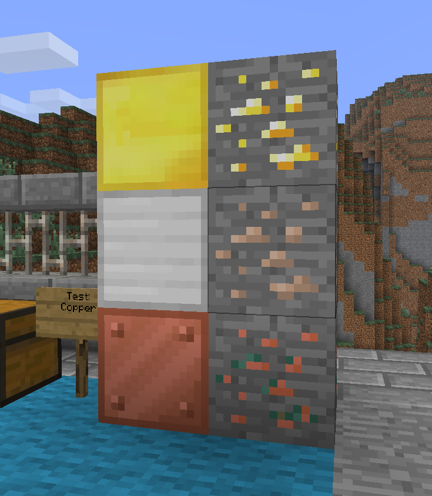

*Copper beside the existing Release 1.0 metal blocks and ores.*

- Copper Ore drops itself and smelts into one Copper Ingot
- Nine Copper Ingots craft into a Block of Copper and can be crafted back
- Copper Ore requires a Stone Pickaxe or better
- Copper tools are stronger than Stone and weaker than Iron
- Copper armor sits between Leather and Chainmail

More Copper visuals

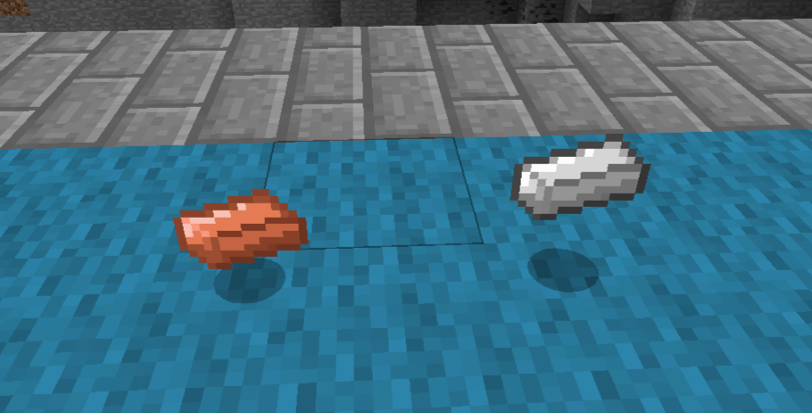

##### Copper tools

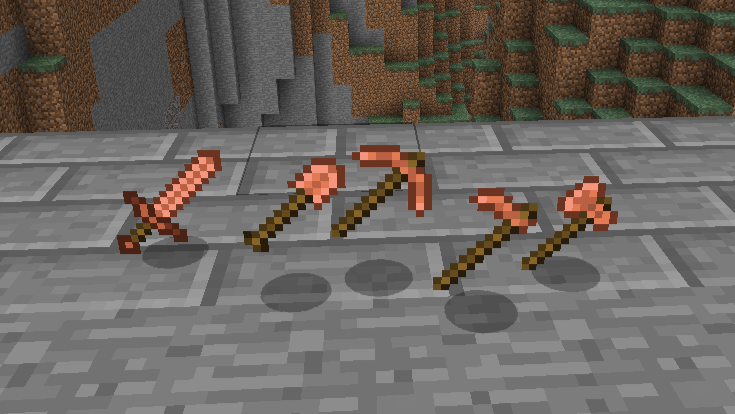

Example recipe

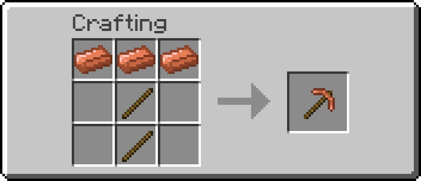

Copper tool stats

| Stat | Copper |
| --- | ---: |
| Harvest level | 2 |
| Durability | 190 |
| Mining speed | 5.0 |
| Material damage bonus | 1 |
| Enchantability | 10 |

##### Copper armor

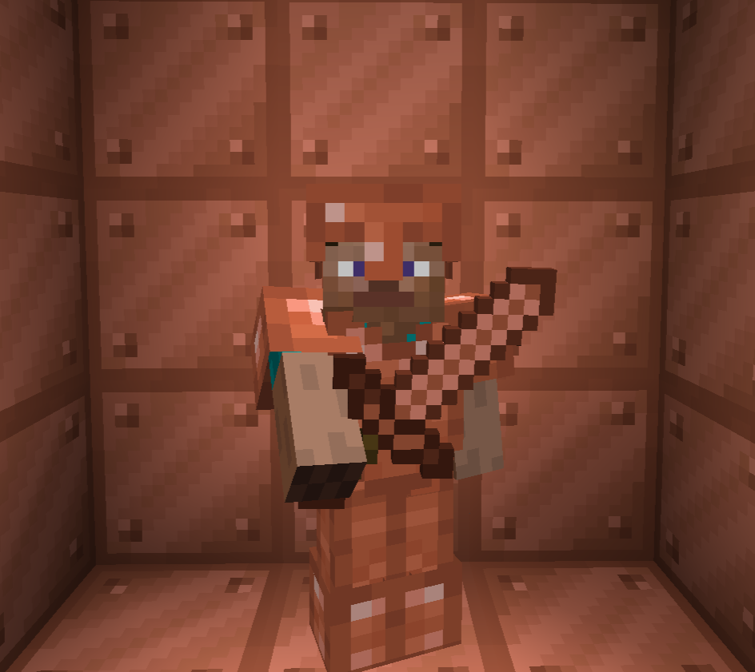

*Copper armor worn by the player.*

More Copper armor visuals

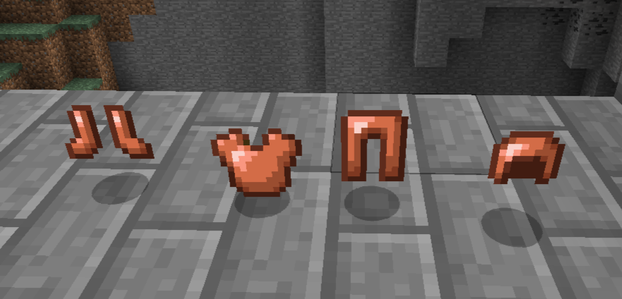

Copper armor stats

| Piece | Protection | Durability |
| --- | ---: | ---: |
| Helmet | 2 | 110 |
| Chestplate | 4 | 160 |
| Leggings | 2 | 150 |
| Boots | 1 | 130 |
| **Full set** | **9** | **550** |

Copper armor uses a durability multiplier of 10 and enchantability of 12.

Copper block hardness

| Block | Hardness |
| --- | ---: |
| Copper Ore | 2.5 |
| Iron Ore | 3.0 |
| Block of Copper | 4.0 |
| Block of Iron | 5.0 |

#### Ore generation

Copper and the existing ores were rebalanced around the new progression.

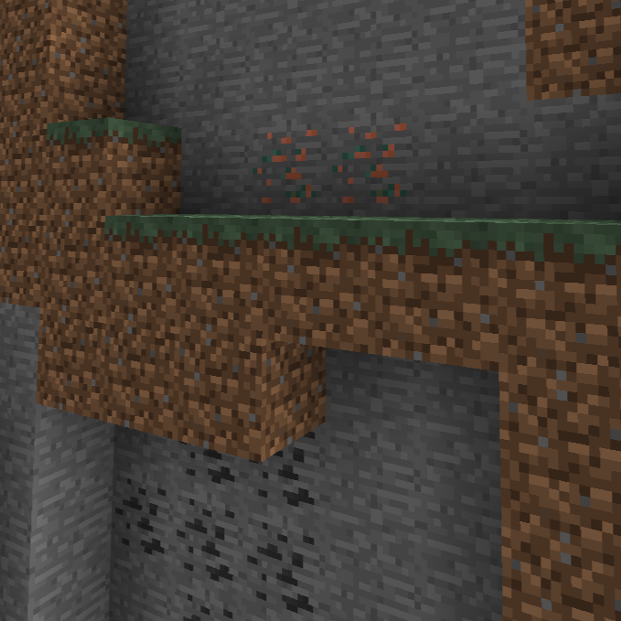
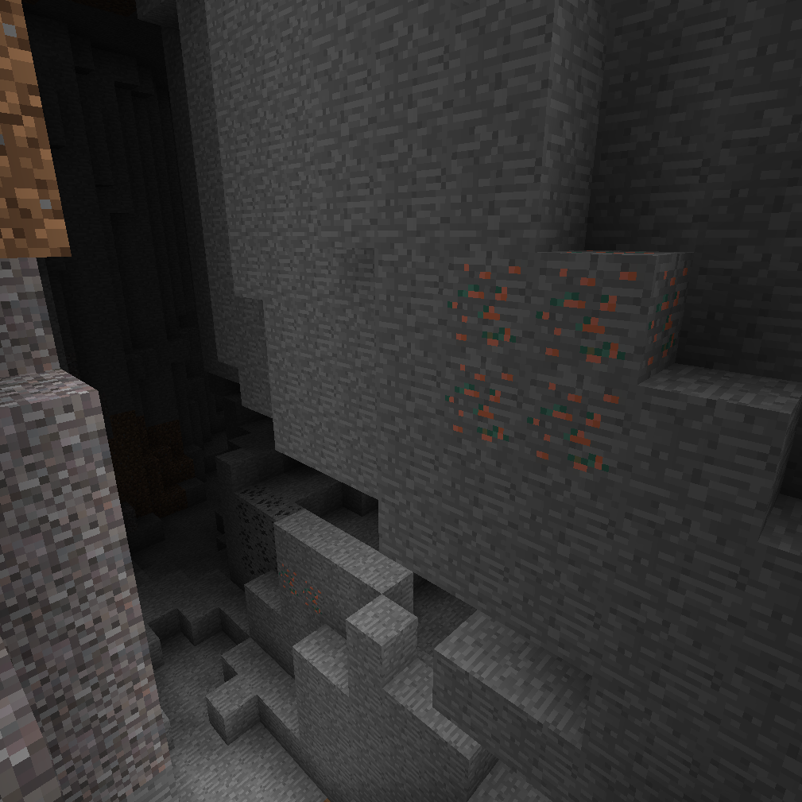

*Copper generation above and inside cave terrain.*

Current ore generation values

These are the current generation values after the first progression balance pass:

| Ore | Attempts / chance | Vein size | Height |
| --- | --- | ---: | --- |
| Coal | 20 attempts/chunk | 16 | Y 0-127 |
| Copper, main | 22 attempts/chunk | 7 | Y 0-55 |
| Copper, upper | 22 attempts/chunk | 6 | Y 56-127 |
| Iron, main | 9 attempts/chunk | 8 | Y 0-55 |
| Iron, rare upper | 25% chance/chunk, 1 attempt | 4 | Y 56-95 |
| Gold, main | 2 attempts/chunk | 8 | Y 0-31 |
| Gold, rare upper | 25% chance/chunk, 1 attempt | 3 | Y 32-47 |
| Redstone | 8 attempts/chunk | 7 | Y 0-15 |
| Diamond | 1 attempt/chunk | 7 | Y 0-15 |
| Lapis | Vanilla | Vanilla | Vanilla |

Rare upper Iron uses terrain-aware placement so its attempt is limited by the terrain height at the selected position.

#### Armor progression

Gold has been rebalanced into a real post-Iron armor tier while intentionally keeping its low durability and high enchantability.

Armor visuals also received a consistency pass:

- The Leather Helmet no longer shows the nose guard used by the heavier helmets
- Iron, Gold, Diamond and Copper helmet item sprites now match their worn helmet shapes more closely
- Copper armor item sprites were adjusted to better match the Release 1.0 item style
- Leather armor was recolored to match normal Leather more closely and distinguish it from Copper

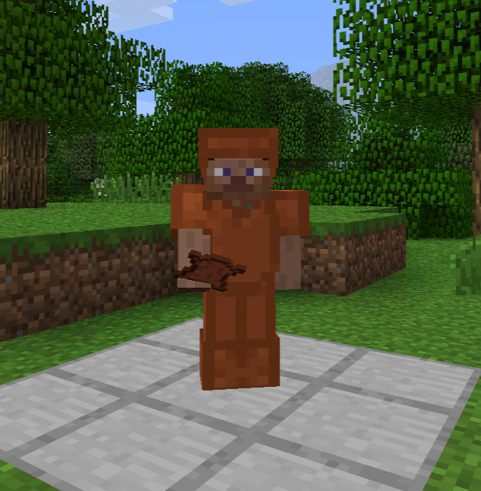

*Updated Leather armor color.*

More armor visual changes

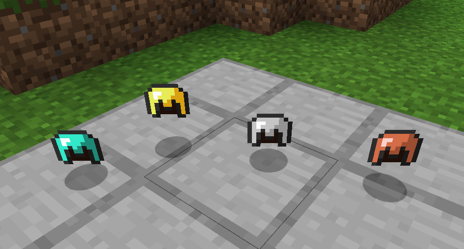
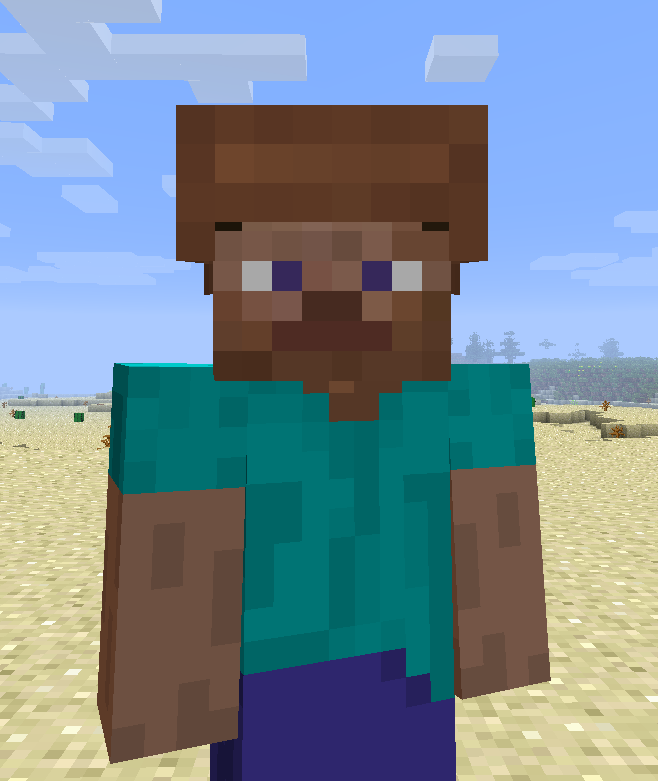
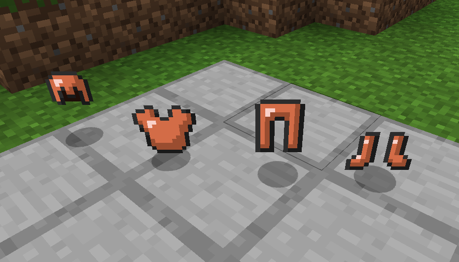

Current armor progression

| Material | Full-set protection | Durability multiplier | Enchantability |
| --- | ---: | ---: | ---: |
| Leather | 7 | 5 | 15 |
| Copper | 9 | 10 | 12 |
| Chainmail | 12 | 15 | 12 |
| Iron | 15 | 15 | 9 |
| Gold | 16 | 7 | 25 |
| Diamond | 20 | 33 | 10 |

#### Chainmail

Chainmail can now be obtained through normal Survival gameplay.

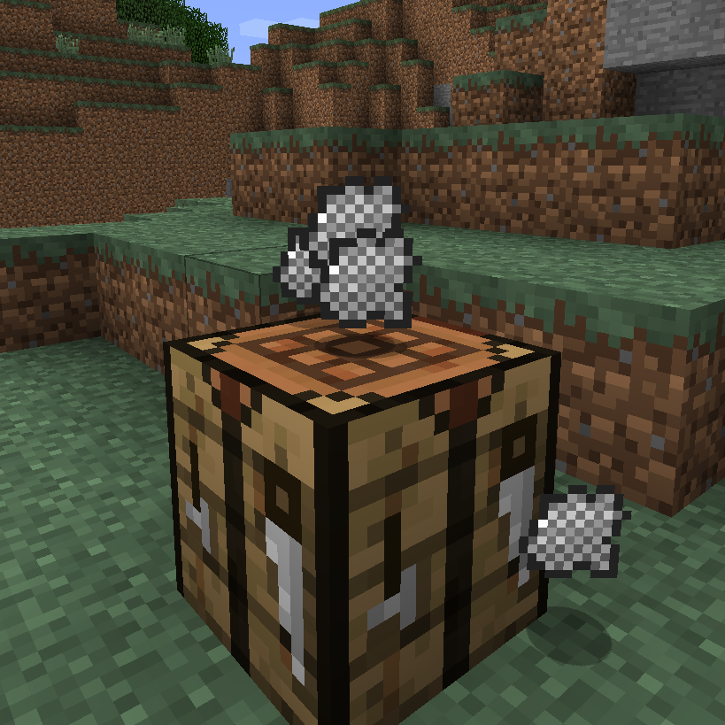

- Chainmail uses the normal armor recipe shapes with Chain Links
- Chainmail's existing protection and durability values are unchanged

Example recipe

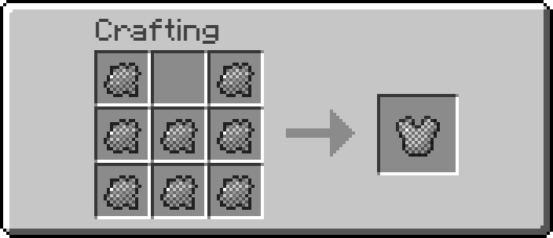

Current Chain Link balance

- Any Zombie has a 20% chance to drop Chain Links
- A successful drop gives 1-3 Chain Links before Looting
- Looting increases the amount from a successful Chain Link drop
- A full Chainmail set costs 24 Chain Links

#### Mutton and Wool

Sheep now provide food instead of an immediate source of Wool.

- Burning sheep drop Cooked Mutton
- Shearing remains the main source of Wool
- Nine String can be crafted into one Wool

Current Mutton and Wool balance

- Sheep drop 1-2 Mutton before Looting instead of Wool when killed
- Shearing gives the normal 2-4 Wool
- Raw Mutton restores 2 hunger with 0.3 saturation
- Cooked Mutton restores 6 hunger with 0.8 saturation

#### Achievements

The achievement tree now guides the changed progression and sleeping mechanics without requiring an outside guide.

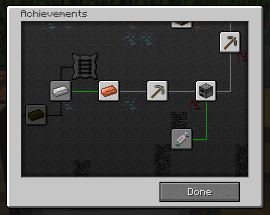

Main progression:

`Time to Mine!` → `Hot Topic` → `Getting an Upgrade` → `Copper Age` → `Acquire Hardware` → `Gold Rush` → `DIAMONDS!`

Additional guidance:

- `Home Sweet Home` branches from `Benchmarking`
- `Bedside Manners` branches from `DIAMONDS!`
- `Sweet Dreams` branches from `We Need to Go Deeper`

---

### Part 3

New equipment and utility items for different playstyles, including backports and alternate takes on features added much later in Minecraft.

#### Crystal

Crystal is a new utility material used for gadgets rather than another tool or armor tier.

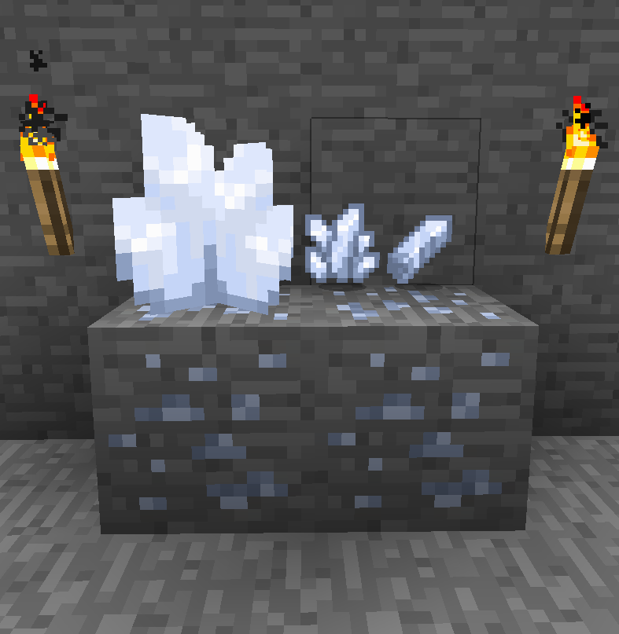

*Crystal Ore, Crystal Deposits and the material itself.*

- Rare Crystal Ore generates underground in small veins
- Exposed Crystal Ore can generate with a Crystal Deposit on any open face
- Crystal Ore and Deposits require a Copper Pickaxe or better to harvest
- Silk Touch gives the Crystal Ore block or a full Crystal from a Deposit
- Fortune affects Crystal Shard drops
- Four Crystal Shards craft into one Crystal, and a Crystal can be split back into four Shards
- Crystals can be placed as Crystal Deposits
- Crystal Deposits use directional collision matching the face they are attached to

Crystal visuals and recipes

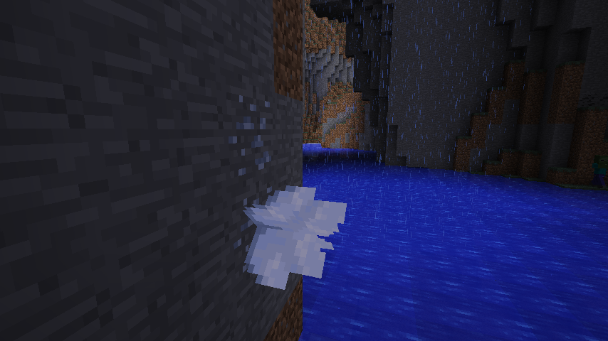

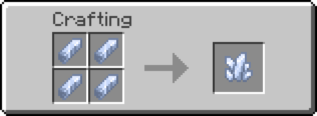
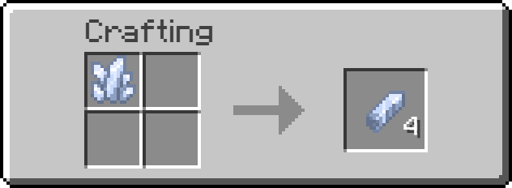

Current Crystal generation and drop values

| Setting | Current value |
| --- | --- |
| Ore attempts | 2 per chunk |
| Maximum vein size | 3 |
| Generation height | Y 0-96 |
| Deposit chance on exposed ore | 50% |
| Crystal Ore drop | 1-2 Crystal Shards |
| Crystal Deposit drop | 2-4 Crystal Shards |
| Minimum harvest tier | Copper |

A Deposit only generates into air and at most one is placed per exposed Crystal Ore block. Player-placed Deposits use the same harvesting rules as natural ones.

#### Spyglass

A backport of the modern Spyglass, adapted to the look and controls of Release 1.0.

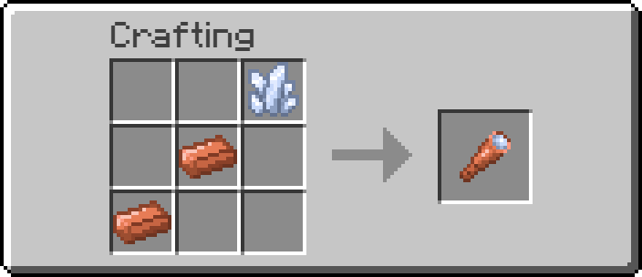

- Hold use to zoom through the Spyglass
- Includes the scope view, use sounds and a dedicated player pose
- The default held-item look is a flat 1.0-style sprite
- The original 3D model can be enabled under `Video Settings → 3D Items...`

3D Items setting and Spyglass views

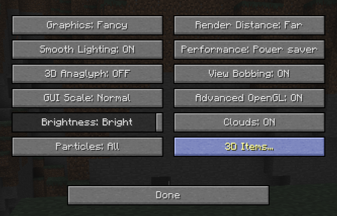

**First person**

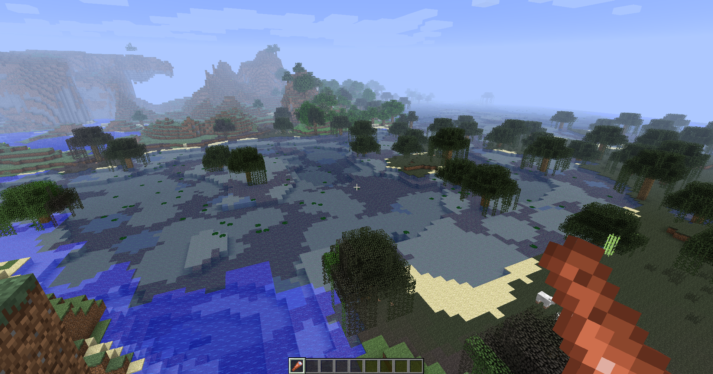
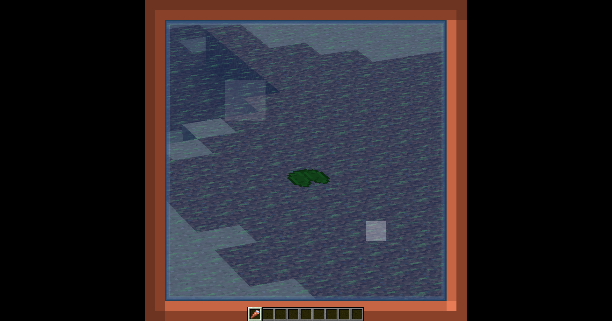

**Third-person sprite**

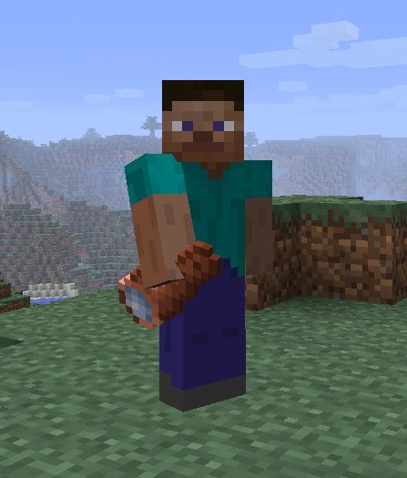
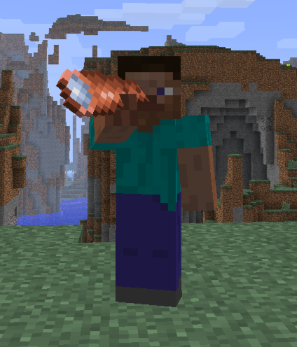

**Third-person 3D model**

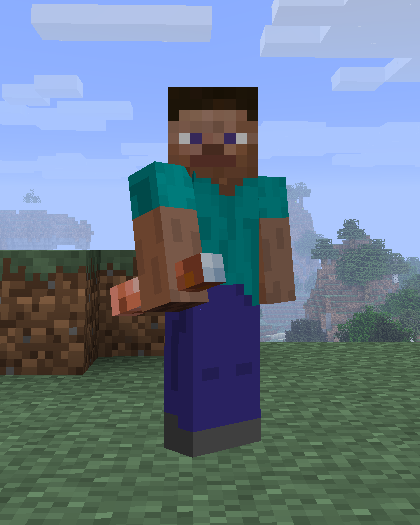
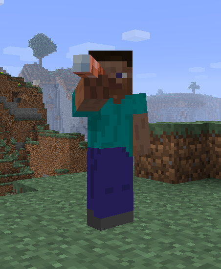

#### Pouch

A backport of the modern Bundle for carrying mixed small stacks without adding another inventory row.

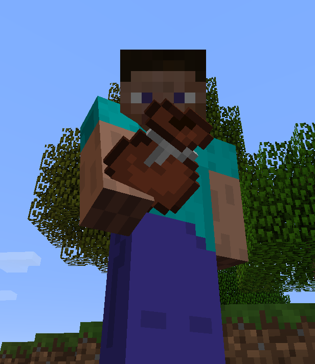
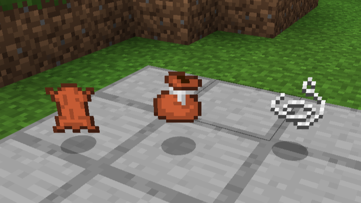

*Pouch held and dropped.*

- Stores up to one stack's worth of mixed items
- Items can be inserted and removed directly from the inventory
- Scrolling while hovering the Pouch selects which stored item to remove
- The tooltip shows up to 12 item types at once and shifts through additional contents while scrolling
- Pouches cannot be stored inside other Pouches
- Backpacks cannot be stored inside Pouches
- The normal Pouch is intended as the base for more specialized Pouches later

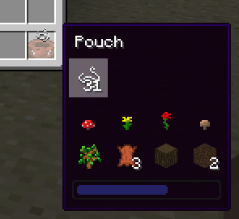

*Pouch contents and selection UI.*

Recipe

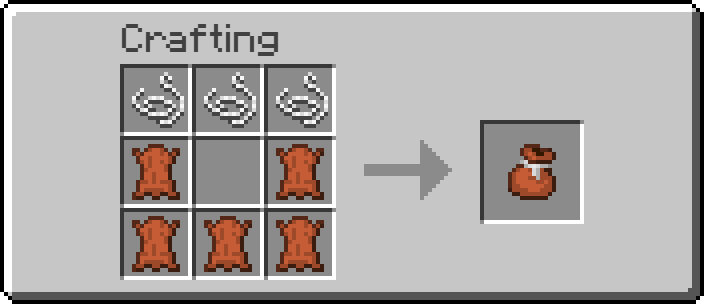

Current Pouch capacity rules

- Total capacity is 64 units
- An item that normally stacks to 64 uses 1 unit each
- An item that normally stacks to 16 uses 4 units each
- An unstackable item uses the full Pouch capacity
- The contents preview shows up to 12 stored item types at once, while selection can scroll through all stored types

#### Backpack

A wearable and placeable nine-slot container built around a physical Backpack rather than a permanent inventory expansion.

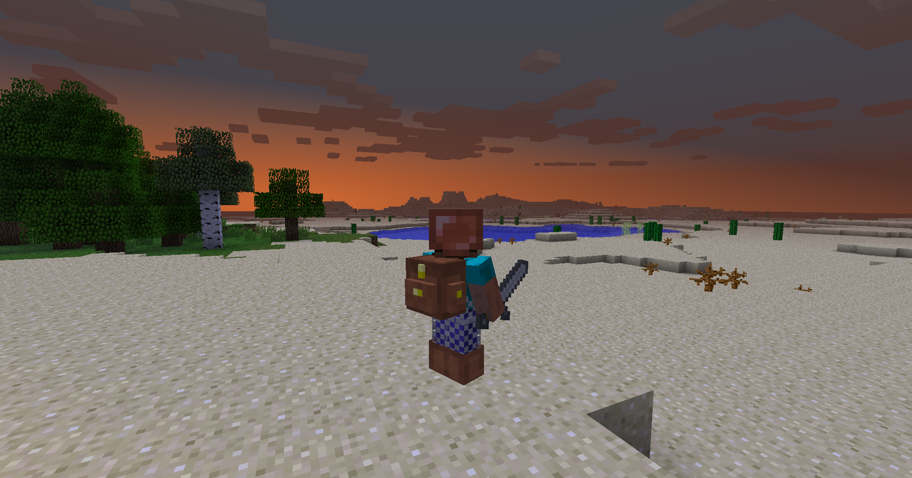

*The Backpack worn in the world.*

- Equips in the chest armor slot and provides no armor protection
- Adds nine persistent storage slots while worn
- Worn storage appears as a separate 3×3 panel beside the normal player inventory
- If the normal inventory is full, item pickups can overflow into the worn Backpack
- Can be placed in the world and opened as a 3×3 container
- Placement follows the player's rotation with 16 possible directions
- The placed flap uses a chest-style opening and closing animation with custom bag sounds
- Breaking or dropping a filled Backpack preserves its contents, including across relogs
- Backpacks cannot contain other Backpacks
- A placed Backpack broken in Creative drops nothing, matching normal Creative behavior

##### Worn and placed

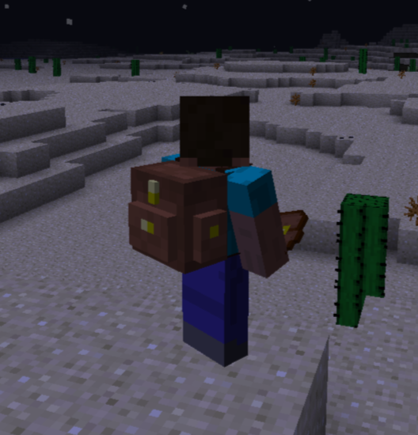
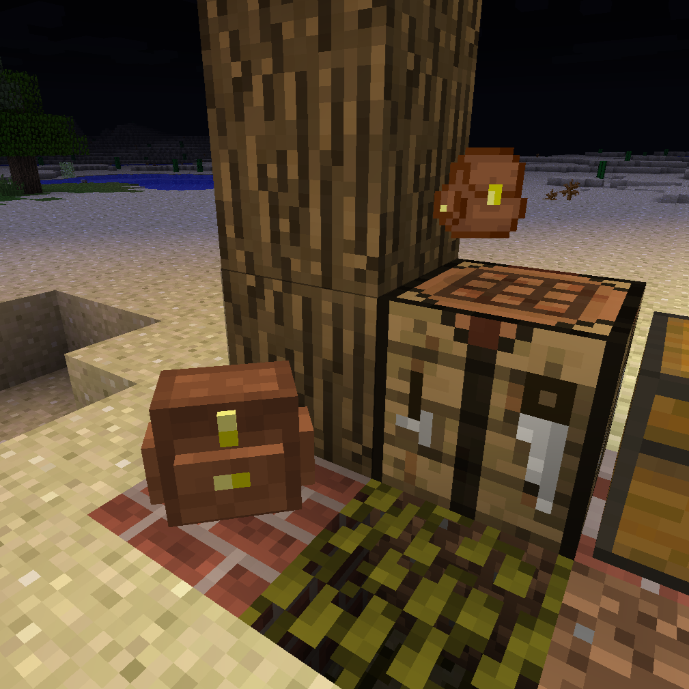

*The same Backpack worn, placed and dropped.*

##### Inventory

The same nine slots stay with the Backpack whether it is worn, carried or placed.

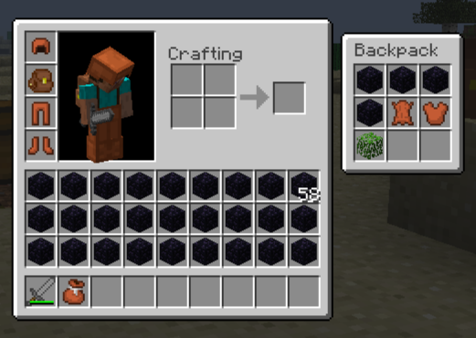
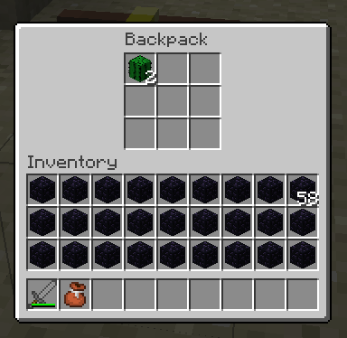

*Worn and placed Backpack storage.*

##### Hard Leather

Hard Leather is the Backpack's main material. It has been added as an item, but its Survival source is still planned for later in Part 3.

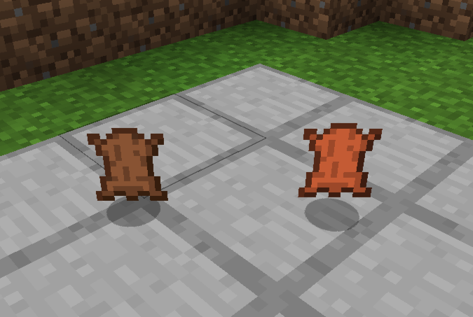

*Normal Leather beside Hard Leather.*

The Backpack recipe is `GGG / H H / HHH`, where `G` is a Gold Ingot and `H` is Hard Leather.

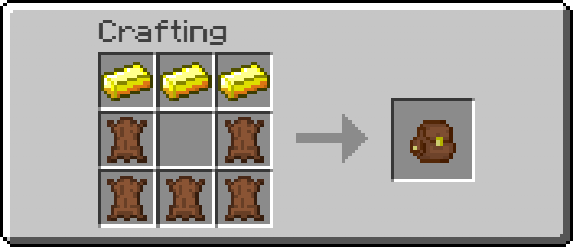

More Backpack views

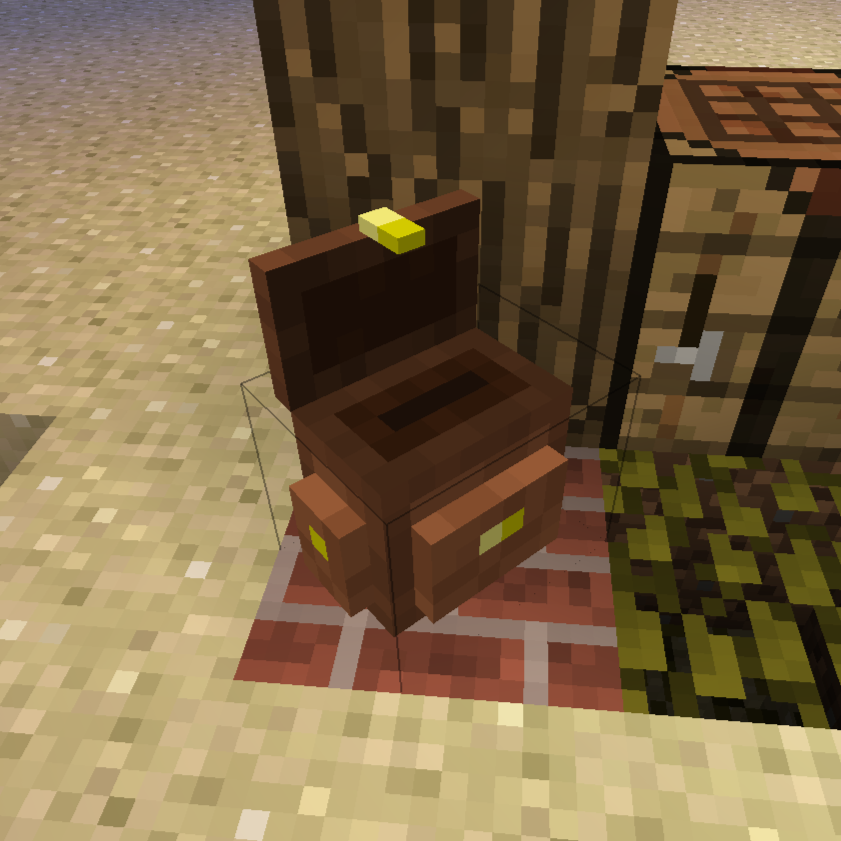
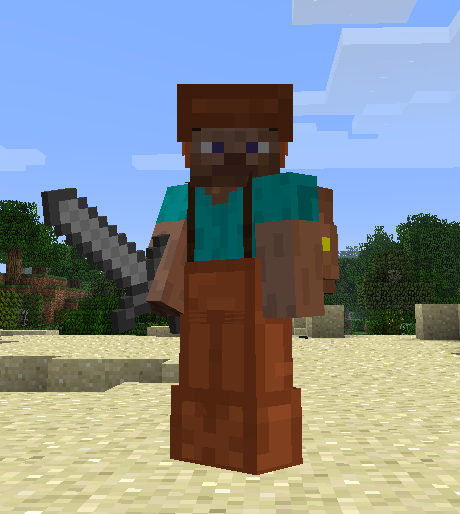

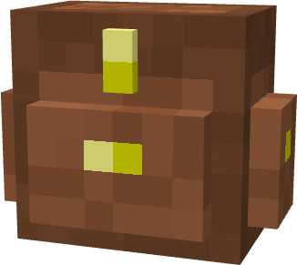
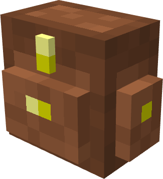

---

## Credits

- Copper armor item sprites are based on axy's Traditional Armour
- Copper ingot and block textures are based on artwork by JM140628
- Chain Links texture is inspired by [Better Than Adventure](https://www.betterthanadventure.net/)
- Crystal textures are based on artwork by [yptsh](https://x.com/yptsh/status/1623341389122510848)
- Pouch assets are adapted from the modern Minecraft Bundle assets
- Backpack item sprite was inspired by [Nemo's Backpacks](https://modrinth.com/mod/nemos-backpacks/gallery)
- Backpack open sound: [Open Bag Sound](https://pixabay.com/sound-effects/film-special-effects-open-bag-sound-39216/) on Pixabay
- Backpack close sound: [Bag Drop and Remove](https://pixabay.com/sound-effects/film-special-effects-bag-drop-and-remove-70142/) on Pixabay
