# Development Log

Minecraft: 2011 Edition, continued through larger updates and smaller feature parts. This log follows the project by update, then by feature.

## Contents

- [Update #1](#update-1)
  - [Part 1](#part-1)
    - [Bedside Table](#bedside-table)
    - [Glowstone Lamp](#glowstone-lamp)
  - [Part 2](#part-2)
    - [Flint progression](#flint-progression)
      - [Flint Pebbles](#flint-pebbles)
      - [Flint tools](#flint-tools)
    - [Stone progression](#stone-progression)
    - [Copper progression](#copper-progression)
      - [Copper tools](#copper-tools)
      - [Copper armor](#copper-armor)
    - [Ore generation](#ore-generation)
    - [Armor progression](#armor-progression)
    - [Chainmail](#chainmail)
    - [Mutton and Wool](#mutton-and-wool)
    - [Cooked Egg](#cooked-egg)
    - [Achievements](#achievements)
  - [Part 3](#part-3)
    - [Steel progression](#steel-progression)
      - [Blast Furnace](#blast-furnace)
      - [Anvil](#anvil)
    - [Grindstone](#grindstone)
    - [Crystal](#crystal)
      - [Glowing Crystal](#glowing-crystal)
      - [Crystal Arrows](#crystal-arrows)
    - [Brightvision Goggles](#brightvision-goggles)
    - [Spyglass](#spyglass)
    - [2011 Edition Features](#2011-edition-features)
    - [Pouch](#pouch)
    - [Hard Leather](#hard-leather)
    - [Fishing Hat](#fishing-hat)
    - [Fishing Trap](#fishing-trap)
    - [Muffled Boots](#muffled-boots)
    - [Ninja Boots](#ninja-boots)
    - [Belt](#belt)
    - [Backpack](#backpack)
      - [Worn and placed](#worn-and-placed)
      - [Inventory](#inventory)
    - [Quiver](#quiver)
    - [Recipe Book](#recipe-book)
    - [Recipe Compendium](#recipe-compendium)
    - [Lectern](#lectern)
    - [Stone of Return](#stone-of-return)
    - [Bottle o' Enchanting](#bottle-o-enchanting)
    - [Rope](#rope)
    - [Tarot of Death](#tarot-of-death)
    - [Part 3 achievements](#part-3-achievements)
  - [Part 4](#part-4)
    - [Regional Gemstones](#regional-gemstones)
      - [Gemstone tools](#gemstone-tools)
      - [Gemstone armor](#gemstone-armor)
    - [Nether Stone](#nether-stone)
    - [Ancient Scrap](#ancient-scrap)
    - [Nethersteel](#nethersteel)
      - [Nethersteel tools](#nethersteel-tools)
      - [Nethersteel armor](#nethersteel-armor)
    - [Nether Gold Ore](#nether-gold-ore)
    - [Netherskulls](#netherskulls)
      - [Netherskull Guard](#netherskull-guard)
      - [Netherskull Helmet](#netherskull-helmet)
    - [Ash](#ash)
    - [Bone Bush](#bone-bush)
    - [Soul Torch](#soul-torch)
    - [Nether Dungeon](#nether-dungeon)
    - [End terrain](#end-terrain)
    - [Amethyst](#amethyst)
      - [Amethyst tools](#amethyst-tools)
      - [Amethyst armor](#amethyst-armor)
    - [End Stone](#end-stone)
    - [Purple Stone](#purple-stone)
    - [Voidstone](#voidstone)
    - [End Spire](#end-spire)
    - [Ender Shade](#ender-shade)
    - [End Forest](#end-forest)
      - [End Wood](#end-wood)
      - [End vegetation](#end-vegetation)
      - [Ender Berries](#ender-berries)
    - [Part 4 achievements](#part-4-achievements)
  - [Part 5](#part-5)
    - [Nuggets](#nuggets)
    - [Chains](#chains)
    - [Bars](#bars)
    - [Amulets](#amulets)
      - [Amulet slot](#amulet-slot)
      - [Amulet effects](#amulet-effects)
  - [Part 6](#part-6)
    - [Daggers](#daggers)
    - [Shurikens](#shurikens)
    - [Blackpowder Bombs](#blackpowder-bombs)
      - [Blackpowder](#blackpowder)
      - [Fire Charge](#fire-charge)
    - [Crossbow](#crossbow)
      - [Crossbow enchantments](#crossbow-enchantments)
    - [Flute](#flute)
      - [Flute enchantments](#flute-enchantments)
- [Credits](#credits)

## Update #1

**Status:** In development. Parts 1, 2, 3, 4, 5 and 6 are feature-complete for now. Tested in singleplayer. Not tested in multiplayer.

Proper Progression rebuilds early-game progression, expands it with utility equipment that still feels at home in Release 1.0, and then carries it past Diamond and out into the dimensions.

---

### Part 1

A Minecraft 1.0 adaptation of [Beds, but Endgame](https://github.com/passziff/beds-but-endgame).

- A Bedside Table beside the head of the bed is required to sleep
- Beds still set the player's respawn point when sleep is denied
- A Glowstone Lamp on a Bedside Table prevents nightmares
- Nightmares wake the player and block sleeping again until daytime

#### Bedside Table

The Bedside Table is the main requirement for sleeping and sits beside the head of the bed.

Recipe

#### Glowstone Lamp

A Glowstone Lamp placed on the Bedside Table prevents nightmares.

Recipe

Current nightmare balance

| Setting | Current value |
| --- | ---: |
| Nightmare chance | 40% |
| No nightmare when dawn is within | 1200 ticks |
| Time advanced by a nightmare | 600 ticks |
| Full sleep before nightmare check | 100 ticks |

A nightmare locks sleeping again until daytime. A Glowstone Lamp on the Bedside Table prevents it.

---

### Part 2

This part rebuilds the early mining ladder around Flint, Stone and Copper, while tightening the progression into Iron and Diamond.

#### Flint progression

Flint forms the first tool tier before Stone. Only Flint Pickaxes and Axes replace their wooden equivalents.

- Flint can be placed as small pebbles
- Flint Pebbles generate naturally on the surface and around exposed underground sediment
- Breaking a Flint Pebble returns one Flint

##### Flint Pebbles

There are three variants for visual diversity.

Current Flint Pebble generation

- Shoreline Flint is limited to 25% of eligible shoreline chunks
- Underground Flint is limited to at most 2 pebbles per chunk
- Underground generation favors Gravel, then Dirt/Sand and sediment-adjacent Stone
- Isolated ordinary cave Stone does not generate Flint Pebbles

##### Flint tools

Tool views and recipes

Flint tool stats

| Stat | Flint |
| --- | ---: |
| Harvest level | 0 |
| Durability | 59 |
| Mining speed | 2.0 |
| Material damage bonus | 0 |
| Enchantability | 15 |

#### Stone progression

Cobblestone must be smelted into Stone before any Stone tools can be crafted.

Current pickaxe harvest progression

| Tier | Harvest level | Unlocks |
| --- | ---: | --- |
| Flint | 0 | Stone / basic mining |
| Stone | 1 | Copper |
| Copper | 2 | Iron |
| Iron / Gold | 3 | Gold and the regional gemstones |
| Emerald / Ruby / Sapphire | 4 | Diamond |
| Diamond / Amethyst | 5 | Obsidian, Ancient Scrap and Amethyst Ore |
| Nethersteel | 6 | All current mineable blocks |

#### Copper progression

Copper forms a complete tool and armor tier between Stone and Iron.

- Copper Ore drops itself and smelts into one Copper Ingot
- Nine Copper Ingots craft into a Block of Copper and can be crafted back
- Copper Ore requires a Stone Pickaxe or better
- Copper tools are stronger than Stone and weaker than Iron
- Copper armor sits between Leather and Chainmail

##### Copper tools

Example recipe

Copper tool stats

| Stat | Copper |
| --- | ---: |
| Harvest level | 2 |
| Durability | 190 |
| Mining speed | 5.0 |
| Material damage bonus | 1 |
| Enchantability | 10 |

##### Copper armor

More Copper armor visuals

Copper armor stats

| Piece | Protection | Durability |
| --- | ---: | ---: |
| Helmet | 2 | 110 |
| Chestplate | 4 | 160 |
| Leggings | 2 | 150 |
| Boots | 1 | 130 |
| **Full set** | **9** | **550** |

Copper armor uses a durability multiplier of 10 and enchantability of 12.

#### Ore generation

Copper and the existing ores were rebalanced around the new progression.

Current ore generation values

| Ore | Attempts / chance | Vein size | Height |
| --- | --- | ---: | --- |
| Coal | 20 attempts/chunk | 16 | Y 0-127 |
| Copper, main | 22 attempts/chunk | 7 | Y 0-55 |
| Copper, upper | 22 attempts/chunk | 6 | Y 56-127 |
| Iron, main | 9 attempts/chunk | 8 | Y 0-55 |
| Iron, rare upper | 25% chance/chunk, 1 attempt | 4 | Y 56-95 |
| Gold, main | 2 attempts/chunk | 8 | Y 0-31 |
| Gold, rare upper | 25% chance/chunk, 1 attempt | 3 | Y 32-47 |
| Redstone | 8 attempts/chunk | 7 | Y 0-15 |
| Diamond | 1 attempt/chunk | 7 | Y 0-15 |
| Lapis | Vanilla | Vanilla | Vanilla |

Rare upper Iron generation is limited by the local terrain height.

#### Armor progression

Gold was rebalanced back toward an old-Minecraft role: low durability and excellent enchantability, while the new gemstone sets bridge Iron to Diamond.

More armor visual changes

#### Chainmail

Chainmail can now be obtained through normal Survival gameplay.

- Chainmail uses the normal armor recipe shapes with Chain Links
- Chainmail's existing protection and durability values are unchanged

Example recipe

Current Chain Link balance

- Any Zombie has a 20% chance to drop Chain Links
- A successful drop gives 1-3 Chain Links before Looting
- Looting increases the amount from a successful Chain Link drop
- A full Chainmail set costs 24 Chain Links

#### Mutton and Wool

Sheep now provide food instead of an immediate source of Wool.

- Burning sheep drop Cooked Mutton
- Shearing remains the main source of Wool
- Nine String can be crafted into one Wool

Current Mutton and Wool balance

- Sheep drop 1-2 Mutton before Looting instead of Wool when killed
- Shearing gives the normal 2-4 Wool
- Raw Mutton restores 2 hunger with 0.3 saturation
- Cooked Mutton restores 6 hunger with 0.8 saturation

#### Cooked Egg

Eggs can now be cooked into a small renewable food source.

- A raw Egg smelts into one Cooked Egg in a normal Furnace
- Cooked Eggs restore **2 hunger points** with **0.6 saturation**
- Cooked Eggs stack to 64; raw Eggs remain limited to 16 because they are throwable
- Thrown Eggs burst into Egg fragments instead of reusing Snowball fragments

Smelting recipe

#### Achievements

The achievement tree guides the changed progression and sleeping mechanics without requiring an outside guide.

Main progression:

`Time to Mine!` → `Hot Topic` → `Getting an Upgrade` → `Copper Age` → `Acquire Hardware` → `Harder, Faster, Stronger` → `DIAMONDS!`

Side achievements include `It's Triplets!`, `Home Sweet Home`, `Bedside Manners` and `Sweet Dreams`.

---

### Part 3

New equipment, workshop systems and utility items for different playstyles, including backports and alternate takes on features added much later in Minecraft.

#### Steel progression

Steel adds a workshop-focused step beyond Iron without becoming another conventional tool or armor tier.

- Iron Ingots can be turned into Steel Ingots in a Blast Furnace
- Nine Steel Ingots craft into a Block of Steel and can be crafted back
- Flint and Steel uses a Steel Ingot instead of Iron and has a matching Steel-colored sprite
- The Cauldron uses Steel Ingots instead of Iron Ingots
- Steel is used for workshop equipment including the Anvil and Steel Hammer

Flint and Steel recipe

Cauldron recipe

##### Blast Furnace

The Blast Furnace is the main way to make Steel and a faster furnace for ores.

- Ores smelt at twice the speed of a normal Furnace
- Iron Ingots become Steel Ingots only while the Blast Furnace is burning Charcoal, a Blaze Rod or a Lava Bucket
- A Lava Bucket used for Steel leaves its empty Bucket behind
- Charcoal has a distinct optional texture to separate it from Coal
- Furnaces and Blast Furnaces have operating sounds that can be disabled in `2011 Edition Features`

Recipe and GUI

##### Anvil

The Anvil backports later repair, renaming and enchantment-combining functionality into Release 1.0, with the Steel Hammer as its dedicated workshop tool.

- A Steel Hammer must be installed in the Anvil before it can be used
- The installed Hammer stays in the Anvil and is visible on the block in-world
- Repairs, compatible enchantment combinations and renaming cost experience levels
- Each successful operation damages the Steel Hammer; a fresh Hammer lasts 20 operations
- Unsupported Anvils fall like Sand or Gravel, damage entities on impact and can damage or break themselves from a fall
- The installed Steel Hammer, Anvil damage stage and facing are preserved while the Anvil falls
- The Anvil can become damaged and eventually break through use or impact

Recipes, GUI and damage

#### Grindstone

The Grindstone adds a dedicated repair and disenchanting workstation alongside the Anvil.

- Two matching damageable items can be combined for a stronger repair than the crafting grid
- Combining items in the Grindstone removes enchantments and returns experience from them
- A custom name from the upper input item is kept on the result
- It can be mounted on the floor, walls or ceiling and drops if its support is removed
- The recipe uses a Sandstone Slab and accepts any vanilla Log; the model uses Oak Log for its wooden supports
- Using the Grindstone plays dedicated use sounds

Recipe, GUI and placements

Current repair system

| Method | Repair | Enchantments | Name | Notes |
| --- | --- | --- | --- | --- |
| Crafting grid, item + item | Remaining durability of both items + **5%** of maximum durability | Removed | Removed | Free |
| Grindstone, item + item | Remaining durability of both items + **10%** of maximum durability | Removed; some XP returned | Upper item's name kept | Free |
| Anvil, item + item | Remaining durability of both items + **12%** of maximum durability | Preserved and compatible enchantments can be combined | Preserved / can be changed | Costs XP, Steel Hammer durability and Anvil wear |
| Anvil, item + material | Up to **25%** of maximum durability per material, or **10%** for the Netherskull Helmet | Preserved | Preserved / can be changed | Only materials actually needed are consumed |

Current Anvil repair materials:

| Equipment | Repair material |
| --- | --- |
| Wooden tools | Wooden Planks |
| Flint tools | Flint |
| Stone tools | Stone |
| Leather armor | Leather |
| Fishing Hat / Muffled Boots | Hard Leather |
| Ninja Boots | Steel Ingot |
| Brightvision Goggles | Glowing Crystal |
| Chainmail | Chain Links |
| Copper equipment | Copper Ingot |
| Iron equipment and Shears | Iron Ingot |
| Gold equipment | Gold Ingot |
| Emerald equipment | Emerald |
| Ruby equipment | Ruby |
| Sapphire equipment | Sapphire |
| Diamond equipment | Diamond |
| Amethyst equipment | Amethyst |
| Flint and Steel / Steel Hammer | Steel Ingot |
| Nethersteel equipment | Nethersteel Ingot |
| Netherskull Helmet | Nethersteel Ingot, at a reduced rate |
| Crossbow | Steel Ingot |
| Flute | Stick |

#### Crystal

Crystal is a utility material used for gadgets rather than another tool or armor tier.

- Rare Crystal Ore generates underground in small veins
- Exposed Crystal Ore can generate with a Crystal Deposit on any open face
- Crystal Ore and Deposits require a Copper Pickaxe or better to harvest
- Silk Touch gives the Crystal Ore block or a full Crystal from a Deposit
- Fortune affects Crystal Shard drops
- Four Crystal Shards craft into one Crystal, and a Crystal can be split back into four Shards
- Crystals can be placed as Crystal Deposits

##### Glowing Crystal

Normal Crystal can be infused with Glowstone to create a luminous branch of the same Crystal system.

- A Crystal surrounded by four Glowstone Dust crafts into one Glowing Crystal
- Four Glowing Crystal Shards craft into one Glowing Crystal, and a Glowing Crystal splits back into four Shards
- A Glowing Crystal Shard can be crafted back into Glowstone Dust
- Glowing Crystal Deposits emit **light level 8** and do not currently generate naturally
- Normal harvesting gives **2-4 Glowing Crystal Shards**; Fortune and Silk Touch apply

##### Crystal Arrows

Crystal Arrows are a harder-hitting but less reliable alternative to normal Arrows, using Crystal Shards in place of Flint.

- The normal Arrow recipe with a Crystal Shard replacing Flint makes **4 Crystal Arrows**
- Deal **2 more damage points** than a normal Arrow at the same Bow draw strength
- Have a **25% chance to shatter on block impact** instead of remaining recoverable
- A shattered Crystal Arrow produces glass-like break sound and Crystal fragments
- Bows visibly show whether the selected ammunition is a normal Arrow or Crystal Arrow while being drawn

Recipe and Bow view

#### Brightvision Goggles

Brightvision Goggles are a zero-armor utility head item that uses Glowstone-infused Crystal lenses to brighten nearby darkness.

- Equip in the helmet slot and provide **0 armor points**
- Have **100 durability**
- Brightvision is intentionally weaker than Night Vision and falls off with distance
- The first-person view uses a warm tint and a dark goggle-style vignette
- Hiding the HUD with F1 or switching to third person disables the Brightvision boost
- Can be repaired with Glowing Crystals at an Anvil

#### Spyglass

The Spyglass backports zooming into Release 1.0 as a simple held utility item.

- Uses a Bow-like hold interaction and a dedicated scope overlay
- Crafted from Copper and Crystal
- Can use either the normal sprite presentation or an optional 3D model

Third-person 3D model

#### 2011 Edition Features

2011 Edition-specific visual and sound options are grouped under `2011 Edition Features` on the main Options screen.

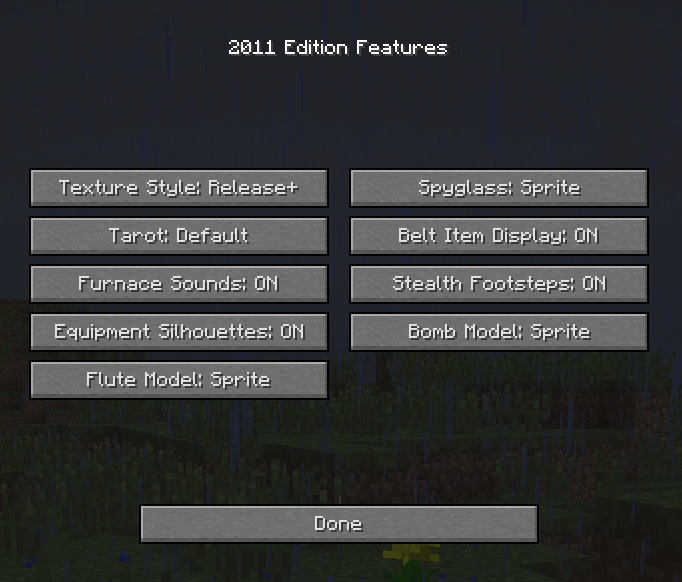

- Texture Style: Release+ or Vanilla
- Spyglass: Sprite or 3D
- Tarot: three cosmetic texture variants
- Furnace Sounds: ON or OFF
- Stealth Footsteps: ON or OFF
- Belt Item Display: ON or OFF
- Equipment Silhouettes: ON or OFF
- Bomb Model: Sprite or 3D
- Flute Model: Sprite or 3D
- These settings do not change the underlying gameplay mechanics

Options button

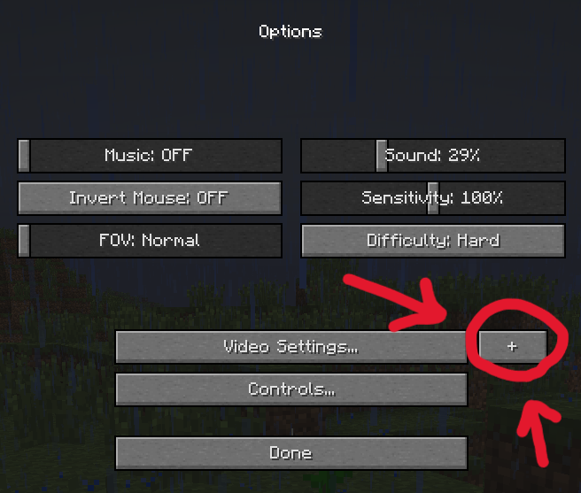

#### Pouch

A backport of the modern Bundle for carrying mixed small stacks without adding another inventory row.

- Stores up to one stack's worth of mixed items
- Items can be inserted and removed directly from the inventory
- Scrolling while hovering the Pouch selects which stored item to remove
- The tooltip shows up to 12 item types at once and shifts through additional contents while scrolling
- Pouches cannot be stored inside other Pouches
- Backpacks cannot be stored inside Pouches

Current Pouch capacity rules

- Total capacity is 64 units
- A 64-stack item uses 1 unit each
- A 16-stack item uses 4 units each
- An unstackable item uses the full Pouch capacity

#### Hard Leather

Hard Leather is a reinforced form of Leather used for sturdier utility equipment. Normal Leather can be smelted into Hard Leather in a Furnace.

- Used by the Backpack, Quiver, Fishing Hat, Belt and Muffled Boots
- Books use Hard Leather instead of normal Leather

#### Fishing Hat

The Fishing Hat is a reinforced Leather Helmet for players who spend time fishing.

- Provides the same armor protection as a Leather Helmet
- Has **90 durability**
- A successful catch has a **25% chance not to consume Fishing Rod durability**
- Can be repaired with Hard Leather at an Anvil

#### Fishing Trap

The Fishing Trap is a passive fishing tool that catches Raw Fish while set in suitable water.

- Can be placed dry or directly into water
- Only catches while waterlogged with water at its open side
- Stores up to **3 Raw Fish**
- Bubble bursts and a catch sound show stored catches
- Right-clicking removes one caught fish at a time
- Rain improves the catch rate
- Breaking the trap drops stored catches

#### Muffled Boots

Muffled Boots are padded Hard Leather utility boots for quieter movement and easier sneaking around hostile mobs.

- Provide **1 armor point**
- Have **105 durability**
- Recipe accepts any Wool color
- While sneaking, an ordinary hostile mob's 16-block detection range is reduced to **14 blocks**
- Use softened footsteps while worn
- `Stealth Footsteps` in `2011 Edition Features` can disable the custom sounds without changing stealth
- Repair with Hard Leather

#### Ninja Boots

Ninja Boots are the Steel-reinforced upgrade to Muffled Boots.

- Provide **2 armor points**
- Have **125 durability**
- While sneaking, an ordinary hostile mob's 16-block detection range is reduced to **10 blocks**
- Use a stronger softened footstep treatment
- Repair with a Steel Ingot

#### Belt

The Belt is a lightweight Hard Leather equipment piece that gives up some leg protection in exchange for one dedicated carried-item slot.

- Equips in the leggings armor slot and provides **1 armor point**
- Has **123 durability**
- Holds supported tools and weapons, including the Steel Hammer, Daggers, Shurikens and Flute
- Its dedicated inventory panel appears to the right of the player inventory and as a slot to the left of the hotbar while occupied
- If a Backpack or Quiver is equipped, the Belt panel moves below that larger right-side panel
- The configurable Belt key (`B` by default) switches to the stored item and back
- A stowed item is visibly carried in third person and disappears from the Belt while selected
- `Belt Item Display` in `2011 Edition Features` can hide the visible stowed item without changing Belt mechanics

#### Backpack

A wearable and placeable nine-slot container built around a physical Backpack rather than a permanent inventory expansion.

- Equips in the chest armor slot and provides no armor protection
- Adds nine persistent storage slots while worn
- Worn storage appears as a separate 3×3 panel beside the player inventory
- If the normal inventory is full, item pickups can overflow into the worn Backpack
- Can be placed in the world and opened as a 3×3 container
- Breaking or dropping a filled Backpack preserves its contents
- Backpacks cannot contain other Backpacks

##### Worn and placed

##### Inventory

#### Quiver

The Quiver is a wearable nine-slot ammunition container built specifically for ranged combat.

- Crafts from **8 Hard Leather** in a Chest-shaped recipe
- Equips in the chest armor slot and provides **0 armor points**
- Holds **9 stacks** of normal Arrows or Crystal Arrows
- Bows and Crossbows consume ammunition from the Quiver before normal inventory ammunition
- Picked-up Arrows and Crystal Arrows prefer available space in the worn Quiver
- Filled Quivers preserve contents when carried, dropped, unequipped or reloaded
- The item sprite and worn model share empty, half-full and full states

Fullness states

| Stored arrows | Fullness state | Visible model arrows |
| --- | --- | ---: |
| 0 | Empty | 0 |
| 1-288 | Half-full | 3 |
| 289-576 | Full | 6 |

#### Recipe Book

The Recipe Book is an early-game reference item for learning what items are and how they fit into crafting and smelting.

- Right-clicking opens a dedicated Release 1.0-style book interface; it can also be read on a Lectern
- Placing an item into the inspection slot shows a short description on its About page
- Further pages show applicable Smelting and Crafting Recipes, including recipes that make or use the inspected item
- Empty categories are omitted
- Alternative ingredients and fuels cycle in place; hovering pauses them and the mouse wheel can browse options
- The displayed recipes use the game's current recipe data, including supported interchangeable ingredient groups such as normal and End Wooden Planks
- Opening, closing and page turns use dedicated sounds

#### Recipe Compendium

The Recipe Compendium is a gilded upgrade to the Recipe Book that builds its own browsable index from inspected items.

- Can only be opened while placed on a Lectern
- Inspecting an item records that item in that physical Compendium
- Index uses a **6×3 grid**, 18 entries per page
- Search/filter categories: **All, Natural, Building, Utility, Equipment, Food, Materials**
- Sort modes: **Newest, Oldest, A-Z, Z-A**
- Remembered entries persist on the physical Compendium
- The physical inspection item is returned when the interface closes

#### Lectern

The Lectern is a dedicated reading stand for the Recipe Book and Recipe Compendium.

- Right-clicking an empty Lectern with a supported book places that exact book on the stand
- Right-clicking an occupied Lectern opens it
- The book is rendered physically on the stand and page turns animate it
- Each page turn produces a short **2-tick redstone pulse**
- Punching an occupied Lectern knocks its book off; breaking it drops the stored book
- Stored book data persists through world saves

#### Stone of Return

The Stone of Return turns Ender teleportation into a long-range way home.

- Crafted from End Stone, Ender Pearls and an Eye of Ender
- Must be calibrated at an Enchanting Table
- Calibration I, II and III cost 10, 20 and 30 levels
- Teleports toward the current respawn point and deals Ender Pearl damage
- Every calibrated Stone is single-use
- Invalid beds fall back to world spawn

| Enchantment | Cost | Return accuracy |
| --- | ---: | --- |
| Calibration I | 10 | Safe position within 256 blocks |
| Calibration II | 20 | Safe position within 64 blocks |
| Calibration III | 30 | Exact respawn point |

#### Bottle o' Enchanting

The Bottle o' Enchanting has been backported as a throwable source of experience. It is currently Creative-only.

#### Rope

Rope is a simple climbable utility block/item, designed to fit the older building language rather than introduce a modern movement system.

#### Tarot of Death

The Tarot of Death is a cosmetic alternate form of the Totem of Undying concept, adapted into the project's older visual language.

The Tarot remains extremely rare in Survival through dimensional loot and Ender Shade drops. Its cosmetic texture can be changed through `2011 Edition Features`.

#### Part 3 achievements

Part 3 extends the Release 1.0 achievement tree with workshop and gadget milestones.

| Achievement | Parent | Unlock |
| --- | --- | --- |
| `Steel Yourself` | `Acquire Hardware` | Take a Steel Ingot from a Blast Furnace |
| `Hammer Time!` | `Steel Yourself` | Complete an Anvil operation using a Steel Hammer |
| `Crystal Clear` | `Copper Age` | Obtain a Crystal Shard |
| `A Closer Look` | `Crystal Clear` | Look through a Spyglass |
| `Pack Rat` | `Cow Tipper` | Craft a Backpack |
| `Bookworm` | `Benchmarking` | Inspect an item with a Recipe Book |
| `Remember 'em All!` | `Bookworm` | Remember a new item in a Recipe Compendium |
| `Homesick` | `The End?` | Successfully use a calibrated Stone of Return |

---

### Part 4

Ores Beyond carries progression past Diamond and gives the Nether and End more of their own materials, structures and reasons to stay.

#### Regional Gemstones

Emerald, Ruby and Sapphire are equal sibling materials between Iron and Diamond. Region determines which route a player is most likely to find first.

- **Emerald Ore** generates only beneath **Extreme Hills**
- **Ruby Ore** generates only beneath **Desert** terrain
- **Sapphire Ore** generates beneath **Taiga, Ice Plains and Ice Mountains**
- One placement attempt per eligible chunk between **Y 4 and Y 32**
- Finds are normally one block, with a **25% chance** to extend into one adjacent block
- Hardness **3.0**, requiring an **Iron or Gold Pickaxe** or better
- Fortune affects gemstone drops and Silk Touch preserves Ore
- Nine gems craft into a matching storage block and back

##### Gemstone tools

| Material | Uses | Mining speed | Material damage bonus | Enchantability |
| --- | ---: | ---: | ---: | ---: |
| Emerald | 400 | **8.0** | 2 | 12 |
| Ruby | **300** | 7.0 | **3** | 12 |
| Sapphire | **650** | 7.0 | 2 | 12 |

##### Gemstone armor

| Material | Full-set protection | Durability multiplier | Enchantability |
| --- | ---: | ---: | ---: |
| Emerald | **17** | 22 | 12 |
| Ruby | **18** | 18 | 12 |
| Sapphire | **16** | **28** | 12 |

#### Nether Stone

Nether Stone gives the Nether a rough stone building family of its own.

- Nether Stone, Nether Moss Stone, Nether Stone Bricks and Cracked Nether Stone Bricks
- Slabs and stairs for Nether Stone and Nether Stone Bricks
- Survival source is Nether Dungeons

#### Ancient Scrap

Ancient Scrap is the slow, rare starting point of Nethersteel.

- Generates fully buried in Netherrack
- Two passes per chunk: a denser band around **Y 8-22** and a sparser pass across **Y 8-119**
- Remnants are **1-3 blocks**
- Requires a Diamond Pickaxe or better
- Drops **3-5 Ancient Dust**, with Fortune
- Hardness **37.5**

#### Nethersteel

Nethersteel is the conventional tier above Diamond, refined slowly from Ancient Dust.

- Ancient Dust smelts into a Nethersteel Nugget only in a Blast Furnace burning a **Blaze Rod or Lava Bucket**
- Nine Nuggets craft an Ingot; nine Ingots craft a Block
- Refined Nethersteel survives fire and lava and floats instead of burning away

##### Nethersteel tools

- Harvest level **6**
- **2000 uses**
- Mining speed **10.0**
- One more damage point than Diamond equivalents
- Enchantability **10**

##### Nethersteel armor

- Diamond-level protection with greater durability and resistance
- Each piece contributes knockback resistance, including against explosions
- Optional plainer vanilla-styled textures are available under the Texture Style option

#### Nether Gold Ore

Gold in the Nether gives Zombie Pigmen something to protect.

- **3 veins of up to 8** per chunk, **Y 10-117**
- Requires an Iron Pickaxe or better
- Smelts into a Gold Ingot
- Mining it angers Zombie Pigmen within **8 blocks**
- Wearing any one piece of Gold armor prevents that reaction

#### Netherskulls

Netherskulls give Nether Fortresses a garrison of their own.

- Spawn in Nether Fortresses in packs and are immune to fire
- **20 health**, **3 damage** unarmed
- Move at Skeleton speed
- Drop **0-2 Ash**, with Coal around a third of the time
- Count as undead and use later vanilla Wither Skeleton-style sounds

##### Netherskull Guard

- Uncommon elite version
- Carries a Stone Sword and deals **5 damage**
- Has **4 points of natural armor**
- Worth **10 experience**
- Wears a helm that can rarely drop

##### Netherskull Helmet

- Drops roughly **1 in 50** from Guards, arriving **30-60% worn**
- Gives **3 protection**, matching a Diamond Helmet
- Adds **15% knockback resistance** and reduces explosion damage by **15%**
- Makes Netherskulls neutral until attacked
- Angering one Netherskull alerts others within **16 blocks**
- Repair rate is reduced: a Nethersteel Ingot repairs only **10%** of maximum durability
- Enchantability **18**

#### Ash

- Dropped by Netherskulls and found in Nether Dungeon chests
- One Ash crafts into **2 Grey Dye**

#### Bone Bush

- Generates on Soul Sand with two random variants
- Drops **0-1 Bone**
- Has no light or sky requirement
- Does not spread or grow

#### Soul Torch

- Crafted from a Torch and Soul Sand
- Blue flame, **light level 10**
- Blocks hostile Nether mob natural spawning within **5 blocks**
- A spawner is sealed only when five Soul Torches cover its top and four sides

#### Nether Dungeon

The Overworld dungeon layout is reused with Nether materials.

- **8 attempts per chunk**
- Nether Stone walls over a Nether Moss Stone floor
- Only Survival source of Nether Stone
- Always contains a Netherskull spawner
- Up to two chests

#### End terrain

The central Dragon island stays original; beyond it, End Stone continues in broad rings separated by traversable void gaps.

- First gap roughly **48 blocks** wide
- Outer rings roughly **64 blocks** wide, separated by **32-block gaps**
- Gaps are sized around Ender Pearl travel
- Obsidian spikes and Ender Crystals remain on the central island

#### Amethyst

Amethyst is the End's brittle, fast and highly enchantable alternative to Diamond.

- Generates in End Stone around **Y 20-64**
- **5 attempts** per chunk, veins up to **5**
- Requires Diamond Pickaxe or better
- Fortune applies; nine Amethysts craft into a Block
- Ore and Block hardness **8.0**

##### Amethyst tools

- Same harvest level and material damage bonus as Diamond
- **300 uses**
- Mining speed **11.0**
- Enchantability **25**

##### Amethyst armor

- Diamond protection values
- Durability multiplier **20**
- Enchantability **25**

#### End Stone

- End Stone Bricks and Cracked End Stone Bricks
- Slabs and stairs for End Stone and End Stone Bricks

#### Purple Stone

- Purple Stone, Purple Stone Bricks and Cracked Purple Stone Bricks
- Slabs, stairs and carved pillar blocks
- Obtained primarily from End Spires

#### Voidstone

- Full-strength light material with Glowstone-like hardness **0.3**
- Breaking drops **2-4 Voidstone Dust**, with Fortune limited to the same upper range
- Four Dust craft a Voidstone
- Dust brews **Leaping**
- Voidstone Lamps are shallow, mountable lights used by End Spires

#### End Spire

- Generate beyond the central island and first void gap
- Region-based placement prevents bunching
- Roughly **18-30 blocks tall**, **7×7** footprint
- Purple Stone ruins with spiral stairs and Voidstone Lamps
- Ender Shade spawner below the summit when tall enough
- One or two loot chests at the top

#### Ender Shade

- **20 health**, no melee attack
- Prefers roughly **10 blocks** of distance and teleports away when crowded
- Every shot has a visible **30-tick charge-up**
- Ender Charge deals **2 damage**, no knockback, and applies **Levitation for 3 seconds**
- Ender Shades ignore Levitation
- Drops Ender Pearls and has a **1 in 200** Tarot of Death chance, unaffected by Looting

#### End Forest

End Forests are sparse outer-End flavour biomes rather than a modern lush overhaul.

- Outer End only
- Broad seed-stable biome regions
- End Grass Block mixed through End Moss Stone transitions
- End Grass spreads onto suitable End Stone and uses Silk Touch preservation
- End-colored particles drift from the surface
- Endermen and Ender Shades keep normal End spawn lists
- End Spires can generate inside the biome

##### End Wood

- End Wood, End Leaves and End Saplings reuse the fourth old Wood metadata slot
- Saplings grow only on End Grass Block
- End Wood crafts End Wooden Planks
- End Wooden Planks work in general plank recipes
- Dedicated Slab, Stairs, Fence and Fence Gate

##### End vegetation

- End Grass grows only on End Grass Block
- End Rose crafts into **2 Purple Dye**
- End Flower crafts into **2 Cyan Dye**
- End and Overworld vegetation keep separate ground rules

##### Ender Berries

- Four growth stages, random growth and Bone Meal support
- Right-click harvests berry-bearing bushes
- Age 2: **1-2 berries**; mature: **2-3**
- Bushes slow entities; grown bushes deal thorn damage to moving living entities
- Mobs normally path around them when a comparable route exists
- Berries restore **2 hunger**, can be eaten while full, and attempt a safe random teleport within roughly **8 blocks** without Ender Pearl damage

#### Part 4 achievements

| Achievement | Parent | Unlock |
| --- | --- | --- |
| `Harder, Faster, Stronger` | `Acquire Hardware` | Obtain an Emerald, Ruby or Sapphire |
| `It's Triplets!` | `Harder, Faster, Stronger` | Obtain all three regional gemstones |
| `One Man's Trash...` | `We Need to Go Deeper` | Dig Ancient Scrap out of the Nether |
| `Hellforged` | `One Man's Trash...` | Refine a Nethersteel Ingot |
| `One of Us` | `Into Fire` | Take the helm from a Netherskull Guard |
| `Purple Reign` | `The End?` | Obtain an Amethyst |
| `Still Getting Wood` | `The End?` | Obtain wood in the End |

---

### Part 5

Chains on Chains expands the metal progression into smaller components and building pieces, then uses those materials for a dedicated Amulet equipment system.

#### Nuggets

Iron, Copper and Steel now have Nuggets alongside Gold and Nethersteel Nuggets.

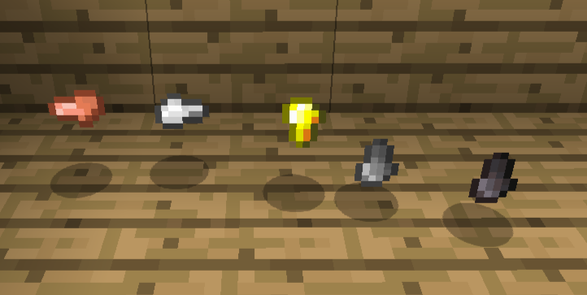

- Iron, Copper and Steel Ingots split into **9 Nuggets**
- **9 matching Nuggets** craft back into an Ingot

#### Chains

Copper Chain, Iron Chain, Golden Chain, Steel Chain and Nethersteel Chain backport the later vanilla Chain block across the current metal progression.

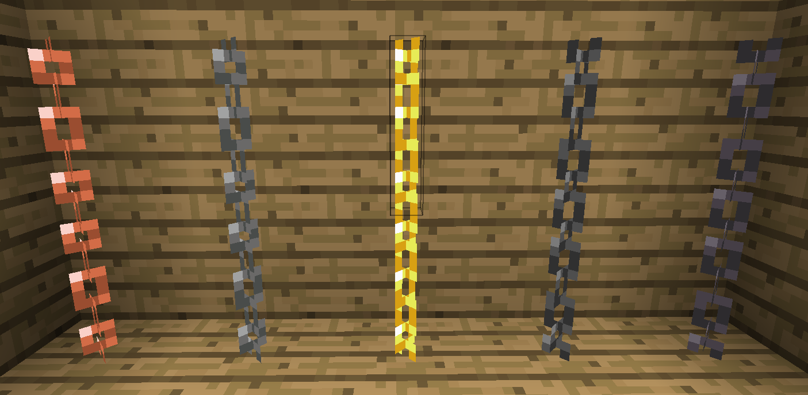
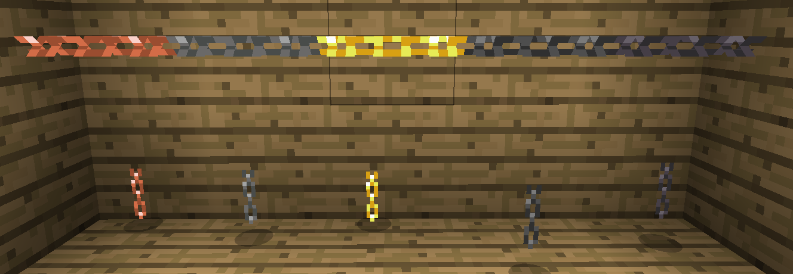

- Later vanilla crossed-plane Chain shape and chain sounds
- Vertical or horizontal placement depending on used face
- Hardness/resistance follows the matching storage block
- Chain Links can substitute for Nuggets in crafting

Chain recipes

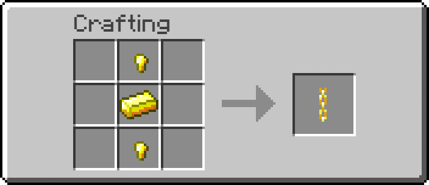
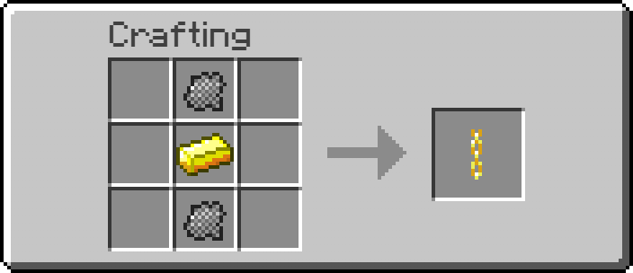

#### Bars

Copper, Golden, Steel and Nethersteel Bars extend vanilla Iron Bars across the metal set.

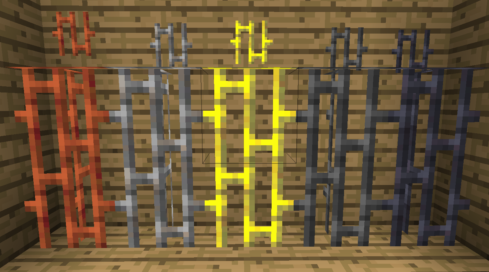

- All five metal Bar types connect to each other
- Otherwise use normal Iron Bars placement and pane behavior
- Hardness/resistance follows matching storage block
- Six matching Ingots craft **16 Bars**

#### Amulets

Amulets are a small equipment category with one dedicated slot. Each provides a focused passive or proc-based benefit rather than more armor points.

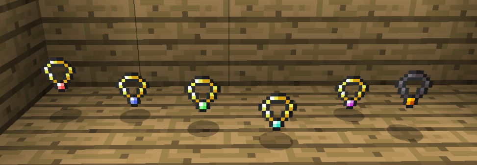

- Ruby, Sapphire, Emerald, Diamond, Amethyst and Nether Amulets are available through Survival
- Gemstone Amulets use **5 Golden Chains** and the matching gemstone
- Nether Amulet uses **5 Nethersteel Chains**, two Blaze Powder and a Ghast Tear
- Experimental Ender Amulet remains Creative-only
- All use ordinary durability and Anvil repair rules

##### Amulet slot

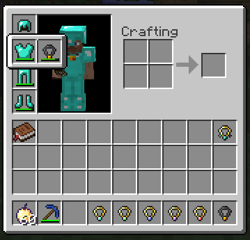
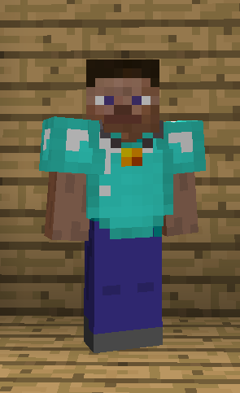

- Attached to the Chestplate slot rather than a permanent extra inventory column
- Hovering the Chestplate expands a small two-slot group
- Shift-clicking an Amulet can equip it directly
- Equipped Amulets render on the torso with fit adjustments for armor and Quiver
- Normal equipped-item save, death and drop behavior
- `Equipment Silhouettes` in `2011 Edition Features` controls slot silhouettes only

The interaction is heavily based on the [Trinkets](https://www.curseforge.com/minecraft/mc-mods/trinkets) equipment-slot presentation, reimplemented around the Release 1.0 inventory.

##### Amulet effects

| Amulet | Durability | Effect | Anvil repair |
| --- | ---: | --- | --- |
| Ruby | 108 | Successful melee hits have a **25% chance** to deal **1 additional damage point**; durability is spent only on a proc. | Ruby |
| Sapphire | 168 | Eligible held equipment/armor has a **25% chance** to redirect 1 durability damage to the Amulet. | Sapphire |
| Emerald | 132 | Correct tools break blocks about **10% faster**; qualifying blocks have a **25% chance** to cost Amulet durability. | Emerald |
| Diamond | 198 | Reduces suitable incoming damage by **5%**; durability is spent only when damage is prevented. | Diamond |
| Amethyst | 108 | Collected XP can be diverted into repairing damaged held/equipped gear; diverted XP is consumed and costs Amulet durability. | Amethyst |
| Nether | 240 | Direct melee attackers are ignited for **2 seconds**. | Ghast Tear |
| Ender *(Creative-only)* | 64 | Suitable incoming damage has a **25% chance** to be avoided through an Enderman-style defensive teleport; cannot trigger while wet or against void damage. | Ender Pearl |

---

### Part 6

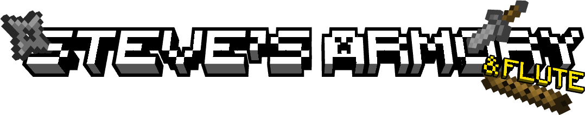

Steve's Armory expands combat with simple melee, thrown and ranged alternatives that still use Release 1.0's straightforward item rules. The Flute closes the part as a deliberately non-combat side item: a playable instrument with a small set of utility enchantments.

#### Daggers

Daggers are cheaper, weaker alternatives to Swords that can also be thrown.

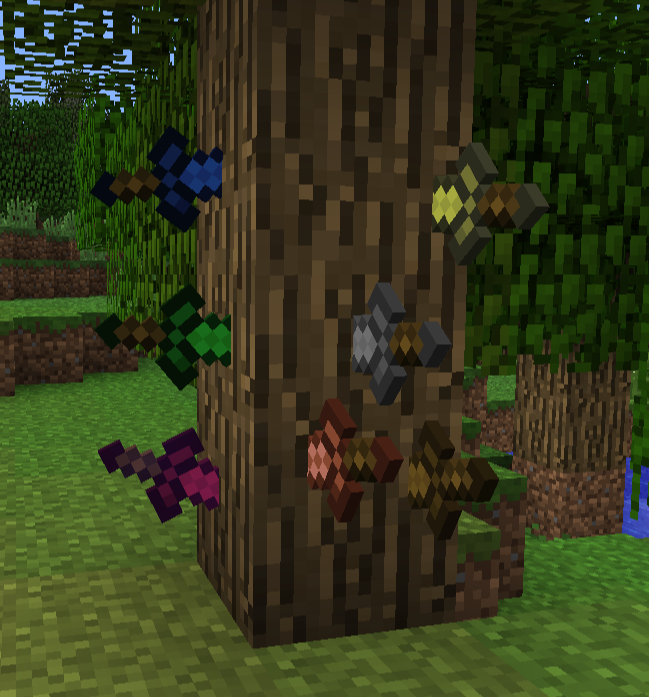

- Available across the current material progression, with matching tier recipes, durability and damage
- Use normal melee attacks and can be thrown instantly with right-click
- A thrown Dagger sticks into blocks and can be recovered
- On an entity hit, it deals damage once, deflects a short distance, then falls or lodges in the next surface
- It can already be recovered while deflecting or falling after an entity hit
- Enchantments apply to thrown hits where relevant
- Work from Dispensers and can be carried on the Belt

**Return** is a rare Dagger-only enchantment. After an enchanted Dagger hits, deflects or lodges, it waits briefly, loosens with a wobble and flies back hilt-first toward its original thrower.

Recipe and more Dagger views

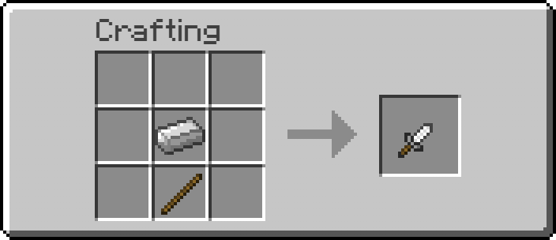
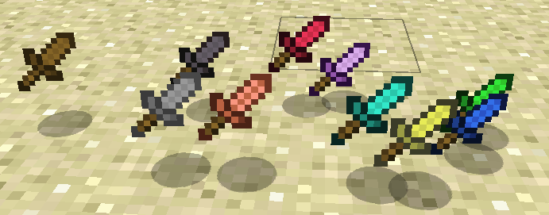
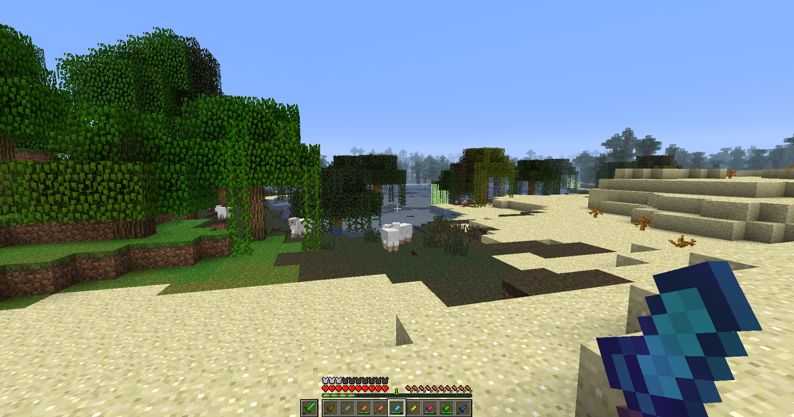
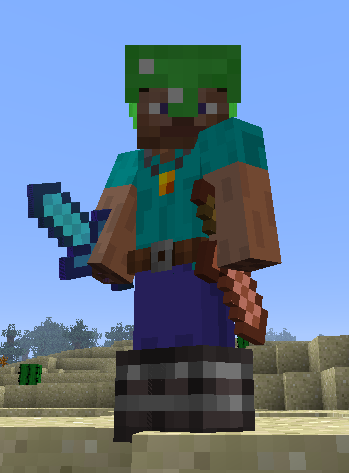

#### Shurikens

Shurikens are lightweight ranged-only throwables built around fast repeated throws instead of Bow-style charging.

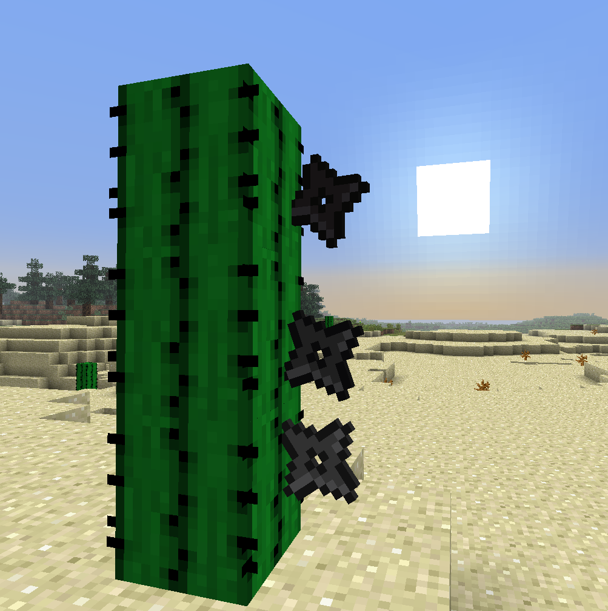

- Available in **Iron, Steel and Nethersteel**
- Four matching Nuggets in a diamond pattern craft Shurikens
- Stack to **16**
- Right-click throws one instantly
- Deal less damage than Daggers
- Spin in flight
- Hitting an entity consumes the Shuriken; missing leaves it stuck and recoverable
- If the supporting block is removed, it falls rather than restarting its throwing spin
- No enchantments and no Quiver support
- Work from Dispensers and can be carried on the Belt

Example recipe

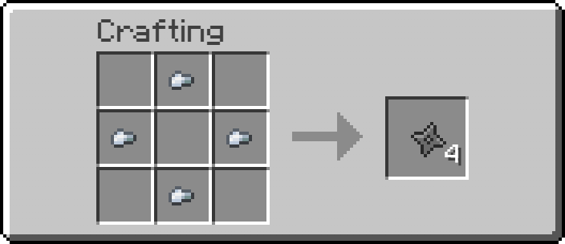

#### Blackpowder Bombs

Blackpowder Bombs are small throwable explosives: mobile and easier to place than TNT, but deliberately worse at demolition.

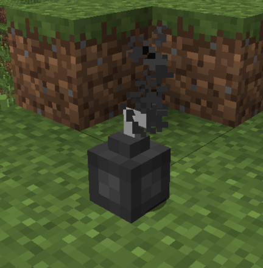

- Stack to **16**
- Right-click throws and lights the Bomb immediately
- **2 second / 40 tick fuse**
- Short, heavy throw with gravity and modest bouncing
- Cannot be recovered once lit
- TNT-style fuse smoke, flashing and final swelling before detonation
- Terrain explosion strength **2.0**, against TNT's 4.0
- Entity damage is strengthened separately so close hits remain dangerous
- Do not create fire
- Water uses the normal vanilla explosion protection rules
- Work from Dispensers
- Do not fit the Belt
- Held, thrown and dropped appearances can use either the sprite or optional 3D model; GUI icons always remain 2D

##### Blackpowder

Blackpowder is the prepared explosive mixture used by Bombs.

- **Gunpowder + Charcoal + Black Ink** is a shapeless recipe for **3 Blackpowder**

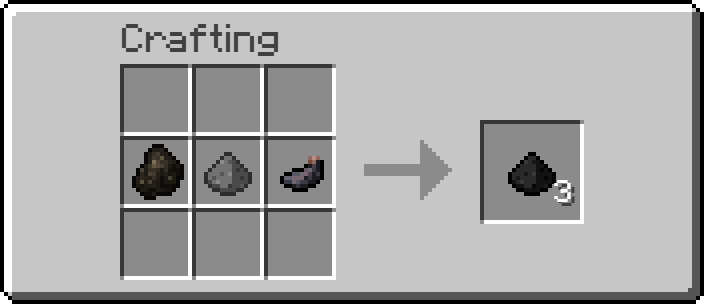

##### Fire Charge

The later vanilla Fire Charge is backported as the Bomb's built-in ignition component.

- **Gunpowder + Blaze Powder + Coal or Charcoal** crafts **3 Fire Charges**
- Using one on a suitable surface places Fire and consumes it
- A Dispenser launches it as a small fireball
- Later direct right-click TNT ignition is intentionally not added

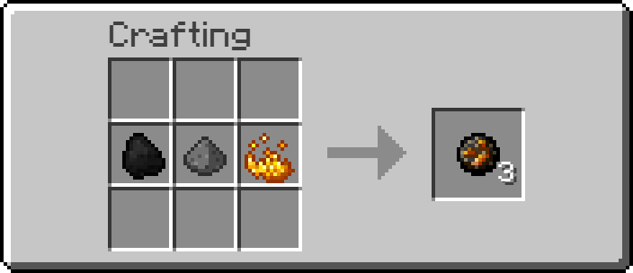
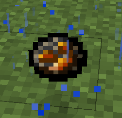

A Blackpowder Bomb uses **4 Blackpowder, 4 Steel Nuggets and 1 Fire Charge** in the center of its TNT-like checkerboard recipe.

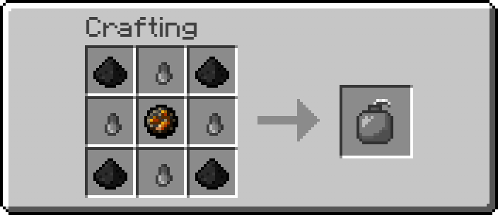

Sprite and 3D model views

**Sprite**

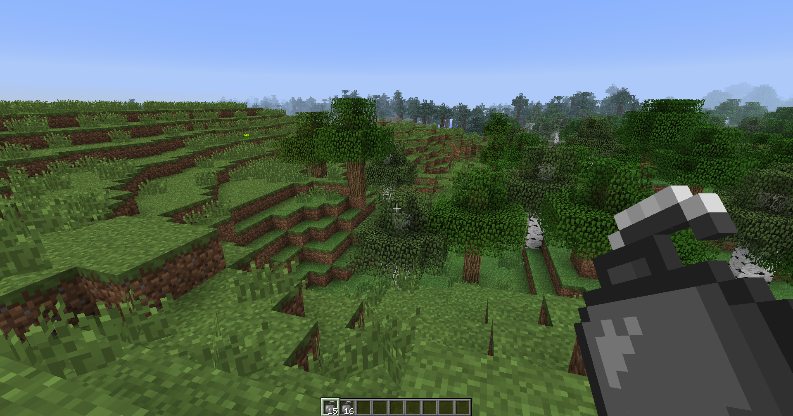
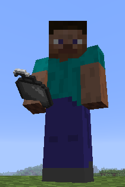
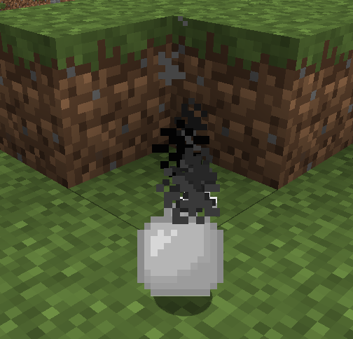

**3D**

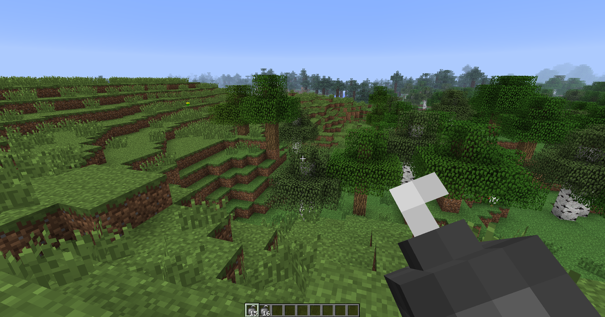
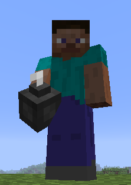

#### Crossbow

The Crossbow is a slow-loading counterpart to the Bow, backported from later Minecraft and adapted to the current Steel progression.

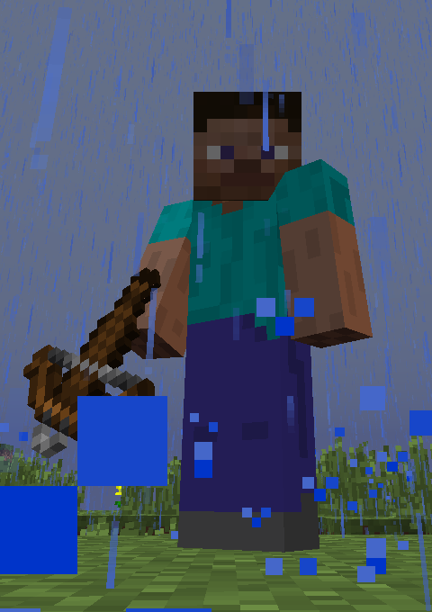

- Crafted with **two Sticks, three String and one Steel Ingot**
- Hold use to load; once loading finishes the Crossbow is cocked and ready
- A loaded Crossbow keeps its shot indefinitely, including while put away, and fires on the next use
- Loading slows the player; a fully loaded Crossbow does not
- Uses fixed launch power of **3.5 blocks/tick** instead of the Bow's variable draw
- Uses ordinary Arrows and Crystal Arrows, including ammunition supplied by the Quiver
- Loaded and charging states use dedicated staged sprites and loading sounds
- **465 durability** and **1 enchantability**
- Can be repaired with a **Steel Ingot** or another Crossbow

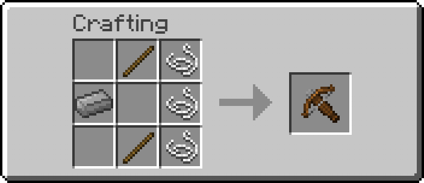

Loaded and dropped views

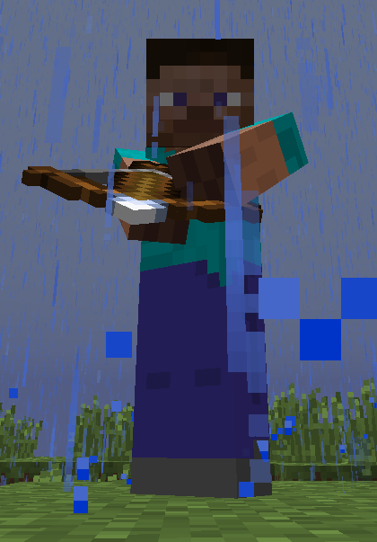
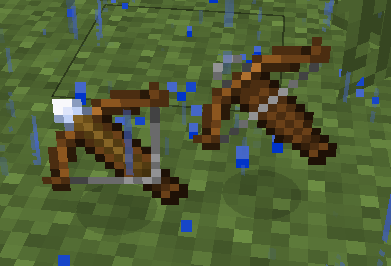

##### Crossbow enchantments

- **Quick Charge I-III** reduces loading time. Quick Charge III cannot be rolled directly at the Enchanting Table and is obtained by combining lower levels at the Anvil
- **Piercing I-IV** lets a fired Arrow pass through targets and continue flying
- **Multishot I** fires three Arrows in a spread for one piece of ammunition. It costs **3 durability** per shot, and the two outer Arrows cannot be picked up. Multishot and Piercing are mutually exclusive
- **Unbreaking I-III** can also be applied; 2011 Edition widens Release 1.0's tool-only Unbreaking scope to include the Crossbow

#### Flute

The Flute is a playable instrument with no direct combat use.

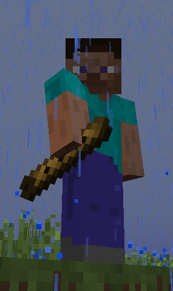

- Crafted from **two Sticks**
- Right-click plays a note
- Looking up or down chooses the pitch: nine notes of a **minor pentatonic scale** spread across a 60-degree vertical band
- Holding use keeps playing at a steady tempo, and looking around can slide through the scale mid-phrase
- Playing roots the player in place
- Notes spawn Note Block-style particles colored by pitch
- **256 durability**, losing one point per played note
- Repairs with a **Stick** or another Flute
- Can be stored on the Belt
- Held and Belt appearance can use the normal sprite or optional 3D model

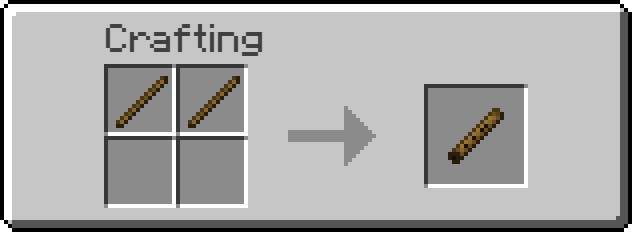

Flute views

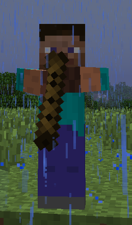
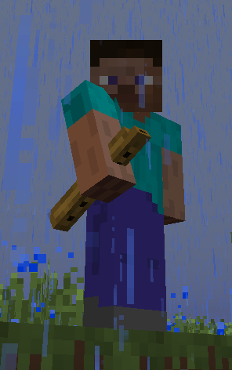
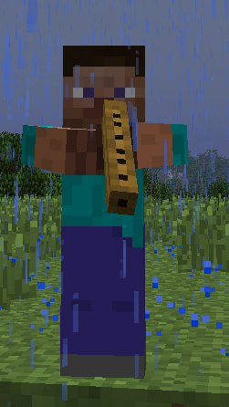

##### Flute enchantments

- **Charm I-II** makes nearby passive animals follow while the Flute is played, with ranges of **7 / 10 blocks**
- **Growth I-II** coaxes nearby crops forward one growth stage at a time while playing
- **Soothing I-II** heals **half a heart at a time** while the player is actually injured
- **Unbreaking I-III** can also be applied

Every Flute effect is tied to actual notes being played, and every note still costs durability. Healing, growing crops or charming animals therefore spends the instrument's finite life rather than becoming a free passive aura.

---

## Credits

(Many 2011 Edition backports and features adapt, recolor or rework visuals and sounds from vanilla Minecraft and later Minecraft versions.)

- Copper armor item sprites are based on axy's Traditional Armour
- Copper ingot and block textures are based on artwork by JM140628
- Block of Steel texture is based on [this NovaSkin Steel Block texture](https://minecraft.novaskin.me/post/4893925167/steel-block)
- Blast Furnace, Anvil and Steel Hammer visuals are recolored/retextured vanilla Minecraft assets
- Grindstone model, GUI and sounds are adapted from later vanilla Minecraft assets, with its textures reworked/recolored for 2011 Edition
- Fishing Hat item sprite is based on the Angler's Hat from [Artifacts](https://modrinth.com/mod/artifacts)
- Fishing Trap catch sounds are edited variants of [Bubble in Water](https://pixabay.com/sound-effects/nature-bubble-in-water-422579/) on Pixabay
- Muffled Boots and Ninja Boots use recolored vanilla boot assets; their optional stealth footsteps are processed variants of vanilla footstep sounds
- Belt item sprite is heavily based on and recolored from [Tool Belt Retextured](https://www.curseforge.com/minecraft/texture-packs/tool-belt-retextured)
- Chain Links texture is inspired by [Better Than Adventure](https://www.betterthanadventure.net/)
- Crystal textures are based on artwork by [yptsh](https://x.com/yptsh/status/1623341389122510848)
- Pouch, Spyglass and Bottle o' Enchanting assets are based on assets from later Minecraft versions
- The Recipe Book system is heavily inspired by the Knowledge Book from Minecraft Infinite (formerly Infdev+), part of [Legacy+](https://legacy-plus.dejvoss.cz/) by Yoniko / VesuviusVenox
- Recipe Book GUI/book visuals are adapted from the vanilla Enchantment Table book, and its open/close/page sounds are adapted from later vanilla Minecraft assets
- The Lectern is adapted from the later vanilla Minecraft Lectern design and rendering behavior, with custom 2011 Edition textures
- Tarot of Death uses an adapted Totem of Undying activation sound from later Minecraft versions
- Rope item texture is heavily based on and recolored from [Farmer's Delight](https://www.curseforge.com/minecraft/mc-mods/farmers-delight)
- Placed Rope texture is heavily based on and recolored from [this NovaSkin Rope texture](https://minecraft.novaskin.me/post/5166333130/rope)
- Stone of Return item sprite is inspired by [Hearthstone](https://www.curseforge.com/minecraft/mc-mods/hearthstone)
- Backpack item sprite was inspired by [Nemo's Backpacks](https://modrinth.com/mod/nemos-backpacks/gallery)
- Backpack open sound: [Open Bag Sound](https://pixabay.com/sound-effects/film-special-effects-open-bag-sound-39216/) on Pixabay
- Backpack close sound: [Bag Drop and Remove](https://pixabay.com/sound-effects/film-special-effects-bag-drop-and-remove-70142/) on Pixabay
- Quiver and Crystal Arrow visuals are recolored/retextured from existing Minecraft assets
- Netherskull and Netherskull Guard textures are heavily based on and inspired by [this NovaSkin skin](https://minecraft.novaskin.me/post/4644643339763712/gggggg) and [this NovaSkin skeleton](https://minecraft.novaskin.me/post/4625788724838400/skeleton-2), both by the same creator
- Emerald, Ruby and Sapphire ores, gems, storage blocks, tools and armor are recolored/retextured from vanilla Minecraft assets
- Ash, Nether Stone and Nethersteel visuals are recolored/retextured vanilla Minecraft assets
- Chain visuals and sounds are adapted from later vanilla Minecraft assets, with material variants recolored/reworked for 2011 Edition
- The Amulet equipment-slot interaction and expandable Chestplate/Amulet presentation are heavily based on the [Trinkets](https://www.curseforge.com/minecraft/mc-mods/trinkets) equipment-slot UI/mechanic; the 2011 Edition implementation and 1.0-style presentation are custom
- Ender Berry Bush visuals and sounds are adapted/recolored from the later vanilla Minecraft Sweet Berry Bush
- Ender Shade texture is heavily based on and inspired by [this NovaSkin Ghost / Entity 303 skin](https://minecraft.novaskin.me/post/3524473209/ghost-entity-303)
- Dagger throw sound is an edited/cut variant of [Knife Throw](https://pixabay.com/sound-effects/film-special-effects-knife-throw-88751/) on Pixabay
- Dagger impact sound is based on [Knife Throw 1](https://pixabay.com/sound-effects/film-special-effects-knife-throw-1-105221/) on Pixabay
- Shuriken visuals are heavily based on and retextured from the Shuriken texture shown on [Minecraft Fanon Wiki](https://minecraftfanon.fandom.com/wiki/Shurikens)
- Crossbow visuals, loading/shoot sounds, Quick Charge sounds and Fire Charge assets are adapted/backported from later vanilla Minecraft assets
- Flute play sound is based on [Musical Flute](https://pixabay.com/sound-effects/musical-flute-102230/) on Pixabay

If an original creator would prefer an inspired, adapted or recolored asset not be used here, I am happy to change or remove it.
