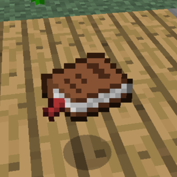

# Development Log

Minecraft: Release+, continued through larger updates and smaller feature parts. This log follows the project by update, then by feature.

## Contents

- [Update #1](#update-1)
  - [Part 1](#part-1)
    - [Bedside Table](#bedside-table)
    - [Glowstone Lamp](#glowstone-lamp)
  - [Part 2](#part-2)
    - [Flint progression](#flint-progression)
      - [Flint Pebbles](#flint-pebbles)
      - [Flint tools](#flint-tools)
    - [Stone progression](#stone-progression)
    - [Copper progression](#copper-progression)
      - [Copper tools](#copper-tools)
      - [Copper armor](#copper-armor)
    - [Ore generation](#ore-generation)
    - [Armor progression](#armor-progression)
    - [Chainmail](#chainmail)
    - [Mutton and Wool](#mutton-and-wool)
    - [Achievements](#achievements)
  - [Part 3](#part-3)
    - [Steel progression](#steel-progression)
      - [Blast Furnace](#blast-furnace)
      - [Anvil](#anvil)
    - [Grindstone](#grindstone)
    - [Crystal](#crystal)
    - [Spyglass](#spyglass)
    - [Release+ Features](#release-features)
    - [Pouch](#pouch)
    - [Hard Leather](#hard-leather)
    - [Fishing Hat](#fishing-hat)
    - [Fishing Trap](#fishing-trap)
    - [Muffled Boots](#muffled-boots)
    - [Ninja Boots](#ninja-boots)
    - [Belt](#belt)
    - [Backpack](#backpack)
      - [Worn and placed](#worn-and-placed)
      - [Inventory](#inventory)
    - [Recipe Book](#recipe-book)
    - [Stone of Return](#stone-of-return)
    - [Bottle o' Enchanting](#bottle-o-enchanting)
    - [Rope](#rope)
    - [Tarot of Death](#tarot-of-death)
- [Credits](#credits)

## Update #1

**Status:** In development. Parts 1 and 2 are feature-complete for now. Part 3 is in progress. Tested in singleplayer. Not tested in multiplayer.

Proper Progression rebuilds early-game progression and then expands it with utility equipment that still feels at home in Release 1.0.

---

### Part 1

A Minecraft 1.0 adaptation of [Beds, but Endgame](https://github.com/passziff/beds-but-endgame).

- A Bedside Table beside the head of the bed is required to sleep
- Beds still set the player's respawn point when sleep is denied
- A Glowstone Lamp on a Bedside Table prevents nightmares
- Nightmares wake the player and block sleeping again until daytime

#### Bedside Table

The Bedside Table is the main requirement for sleeping and sits beside the head of the bed.

Recipe

#### Glowstone Lamp

A Glowstone Lamp placed on the Bedside Table prevents nightmares.

Recipe

Current nightmare balance

| Setting | Current value |
| --- | ---: |
| Nightmare chance | 40% |
| No nightmare when dawn is within | 1200 ticks |
| Time advanced by a nightmare | 600 ticks |
| Full sleep before nightmare check | 100 ticks |

A nightmare locks sleeping again until daytime. A Glowstone Lamp on the Bedside Table prevents it.

---

### Part 2

This part rebuilds the early mining ladder around Flint, Stone and Copper, while tightening the progression into Iron, Gold and Diamond.

#### Flint progression

Flint forms the first tool tier before Stone. Only Flint Pickaxes and Axes replace their wooden equivalents.

- Flint can be placed as small pebbles
- Flint Pebbles generate naturally on the surface and around exposed underground sediment
- Breaking a Flint Pebble returns one Flint

##### Flint Pebbles

There are three variants for visual diversity.

Current Flint Pebble generation

- Shoreline Flint is limited to 25% of eligible shoreline chunks
- Underground Flint is limited to at most 2 pebbles per chunk
- Underground generation favors gravel, then dirt/sand and sediment-adjacent stone
- Isolated ordinary cave stone does not generate Flint Pebbles

##### Flint tools

Tool views and recipes

Flint tool stats

Flint keeps the old Wood-tier statistics:

| Stat | Flint |
| --- | ---: |
| Harvest level | 0 |
| Durability | 59 |
| Mining speed | 2.0 |
| Material damage bonus | 0 |
| Enchantability | 15 |

#### Stone progression

Cobblestone must be smelted into Stone before any Stone tools can be crafted.

Current pickaxe harvest progression

| Tier | Harvest level | Unlocks |
| --- | ---: | --- |
| Flint | 0 | Stone / basic mining |
| Stone | 1 | Copper |
| Copper | 2 | Iron |
| Iron | 3 | Gold |
| Gold | 4 | Diamond |
| Diamond | 5 | Obsidian |

#### Copper progression

Copper forms a complete tool and armor tier between Stone and Iron.

- Copper Ore drops itself and smelts into one Copper Ingot
- Nine Copper Ingots craft into a Block of Copper and can be crafted back
- Copper Ore requires a Stone Pickaxe or better
- Copper tools are stronger than Stone and weaker than Iron
- Copper armor sits between Leather and Chainmail

More Copper visuals

##### Copper tools

Example recipe

Copper tool stats

| Stat | Copper |
| --- | ---: |
| Harvest level | 2 |
| Durability | 190 |
| Mining speed | 5.0 |
| Material damage bonus | 1 |
| Enchantability | 10 |

##### Copper armor

More Copper armor visuals

Copper armor stats

| Piece | Protection | Durability |
| --- | ---: | ---: |
| Helmet | 2 | 110 |
| Chestplate | 4 | 160 |
| Leggings | 2 | 150 |
| Boots | 1 | 130 |
| **Full set** | **9** | **550** |

Copper armor uses a durability multiplier of 10 and enchantability of 12.

Copper block hardness

| Block | Hardness |
| --- | ---: |
| Copper Ore | 2.5 |
| Iron Ore | 3.0 |
| Block of Copper | 4.0 |
| Block of Iron | 5.0 |

#### Ore generation

Copper and the existing ores were rebalanced around the new progression.

Current ore generation values

These are the current generation values after the first progression balance pass:

| Ore | Attempts / chance | Vein size | Height |
| --- | --- | ---: | --- |
| Coal | 20 attempts/chunk | 16 | Y 0-127 |
| Copper, main | 22 attempts/chunk | 7 | Y 0-55 |
| Copper, upper | 22 attempts/chunk | 6 | Y 56-127 |
| Iron, main | 9 attempts/chunk | 8 | Y 0-55 |
| Iron, rare upper | 25% chance/chunk, 1 attempt | 4 | Y 56-95 |
| Gold, main | 2 attempts/chunk | 8 | Y 0-31 |
| Gold, rare upper | 25% chance/chunk, 1 attempt | 3 | Y 32-47 |
| Redstone | 8 attempts/chunk | 7 | Y 0-15 |
| Diamond | 1 attempt/chunk | 7 | Y 0-15 |
| Lapis | Vanilla | Vanilla | Vanilla |

Rare upper Iron generation is limited by the local terrain height.

#### Armor progression

Gold has been rebalanced into a real post-Iron armor tier while intentionally keeping its low durability and high enchantability.

Armor visuals also received a consistency pass:

- The Leather Helmet no longer shows the nose guard used by the heavier helmets
- Iron, Gold, Diamond and Copper helmet item sprites were adjusted to better match their worn shapes and the Release 1.0 item style
- Leather armor was recolored to match normal Leather more closely and distinguish it from Hard Leather

More armor visual changes

Current armor progression

| Material | Full-set protection | Durability multiplier | Enchantability |
| --- | ---: | ---: | ---: |
| Leather | 7 | 5 | 15 |
| Copper | 9 | 10 | 12 |
| Chainmail | 12 | 15 | 12 |
| Iron | 15 | 15 | 9 |
| Gold | 16 | 7 | 25 |
| Diamond | 20 | 33 | 10 |

#### Chainmail

Chainmail can now be obtained through normal Survival gameplay.

- Chainmail uses the normal armor recipe shapes with Chain Links
- Chainmail's existing protection and durability values are unchanged

Example recipe

Current Chain Link balance

- Any Zombie has a 20% chance to drop Chain Links
- A successful drop gives 1-3 Chain Links before Looting
- Looting increases the amount from a successful Chain Link drop
- A full Chainmail set costs 24 Chain Links

#### Mutton and Wool

Sheep now provide food instead of an immediate source of Wool.

- Burning sheep drop Cooked Mutton
- Shearing remains the main source of Wool
- Nine String can be crafted into one Wool

Current Mutton and Wool balance

- Sheep drop 1-2 Mutton before Looting instead of Wool when killed
- Shearing gives the normal 2-4 Wool
- Raw Mutton restores 2 hunger with 0.3 saturation
- Cooked Mutton restores 6 hunger with 0.8 saturation

#### Achievements

The achievement tree now guides the changed progression and sleeping mechanics without requiring an outside guide.

Main progression:

`Time to Mine!` → `Hot Topic` → `Getting an Upgrade` → `Copper Age` → `Acquire Hardware` → `Gold Rush` → `DIAMONDS!`

Side achievements:

- `Home Sweet Home` branches from `Benchmarking`
- `Bedside Manners` branches from `DIAMONDS!`
- `Sweet Dreams` branches from `We Need to Go Deeper`

---

### Part 3

New equipment, workshop systems and utility items for different playstyles, including backports and alternate takes on features added much later in Minecraft.

#### Steel progression

Steel adds a workshop-focused step beyond Iron without becoming another tool or armor tier.

- Iron Ingots can be turned into Steel Ingots in a Blast Furnace
- Nine Steel Ingots craft into a Block of Steel and can be crafted back
- Flint and Steel now uses a Steel Ingot instead of Iron and has a matching Steel-colored sprite
- The Cauldron now uses Steel Ingots instead of Iron Ingots
- Steel is used for workshop equipment including the Anvil and Steel Hammer

Flint and Steel recipe

Cauldron recipe

##### Blast Furnace

The Blast Furnace is the main way to make Steel and a faster furnace for ores.

- Ores smelt at twice the speed of a normal Furnace
- Iron Ingots become Steel Ingots only while the Blast Furnace is burning Charcoal, a Blaze Rod or a Lava Bucket
- A Lava Bucket used for Steel leaves its empty Bucket behind
- Charcoal has a distinct Release+ texture to separate it from Coal
- Furnaces and Blast Furnaces have operating sounds that can be disabled in `Release+ Features`

Recipe and GUI

##### Anvil

The Anvil backports later repair, renaming and enchantment-combining functionality into Release 1.0, with the Steel Hammer as its dedicated workshop tool.

- A Steel Hammer must be installed in the Anvil before it can be used
- The installed Hammer stays in the Anvil and is visible on the block in-world
- Repairs, compatible enchantment combinations and renaming cost experience levels
- Each successful operation damages the Steel Hammer; a fresh Hammer lasts 20 operations
- Unsupported Anvils fall like Sand or Gravel, damage entities on impact and can damage or break themselves from a fall
- The installed Steel Hammer, Anvil damage stage and facing are preserved while the Anvil falls
- The Anvil can become damaged and eventually break through use or impact

Recipes, GUI and damage

#### Grindstone

The Grindstone adds a dedicated repair and disenchanting workstation alongside the Anvil.

- Two matching damageable items can be combined for a stronger repair than the crafting grid
- Combining items in the Grindstone removes enchantments and returns experience from them
- A custom name from the upper input item is kept on the result
- It can be mounted on the floor, walls or ceiling and drops if its support is removed
- The recipe uses a Sandstone Slab and accepts any vanilla Log; the model uses Oak Log for its wooden supports
- Using the Grindstone plays dedicated use sounds

Recipe, GUI and placements

Current repair system

| Method | Repair amount | Enchantments | Custom name | Cost / role |
| --- | --- | --- | --- | --- |
| Crafting grid | Remaining durability of both items + **5%** of maximum durability | Removed | Removed | Free basic repair |
| Grindstone | Remaining durability of both items + **10%** of maximum durability | Removed; XP is returned | Upper item's name is kept | Dedicated destructive repair / disenchanting |
| Anvil, item + item | Remaining durability of both items + **12%** of maximum durability | Preserved and compatible enchantments can be combined | Preserved / can be changed | Costs XP, Steel Hammer durability and Anvil wear |
| Anvil, item + material | Up to **25%** of maximum durability per material | Preserved | Preserved / can be changed | Only the materials actually needed are consumed |

Current Anvil repair materials:

| Equipment | Repair material |
| --- | --- |
| Wooden tools | Wooden Planks |
| Flint tools | Flint |
| Stone tools | Stone |
| Leather armor | Leather |
| Fishing Hat / Muffled Boots | Hard Leather |
| Ninja Boots | Steel Ingot |
| Chainmail | Chain Links |
| Copper equipment | Copper Ingot |
| Iron equipment and Shears | Iron Ingot |
| Gold equipment | Gold Ingot |
| Diamond equipment | Diamond |
| Flint and Steel / Steel Hammer | Steel Ingot |

#### Crystal

Crystal is a new utility material used for gadgets rather than another tool or armor tier.

- Rare Crystal Ore generates underground in small veins
- Exposed Crystal Ore can generate with a Crystal Deposit on any open face
- Crystal Ore and Deposits require a Copper Pickaxe or better to harvest
- Silk Touch gives the Crystal Ore block or a full Crystal from a Deposit
- Fortune affects Crystal Shard drops
- Four Crystal Shards craft into one Crystal, and a Crystal can be split back into four Shards
- Crystals can be placed as Crystal Deposits
- Crystal Deposits can attach to exposed faces and use matching collision

Crystal visuals and recipes

Current Crystal generation and drop values

| Setting | Current value |
| --- | --- |
| Ore attempts | 2 per chunk |
| Maximum vein size | 3 |
| Generation height | Y 0-96 |
| Deposit chance on exposed ore | 50% |
| Crystal Ore drop | 1-2 Crystal Shards |
| Crystal Deposit drop | 2-4 Crystal Shards |
| Minimum harvest tier | Copper |

A Deposit only generates into air and at most one is placed per exposed Crystal Ore block. Player-placed Deposits use the same harvesting rules as natural ones.

#### Spyglass

A backport of the modern Spyglass, adapted to the look and controls of Release 1.0.

- Hold use to zoom through the Spyglass
- Includes the scope view, use sounds and a dedicated player pose
- Its held-item appearance can be switched between a flat 1.0-style sprite and the original 3D model

Spyglass views

**First person**

**Third-person sprite**

**Third-person 3D model**

#### Release+ Features

Release+-specific visual and sound options are grouped under `Release+ Features` on the main Options screen.

- Spyglass: Sprite or 3D
- Tarot: three cosmetic texture variants
- Charcoal: Release+ or Vanilla
- Furnace Sounds: ON or OFF
- Stealth Footsteps: ON or OFF (default ON)
- Belt Item Display: ON or OFF (default ON)
- These settings do not change gameplay

#### Pouch

A backport of the modern Bundle for carrying mixed small stacks without adding another inventory row.

- Stores up to one stack's worth of mixed items
- Items can be inserted and removed directly from the inventory
- Scrolling while hovering the Pouch selects which stored item to remove
- The tooltip shows up to 12 item types at once and shifts through additional contents while scrolling
- Pouches cannot be stored inside other Pouches
- Backpacks cannot be stored inside Pouches

Recipe

Current Pouch capacity rules

- Total capacity is 64 units
- An item that normally stacks to 64 uses 1 unit each
- An item that normally stacks to 16 uses 4 units each
- An unstackable item uses the full Pouch capacity
- The contents preview shows up to 12 stored item types at once, while selection can scroll through all stored types

#### Hard Leather

Hard Leather is a reinforced form of Leather used for sturdier utility equipment. Normal Leather can be smelted into Hard Leather in a Furnace.

- Hard Leather is used by the Backpack, Fishing Hat, Belt and Muffled Boots
- Books now use Hard Leather instead of normal Leather

#### Fishing Hat

The Fishing Hat is a reinforced Leather Helmet for players who spend time fishing.

- Provides the same armor protection as a Leather Helmet
- Has **90 durability**, placing it above Leather but below Iron
- A successful catch has a **25% chance not to consume Fishing Rod durability**
- Uses the normal helmet enchantments available to Leather armor
- Can be repaired with Hard Leather at an Anvil

Recipe and inventory view

#### Fishing Trap

The Fishing Trap is a passive fishing tool that catches Raw Fish while set in suitable water.

- Can be placed dry on solid ground or directly into water, with water occupying the same block as the trap
- Only catches while waterlogged with water at its open side
- Stores up to **3 Raw Fish**
- Bubble bursts show stored catches, and a dedicated catch sound plays when a new fish is caught
- Right-clicking removes one caught fish at a time
- Rain improves the catch rate
- Breaking the trap drops any stored catches

Recipe and more views

#### Muffled Boots

Muffled Boots are padded Hard Leather utility boots for quieter movement and easier sneaking around hostile mobs.

- Provide the same **1 armor point** as Leather Boots
- Have **105 durability**
- The recipe accepts any Wool color
- While sneaking, an ordinary hostile mob's 16-block detection range is reduced to **14 blocks**
- Use softened versions of the normal surface footstep sounds while worn
- The custom footsteps can be disabled with `Stealth Footsteps` in `Release+ Features` without changing the stealth effect
- Can be repaired with Hard Leather at an Anvil

Recipe

#### Ninja Boots

Ninja Boots are the Steel-reinforced upgrade to Muffled Boots, trading a little more material investment for stronger stealth and protection.

- Provide **2 armor points**
- Have **125 durability**
- While sneaking, an ordinary hostile mob's 16-block detection range is reduced to **10 blocks**
- Use a stronger softened footstep treatment than Muffled Boots
- Their custom footsteps use the same `Stealth Footsteps` setting
- Can be repaired with a Steel Ingot at an Anvil

Recipe

#### Belt

The Belt is a lightweight Hard Leather equipment piece that gives up some leg protection in exchange for one dedicated carried-item slot.

- Equips in the leggings armor slot and provides **1 armor point**
- Has **123 durability**
- Holds one Sword, Axe, Pickaxe, Shovel, Hoe, pair of Shears or Steel Hammer
- Its dedicated slot appears beside the player inventory and as a separate slot to the left of the hotbar while occupied
- Pressing the configurable Belt key (`B` by default) switches to the stored item; pressing it again returns to the previous hotbar slot
- A stowed item is visibly carried on the Belt in third person and disappears from the Belt while selected
- `Belt Item Display` in `Release+ Features` can hide the visible stowed item without changing Belt mechanics
- Normal item pickups do not automatically fill the Belt slot
- If the Belt is removed or breaks while carrying an item, the stored item drops into the world

Recipe and inventory

More worn Belt views

#### Backpack

A wearable and placeable nine-slot container built around a physical Backpack rather than a permanent inventory expansion.

- Equips in the chest armor slot and provides no armor protection
- Adds nine persistent storage slots while worn
- Worn storage appears as a separate 3×3 panel beside the normal player inventory
- If the normal inventory is full, item pickups can overflow into the worn Backpack
- Can be placed in the world and opened as a 3×3 container
- Placement follows the player's rotation
- The placed flap uses a chest-style opening and closing animation with custom bag sounds
- Breaking or dropping a filled Backpack preserves its contents, including across relogs
- Backpacks cannot contain other Backpacks

Recipe

##### Worn and placed

##### Inventory

The same nine slots stay with the Backpack whether it is worn, carried or placed.

More Backpack views

#### Recipe Book

The Recipe Book is an early-game reference item for learning what items are and how they fit into the current crafting and smelting systems. Its design is heavily inspired by the Knowledge Book from Minecraft Infinite.

- Right-clicking the held book opens a dedicated Release 1.0-style book interface
- Placing an item into the inspection slot shows a short custom description on its About page
- The following pages show applicable **Smelting Recipes** and **Crafting Recipes**, including recipes that make the inspected item and recipes that use it
- Empty recipe categories are omitted
- Alternative ingredients and valid smelting fuels cycle in place; hovering pauses them and the mouse wheel can browse the available options
- The displayed recipes use the game's current recipe data, including interchangeable ingredients such as Cobblestone and Cobbled Netherstone
- Opening, closing and turning pages use dedicated book sounds

Recipe and GUI views

#### Stone of Return

The Stone of Return is an endgame utility item that turns Ender teleportation into a long-range way home.

- Crafted from End Stone, Ender Pearls and an Eye of Ender
- The crafted stone is inert until it is calibrated at an Enchanting Table
- Calibration I, II and III cost 10, 20 and 30 levels and improve the accuracy of the return
- Using a calibrated stone instantly returns the player toward their current respawn point, with accuracy determined by its Calibration level
- Departure and arrival use Ender-style portal clouds and teleport sounds
- The teleport deals the same damage as an Ender Pearl
- Every calibrated Stone of Return is single-use
- If the player's bed is no longer valid, the return falls back to world spawn

Recipe

Calibration

| Enchantment | Cost | Bookshelves | Return accuracy |
| --- | ---: | ---: | --- |
| Calibration I | 10 levels | 0 | Safe position within 256 blocks of the respawn point |
| Calibration II | 20 levels | 15 | Safe position within 64 blocks of the respawn point |
| Calibration III | 30 levels | 30 | Exact respawn point |

More Stone of Return views

#### Bottle o' Enchanting

The Bottle o' Enchanting has also been backported as a throwable source of experience. It is currently Creative-only; a place in Survival progression has not been decided yet.

#### Rope

Rope is a placeable climbing tool that hangs downward from existing terrain.

- Three String craft into two Rope
- Rope can hang from full blocks and bottom slabs
- Using its support or an existing Rope segment extends the line downward
- Rope can be climbed like a Ladder and uses cloth step sounds while climbing
- The lowest segment automatically uses a distinct loose-end texture
- Breaking its support drops the hanging Rope chain

Item and recipe

#### Tarot of Death

The Tarot of Death is my version/backport of the modern Totem of Undying, adapted for Release 1.0. It takes a fatal hit in the player's place.

- Works from any of the nine hotbar slots, not only the currently held one
- On activation, one Tarot is consumed and the player survives at 1 health
- Clears current status effects and extinguishes the player
- Gives Regeneration II and Fire Resistance for 10 seconds
- Uses a dedicated activation animation rising from the hotbar, green and gold particles, and sound
- Does not protect against void damage

There is currently no way to obtain the Tarot of Death in Survival.

More Tarot of Death views

**Held**

**Optional textures**

---

## Credits

- Copper armor item sprites are based on axy's Traditional Armour
- Copper ingot and block textures are based on artwork by JM140628
- Block of Steel texture is based on [this NovaSkin Steel Block texture](https://minecraft.novaskin.me/post/4893925167/steel-block)
- Blast Furnace, Anvil and Steel Hammer visuals are recolored/retextured vanilla Minecraft assets
- Grindstone model, GUI and sounds are adapted from later vanilla Minecraft assets, with its textures reworked/recolored for Release+
- Fishing Hat item sprite is based on the Angler's Hat from [Artifacts](https://modrinth.com/mod/artifacts)
- Fishing Trap catch sounds are edited variants of [Bubble in Water](https://pixabay.com/sound-effects/nature-bubble-in-water-422579/) on Pixabay
- Muffled Boots and Ninja Boots use recolored vanilla boot assets; their optional stealth footsteps are processed variants of vanilla footstep sounds
- Belt item sprite is heavily based on and recolored from [Tool Belt Retextured](https://www.curseforge.com/minecraft/texture-packs/tool-belt-retextured)
- Chain Links texture is inspired by [Better Than Adventure](https://www.betterthanadventure.net/)
- Crystal textures are based on artwork by [yptsh](https://x.com/yptsh/status/1623341389122510848)
- Pouch, Spyglass and Bottle o' Enchanting assets are based on assets from later Minecraft versions
- The Recipe Book system is heavily inspired by the Knowledge Book from Minecraft Infinite (formerly Infdev+), part of [Legacy+](https://legacy-plus.dejvoss.cz/) by Yoniko
- Recipe Book GUI/book visuals are adapted from the vanilla Enchantment Table book, and its open/close/page sounds are adapted from later vanilla Minecraft assets
- Tarot of Death uses an adapted Totem of Undying activation sound from later Minecraft versions
- Rope item texture is heavily based on and recolored from [Farmer's Delight](https://www.curseforge.com/minecraft/mc-mods/farmers-delight)
- Placed Rope texture is heavily based on and recolored from [this NovaSkin Rope texture](https://minecraft.novaskin.me/post/5166333130/rope)
- Stone of Return item sprite is inspired by [Hearthstone](https://www.curseforge.com/minecraft/mc-mods/hearthstone)
- Backpack item sprite was inspired by [Nemo's Backpacks](https://modrinth.com/mod/nemos-backpacks/gallery)
- Backpack open sound: [Open Bag Sound](https://pixabay.com/sound-effects/film-special-effects-open-bag-sound-39216/) on Pixabay
- Backpack close sound: [Bag Drop and Remove](https://pixabay.com/sound-effects/film-special-effects-bag-drop-and-remove-70142/) on Pixabay

If an original creator would prefer an inspired, adapted or recolored asset not be used here, I am happy to change or remove it.
