# Development Log

Minecraft: Release+, continued through larger updates and smaller feature parts. This log follows the project by update, then by feature.

## Contents

- [Update #1](#update-1)
  - [Part 1](#part-1)
    - [Bedside Table](#bedside-table)
    - [Glowstone Lamp](#glowstone-lamp)
  - [Part 2](#part-2)
    - [Flint progression](#flint-progression)
      - [Flint Pebbles](#flint-pebbles)
      - [Flint tools](#flint-tools)
    - [Stone progression](#stone-progression)
    - [Copper progression](#copper-progression)
      - [Copper tools](#copper-tools)
      - [Copper armor](#copper-armor)
    - [Ore generation](#ore-generation)
    - [Armor progression](#armor-progression)
    - [Chainmail](#chainmail)
    - [Mutton and Wool](#mutton-and-wool)
    - [Cooked Egg](#cooked-egg)
    - [Achievements](#achievements)
  - [Part 3](#part-3)
    - [Steel progression](#steel-progression)
      - [Blast Furnace](#blast-furnace)
      - [Anvil](#anvil)
    - [Grindstone](#grindstone)
    - [Crystal](#crystal)
      - [Glowing Crystal](#glowing-crystal)
      - [Crystal Arrows](#crystal-arrows)
    - [Brightvision Goggles](#brightvision-goggles)
    - [Spyglass](#spyglass)
    - [Release+ Features](#release-features)
    - [Pouch](#pouch)
    - [Hard Leather](#hard-leather)
    - [Fishing Hat](#fishing-hat)
    - [Fishing Trap](#fishing-trap)
    - [Muffled Boots](#muffled-boots)
    - [Ninja Boots](#ninja-boots)
    - [Belt](#belt)
    - [Backpack](#backpack)
      - [Worn and placed](#worn-and-placed)
      - [Inventory](#inventory)
    - [Quiver](#quiver)
    - [Recipe Book](#recipe-book)
    - [Recipe Compendium](#recipe-compendium)
    - [Lectern](#lectern)
    - [Stone of Return](#stone-of-return)
    - [Bottle o' Enchanting](#bottle-o-enchanting)
    - [Rope](#rope)
    - [Tarot of Death](#tarot-of-death)
    - [Part 3 achievements](#part-3-achievements)
  - [Part 4](#part-4)
    - [Regional Gemstones](#regional-gemstones)
      - [Gemstone tools](#gemstone-tools)
      - [Gemstone armor](#gemstone-armor)
    - [Nether Stone](#nether-stone)
    - [Ancient Scrap](#ancient-scrap)
    - [Nethersteel](#nethersteel)
      - [Nethersteel tools](#nethersteel-tools)
      - [Nethersteel armor](#nethersteel-armor)
    - [Nether Gold Ore](#nether-gold-ore)
    - [Netherskulls](#netherskulls)
      - [Netherskull Guard](#netherskull-guard)
      - [Netherskull Helmet](#netherskull-helmet)
    - [Ash](#ash)
    - [Bone Bush](#bone-bush)
    - [Soul Torch](#soul-torch)
    - [Nether Dungeon](#nether-dungeon)
    - [End terrain](#end-terrain)
    - [Amethyst](#amethyst)
      - [Amethyst tools](#amethyst-tools)
      - [Amethyst armor](#amethyst-armor)
    - [End Stone](#end-stone)
    - [Purple Stone](#purple-stone)
    - [Voidstone](#voidstone)
    - [End Spire](#end-spire)
    - [Ender Shade](#ender-shade)
    - [End Forest](#end-forest)
      - [End Wood](#end-wood)
      - [End vegetation](#end-vegetation)
      - [Ender Berries](#ender-berries)
    - [Part 4 achievements](#part-4-achievements)
- [Credits](#credits)

## Update #1

**Status:** In development. Parts 1, 2, 3 and 4 are feature-complete for now. Tested in singleplayer. Not tested in multiplayer.

Proper Progression rebuilds early-game progression, expands it with utility equipment that still feels at home in Release 1.0, and then carries it past Diamond and out into the dimensions.

---

### Part 1

A Minecraft 1.0 adaptation of [Beds, but Endgame](https://github.com/passziff/beds-but-endgame).

- A Bedside Table beside the head of the bed is required to sleep
- Beds still set the player's respawn point when sleep is denied
- A Glowstone Lamp on a Bedside Table prevents nightmares
- Nightmares wake the player and block sleeping again until daytime

#### Bedside Table

The Bedside Table is the main requirement for sleeping and sits beside the head of the bed.

Recipe

#### Glowstone Lamp

A Glowstone Lamp placed on the Bedside Table prevents nightmares.

Recipe

Current nightmare balance

| Setting | Current value |
| --- | ---: |
| Nightmare chance | 40% |
| No nightmare when dawn is within | 1200 ticks |
| Time advanced by a nightmare | 600 ticks |
| Full sleep before nightmare check | 100 ticks |

A nightmare locks sleeping again until daytime. A Glowstone Lamp on the Bedside Table prevents it.

---

### Part 2

This part rebuilds the early mining ladder around Flint, Stone and Copper, while tightening the progression into Iron and Diamond.

#### Flint progression

Flint forms the first tool tier before Stone. Only Flint Pickaxes and Axes replace their wooden equivalents.

- Flint can be placed as small pebbles
- Flint Pebbles generate naturally on the surface and around exposed underground sediment
- Breaking a Flint Pebble returns one Flint

##### Flint Pebbles

There are three variants for visual diversity.

Current Flint Pebble generation

- Shoreline Flint is limited to 25% of eligible shoreline chunks
- Underground Flint is limited to at most 2 pebbles per chunk
- Underground generation favors gravel, then dirt/sand and sediment-adjacent stone
- Isolated ordinary cave stone does not generate Flint Pebbles

##### Flint tools

Tool views and recipes

Flint tool stats

Flint keeps the old Wood-tier statistics:

| Stat | Flint |
| --- | ---: |
| Harvest level | 0 |
| Durability | 59 |
| Mining speed | 2.0 |
| Material damage bonus | 0 |
| Enchantability | 15 |

#### Stone progression

Cobblestone must be smelted into Stone before any Stone tools can be crafted.

Current pickaxe harvest progression

| Tier | Harvest level | Unlocks |
| --- | ---: | --- |
| Flint | 0 | Stone / basic mining |
| Stone | 1 | Copper |
| Copper | 2 | Iron |
| Iron / Gold | 3 | Gold and the regional gemstones |
| Emerald / Ruby / Sapphire | 4 | Diamond |
| Diamond / Amethyst | 5 | Obsidian, Ancient Scrap and Amethyst Ore |
| Nethersteel | 6 | All current mineable blocks |

#### Copper progression

Copper forms a complete tool and armor tier between Stone and Iron.

- Copper Ore drops itself and smelts into one Copper Ingot
- Nine Copper Ingots craft into a Block of Copper and can be crafted back
- Copper Ore requires a Stone Pickaxe or better
- Copper tools are stronger than Stone and weaker than Iron
- Copper armor sits between Leather and Chainmail

More Copper visuals

##### Copper tools

Example recipe

Copper tool stats

| Stat | Copper |
| --- | ---: |
| Harvest level | 2 |
| Durability | 190 |
| Mining speed | 5.0 |
| Material damage bonus | 1 |
| Enchantability | 10 |

##### Copper armor

More Copper armor visuals

Copper armor stats

| Piece | Protection | Durability |
| --- | ---: | ---: |
| Helmet | 2 | 110 |
| Chestplate | 4 | 160 |
| Leggings | 2 | 150 |
| Boots | 1 | 130 |
| **Full set** | **9** | **550** |

Copper armor uses a durability multiplier of 10 and enchantability of 12.

Copper block hardness

| Block | Hardness |
| --- | ---: |
| Copper Ore | 2.5 |
| Iron Ore | 3.0 |
| Block of Copper | 4.0 |
| Block of Iron | 5.0 |

#### Ore generation

Copper and the existing ores were rebalanced around the new progression.

Current ore generation values

These are the current generation values after the first progression balance pass:

| Ore | Attempts / chance | Vein size | Height |
| --- | --- | ---: | --- |
| Coal | 20 attempts/chunk | 16 | Y 0-127 |
| Copper, main | 22 attempts/chunk | 7 | Y 0-55 |
| Copper, upper | 22 attempts/chunk | 6 | Y 56-127 |
| Iron, main | 9 attempts/chunk | 8 | Y 0-55 |
| Iron, rare upper | 25% chance/chunk, 1 attempt | 4 | Y 56-95 |
| Gold, main | 2 attempts/chunk | 8 | Y 0-31 |
| Redstone | 8 attempts/chunk | 7 | Y 0-15 |
| Diamond | 1 attempt/chunk | 7 | Y 0-15 |
| Lapis | Vanilla | Vanilla | Vanilla |

Rare upper Iron generation is limited by the local terrain height. Gold's former Release+ upper pass has been removed, restoring the Overworld Gold distribution to Release 1.0's normal two size-8 attempts below Y 32.

#### Armor progression

Gold equipment has been returned to its Release 1.0 specialist balance instead of remaining a mandatory post-Iron tier. Gold tools keep their extreme speed, very low durability and high enchantability, while Gold armor is back to **11 total protection**. Release+ keeps one deliberate exception: the Gold Pickaxe has Iron-level harvest capability, so it can mine Iron, Gold and the regional gemstones, but not Diamond.

Armor visuals also received a consistency pass:

- The Leather Helmet no longer shows the nose guard used by the heavier helmets
- Iron, Gold, Diamond and Copper helmet item sprites were adjusted to better match their worn shapes and the Release 1.0 item style
- Leather armor was recolored to match normal Leather more closely and distinguish it from Hard Leather

More armor visual changes

Current armor progression

| Material | Full-set protection | Durability multiplier | Enchantability |
| --- | ---: | ---: | ---: |
| Leather | 7 | 5 | 15 |
| Copper | 9 | 10 | 12 |
| Gold | 11 | 7 | 25 |
| Chainmail | 12 | 15 | 12 |
| Iron | 15 | 15 | 9 |
| Sapphire | 16 | 28 | 12 |
| Emerald | 17 | 22 | 12 |
| Ruby | 18 | 18 | 12 |
| Diamond | 20 | 33 | 10 |

#### Chainmail

Chainmail can now be obtained through normal Survival gameplay.

- Chainmail uses the normal armor recipe shapes with Chain Links
- Chainmail's existing protection and durability values are unchanged

Example recipe

Current Chain Link balance

- Any Zombie has a 20% chance to drop Chain Links
- A successful drop gives 1-3 Chain Links before Looting
- Looting increases the amount from a successful Chain Link drop
- A full Chainmail set costs 24 Chain Links

#### Mutton and Wool

Sheep now provide food instead of an immediate source of Wool.

- Burning sheep drop Cooked Mutton
- Shearing remains the main source of Wool
- Nine String can be crafted into one Wool

Current Mutton and Wool balance

- Sheep drop 1-2 Mutton before Looting instead of Wool when killed
- Shearing gives the normal 2-4 Wool
- Raw Mutton restores 2 hunger with 0.3 saturation
- Cooked Mutton restores 6 hunger with 0.8 saturation

#### Cooked Egg

Eggs can now be cooked into a small renewable food source.

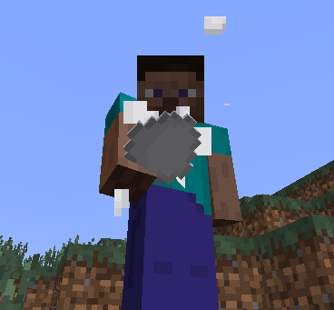

- A raw Egg smelts into one Cooked Egg in a normal Furnace
- Cooked Eggs restore **2 hunger points** with **0.6 saturation**
- Cooked Eggs stack to 64; raw Eggs remain limited to 16 because they are throwable
- Thrown Eggs now burst into Egg fragments instead of reusing Snowball fragments

Smelting recipe

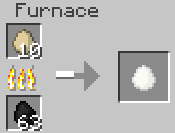

#### Achievements

The achievement tree now guides the changed progression and sleeping mechanics without requiring an outside guide.

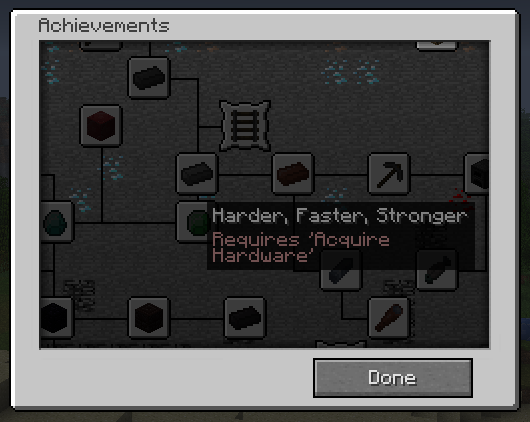

Main progression:

`Time to Mine!` → `Hot Topic` → `Getting an Upgrade` → `Copper Age` → `Acquire Hardware` → `Harder, Faster, Stronger` → `DIAMONDS!`

Side achievements:

- `It's Triplets!` branches from `Harder, Faster, Stronger` and rewards finding all three regional gemstones
- `Home Sweet Home` branches from `Benchmarking`
- `Bedside Manners` branches from `DIAMONDS!`
- `Sweet Dreams` branches from `We Need to Go Deeper`

---

### Part 3

New equipment, workshop systems and utility items for different playstyles, including backports and alternate takes on features added much later in Minecraft.

#### Steel progression

Steel adds a workshop-focused step beyond Iron without becoming another tool or armor tier.

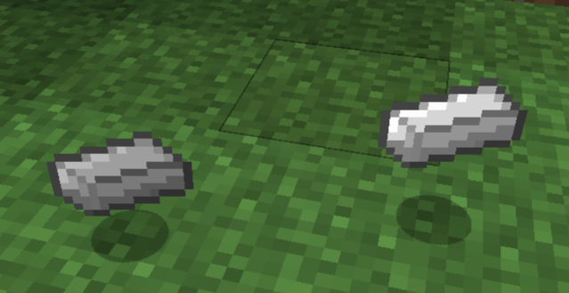
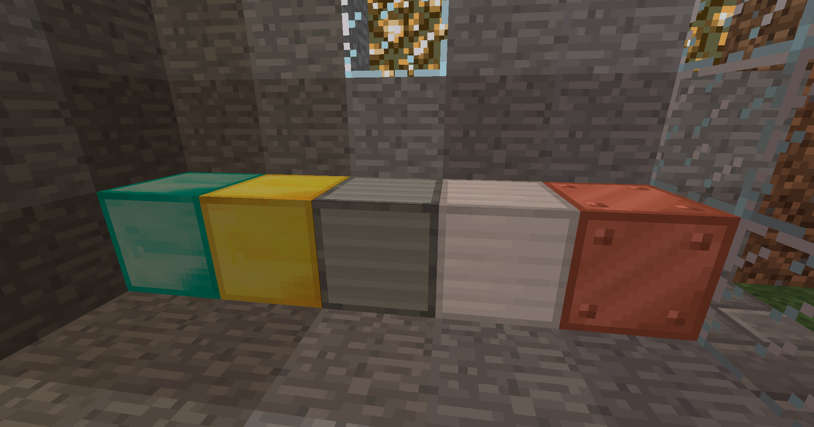

- Iron Ingots can be turned into Steel Ingots in a Blast Furnace
- Nine Steel Ingots craft into a Block of Steel and can be crafted back
- Flint and Steel now uses a Steel Ingot instead of Iron and has a matching Steel-colored sprite
- The Cauldron now uses Steel Ingots instead of Iron Ingots
- Steel is used for workshop equipment including the Anvil and Steel Hammer

Flint and Steel recipe

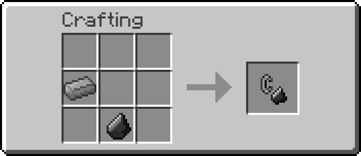

Cauldron recipe

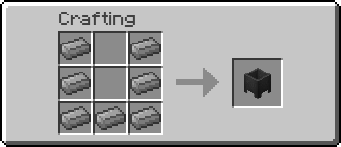

##### Blast Furnace

The Blast Furnace is the main way to make Steel and a faster furnace for ores.

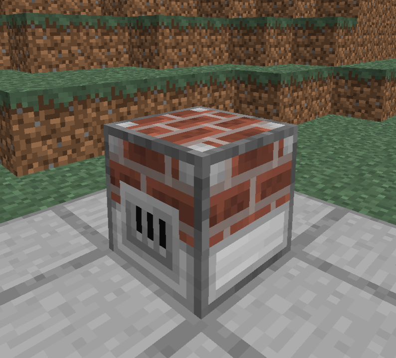

- Ores smelt at twice the speed of a normal Furnace
- Iron Ingots become Steel Ingots only while the Blast Furnace is burning Charcoal, a Blaze Rod or a Lava Bucket
- A Lava Bucket used for Steel leaves its empty Bucket behind
- Charcoal has a distinct Release+ texture to separate it from Coal
- Furnaces and Blast Furnaces have operating sounds that can be disabled in `Release+ Features`

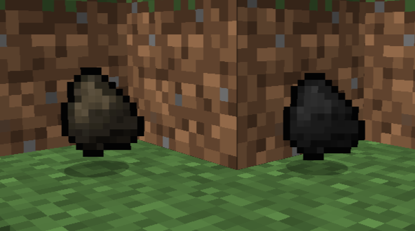

Recipe and GUI

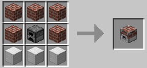
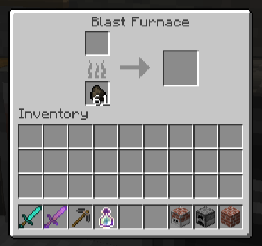

##### Anvil

The Anvil backports later repair, renaming and enchantment-combining functionality into Release 1.0, with the Steel Hammer as its dedicated workshop tool.

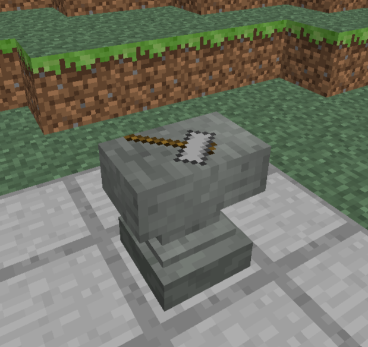

- A Steel Hammer must be installed in the Anvil before it can be used
- The installed Hammer stays in the Anvil and is visible on the block in-world
- Repairs, compatible enchantment combinations and renaming cost experience levels
- Each successful operation damages the Steel Hammer; a fresh Hammer lasts 20 operations
- Unsupported Anvils fall like Sand or Gravel, damage entities on impact and can damage or break themselves from a fall
- The installed Steel Hammer, Anvil damage stage and facing are preserved while the Anvil falls
- The Anvil can become damaged and eventually break through use or impact

Recipes, GUI and damage

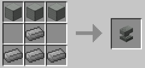
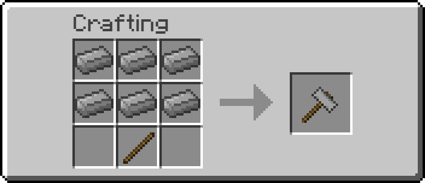
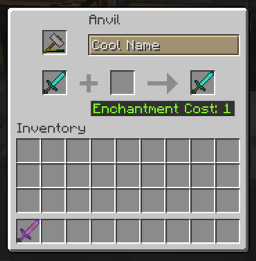
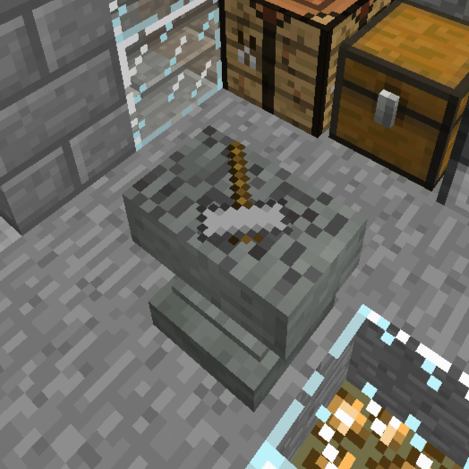

#### Grindstone

The Grindstone adds a dedicated repair and disenchanting workstation alongside the Anvil.

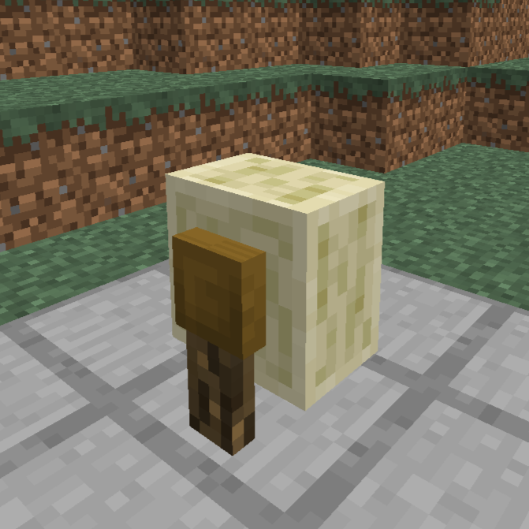

- Two matching damageable items can be combined for a stronger repair than the crafting grid
- Combining items in the Grindstone removes enchantments and returns experience from them
- A custom name from the upper input item is kept on the result
- It can be mounted on the floor, walls or ceiling and drops if its support is removed
- The recipe uses a Sandstone Slab and accepts any vanilla Log; the model uses Oak Log for its wooden supports
- Using the Grindstone plays dedicated use sounds

Recipe, GUI and placements

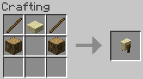
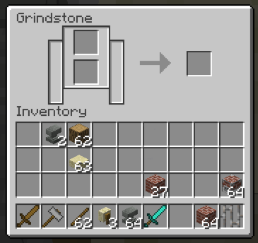
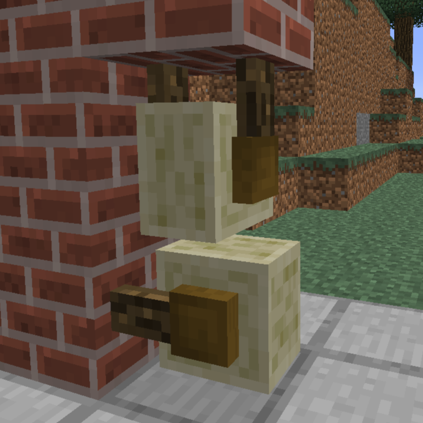

Current repair system

| Method | Repair amount | Enchantments | Custom name | Cost / role |
| --- | --- | --- | --- | --- |
| Crafting grid | Remaining durability of both items + **5%** of maximum durability | Removed | Removed | Free basic repair |
| Grindstone | Remaining durability of both items + **10%** of maximum durability | Removed; XP is returned | Upper item's name is kept | Dedicated destructive repair / disenchanting |
| Anvil, item + item | Remaining durability of both items + **12%** of maximum durability | Preserved and compatible enchantments can be combined | Preserved / can be changed | Costs XP, Steel Hammer durability and Anvil wear |
| Anvil, item + material | Up to **25%** of maximum durability per material, or **10%** for the Netherskull Helmet | Preserved | Preserved / can be changed | Only the materials actually needed are consumed |

Current Anvil repair materials:

| Equipment | Repair material |
| --- | --- |
| Wooden tools | Wooden Planks |
| Flint tools | Flint |
| Stone tools | Stone |
| Leather armor | Leather |
| Fishing Hat / Muffled Boots | Hard Leather |
| Ninja Boots | Steel Ingot |
| Brightvision Goggles | Glowing Crystal |
| Chainmail | Chain Links |
| Copper equipment | Copper Ingot |
| Iron equipment and Shears | Iron Ingot |
| Gold equipment | Gold Ingot |
| Emerald equipment | Emerald |
| Ruby equipment | Ruby |
| Sapphire equipment | Sapphire |
| Diamond equipment | Diamond |
| Amethyst equipment | Amethyst |
| Flint and Steel / Steel Hammer | Steel Ingot |
| Nethersteel equipment | Nethersteel Ingot |
| Netherskull Helmet | Nethersteel Ingot, at a reduced rate |

#### Crystal

Crystal is a new utility material used for gadgets rather than another tool or armor tier.

- Rare Crystal Ore generates underground in small veins
- Exposed Crystal Ore can generate with a Crystal Deposit on any open face
- Crystal Ore and Deposits require a Copper Pickaxe or better to harvest
- Silk Touch gives the Crystal Ore block or a full Crystal from a Deposit
- Fortune affects Crystal Shard drops
- Four Crystal Shards craft into one Crystal, and a Crystal can be split back into four Shards
- Crystals can be placed as Crystal Deposits
- Crystal Deposits can attach to exposed faces and use matching collision

Crystal visuals and recipes

Current Crystal generation and drop values

| Setting | Current value |
| --- | --- |
| Ore attempts | 2 per chunk |
| Maximum vein size | 3 |
| Generation height | Y 0-96 |
| Deposit chance on exposed ore | 50% |
| Crystal Ore drop | 1-2 Crystal Shards |
| Crystal Deposit drop | 2-4 Crystal Shards |
| Minimum harvest tier | Copper |

A Deposit only generates into air and at most one is placed per exposed Crystal Ore block. Player-placed Deposits use the same harvesting rules as natural ones.

##### Glowing Crystal

Normal Crystal can be infused with Glowstone to create a luminous branch of the same Crystal system.

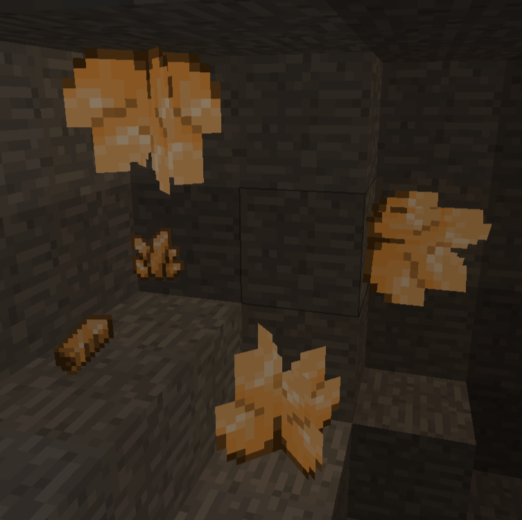

- A Crystal surrounded by four Glowstone Dust crafts into one Glowing Crystal
- Four Glowing Crystal Shards craft into one Glowing Crystal, and a Glowing Crystal splits back into four Shards
- A Glowing Crystal Shard can be crafted back into Glowstone Dust
- Placing a Glowing Crystal creates a Glowing Crystal Deposit, using the same attachment and collision rules as normal Crystal Deposits
- Glowing Crystal Deposits emit **light level 8**
- They currently do **not** generate naturally
- Normal harvesting gives **2-4 Glowing Crystal Shards**, Fortune affects the amount, and Silk Touch returns a full Glowing Crystal

Glowing Crystal recipes

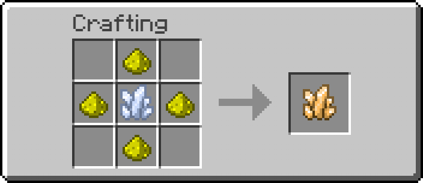
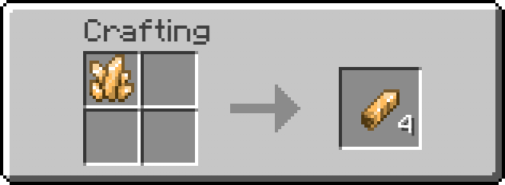
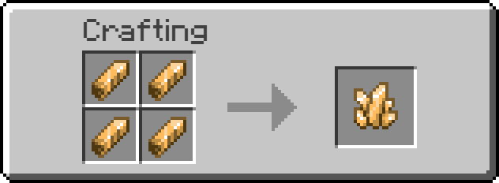
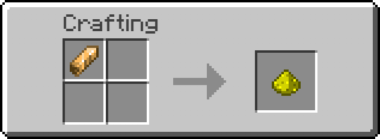

##### Crystal Arrows

Crystal Arrows are a harder-hitting but less reliable alternative to normal Arrows, using Crystal Shards in place of Flint.

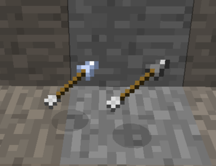

- Use the normal Arrow recipe with a Crystal Shard replacing Flint; one recipe makes **4 Crystal Arrows**
- Deal **2 more damage points** than a normal Arrow at the same Bow draw strength, equal to one additional heart before armor
- Have a **25% chance to shatter on block impact** instead of remaining recoverable
- A shattered Crystal Arrow produces glass-like break sound and Crystal fragments
- Bows visibly show whether the selected ammunition is a normal Arrow or Crystal Arrow while being drawn
- Normal Arrow item, Bow and projectile visuals were also updated to use a more clearly Flint-tipped design

Recipe and Bow view

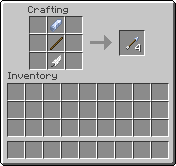
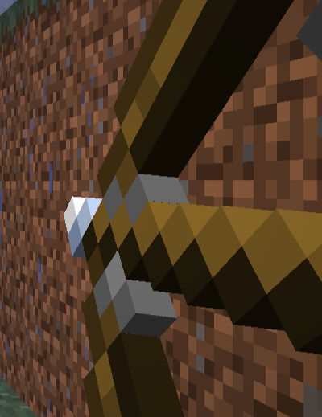

#### Brightvision Goggles

Brightvision Goggles are a zero-armor utility head item that uses Glowstone-infused Crystal lenses to brighten nearby darkness.

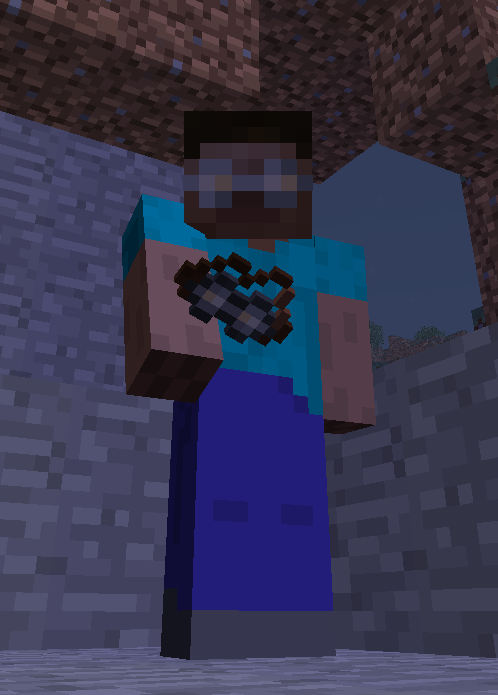

- Equip in the helmet slot and provide **0 armor points**
- Have **100 durability**
- Brightvision is intentionally weaker than the Night Vision potion effect and falls off with distance
- The first-person view uses a warm yellow-orange tint and a dark goggle-style vignette around the edges
- Hiding the HUD with F1 or switching to third person also disables the Brightvision boost, so the visibility benefit cannot be separated from its viewing limitation
- The Goggles can be repaired with Glowing Crystals at an Anvil

Recipe and Brightvision comparison

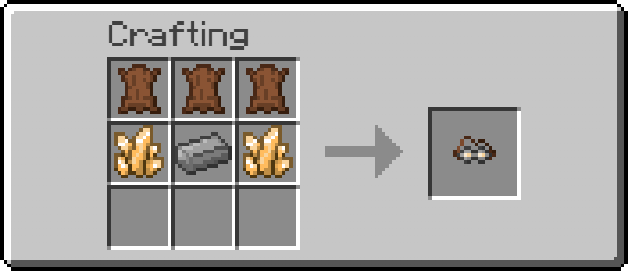

**Without Brightvision**

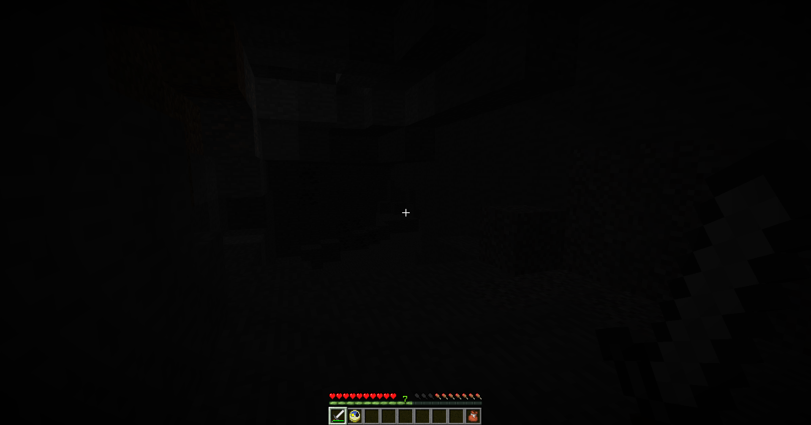

**With Brightvision**

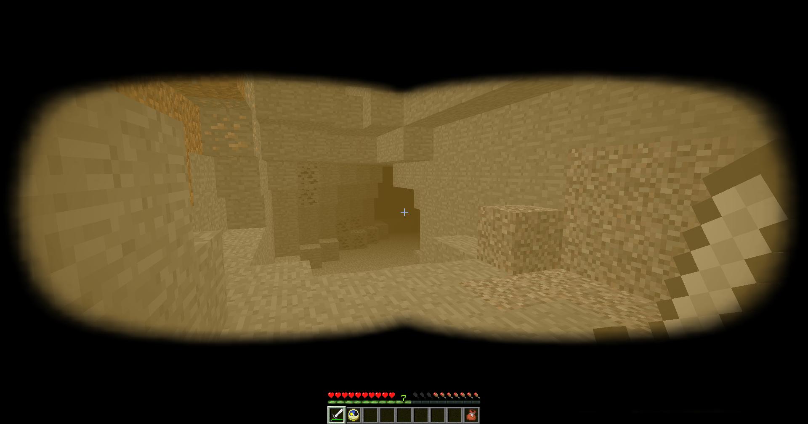

Current Brightvision balance

- Brightness amplification is currently about **75%** of the full Night Vision-style boost
- Full effect is concentrated nearby, beginning to fall off around **12 blocks** and largely disappearing by about **24 blocks**
- Distant darkness is deliberately allowed to become darker again rather than remaining full-bright

These values and the exact visual falloff are still being tuned.

#### Spyglass

A backport of the modern Spyglass, adapted to the look and controls of Release 1.0.

- Hold use to zoom through the Spyglass
- Includes the scope view, use sounds and a dedicated player pose
- Its held-item appearance can be switched between a flat 1.0-style sprite and the original 3D model

Spyglass views

**First person**

**Third-person sprite**

**Third-person 3D model**

#### Release+ Features

Release+-specific visual and sound options are grouped under `Release+ Features` on the main Options screen.

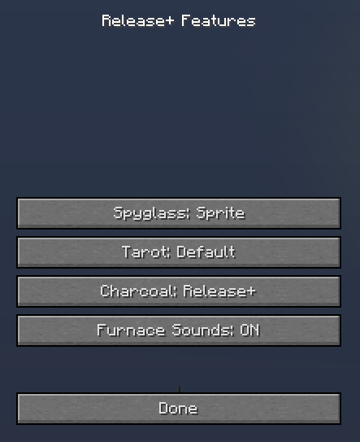

- Spyglass: Sprite or 3D
- Tarot: three cosmetic texture variants
- Charcoal: Release+ or Vanilla
- Furnace Sounds: ON or OFF
- Stealth Footsteps: ON or OFF (default ON)
- Belt Item Display: ON or OFF (default ON)
- These settings do not change gameplay

#### Pouch

A backport of the modern Bundle for carrying mixed small stacks without adding another inventory row.

- Stores up to one stack's worth of mixed items
- Items can be inserted and removed directly from the inventory
- Scrolling while hovering the Pouch selects which stored item to remove
- The tooltip shows up to 12 item types at once and shifts through additional contents while scrolling
- Pouches cannot be stored inside other Pouches
- Backpacks cannot be stored inside Pouches

Recipe

Current Pouch capacity rules

- Total capacity is 64 units
- An item that normally stacks to 64 uses 1 unit each
- An item that normally stacks to 16 uses 4 units each
- An unstackable item uses the full Pouch capacity
- The contents preview shows up to 12 stored item types at once, while selection can scroll through all stored types

#### Hard Leather

Hard Leather is a reinforced form of Leather used for sturdier utility equipment. Normal Leather can be smelted into Hard Leather in a Furnace.

- Hard Leather is used by the Backpack, Quiver, Fishing Hat, Belt and Muffled Boots
- Books now use Hard Leather instead of normal Leather

#### Fishing Hat

The Fishing Hat is a reinforced Leather Helmet for players who spend time fishing.

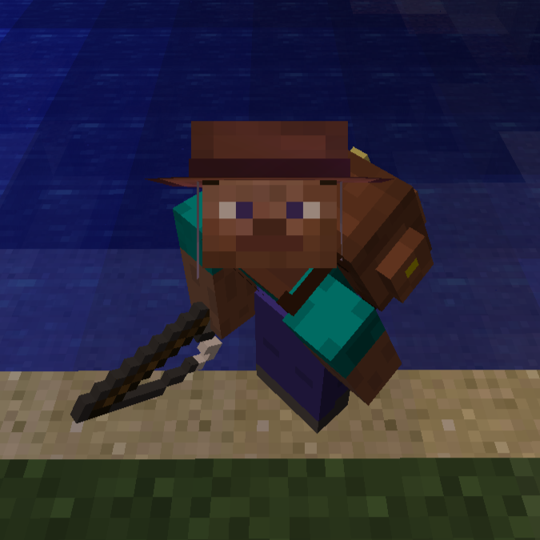

- Provides the same armor protection as a Leather Helmet
- Has **90 durability**, placing it above Leather but below Iron
- A successful catch has a **25% chance not to consume Fishing Rod durability**
- Uses the normal helmet enchantments available to Leather armor
- Can be repaired with Hard Leather at an Anvil

Recipe and inventory view

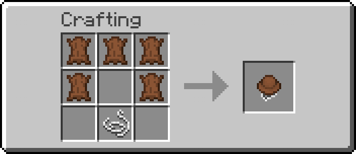
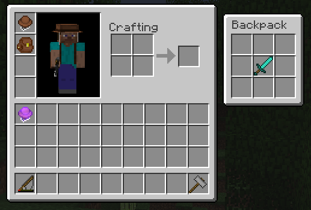

#### Fishing Trap

The Fishing Trap is a passive fishing tool that catches Raw Fish while set in suitable water.

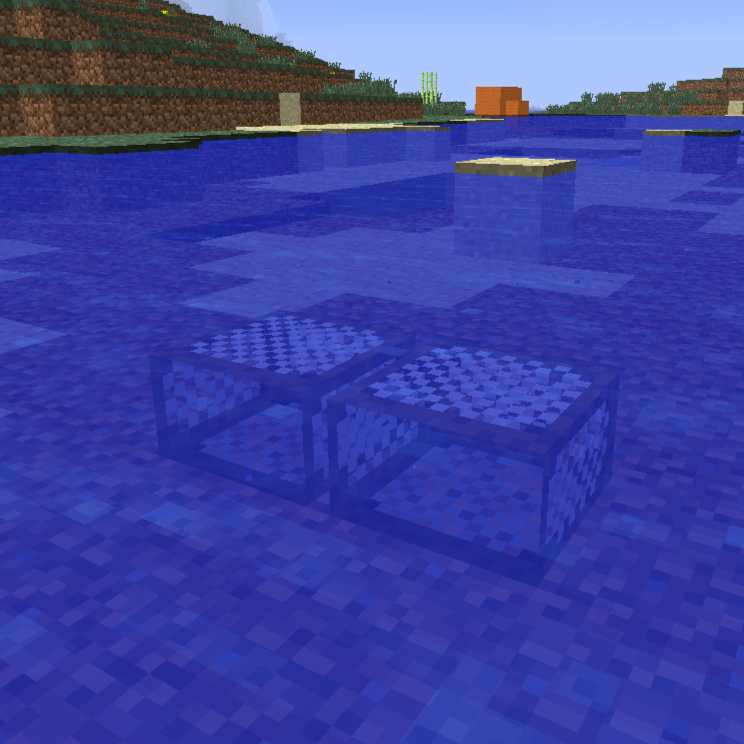

- Can be placed dry on solid ground or directly into water, with water occupying the same block as the trap
- Only catches while waterlogged with water at its open side
- Stores up to **3 Raw Fish**
- Bubble bursts show stored catches, and a dedicated catch sound plays when a new fish is caught
- Right-clicking removes one caught fish at a time
- Rain improves the catch rate
- Breaking the trap drops any stored catches

Recipe and more views

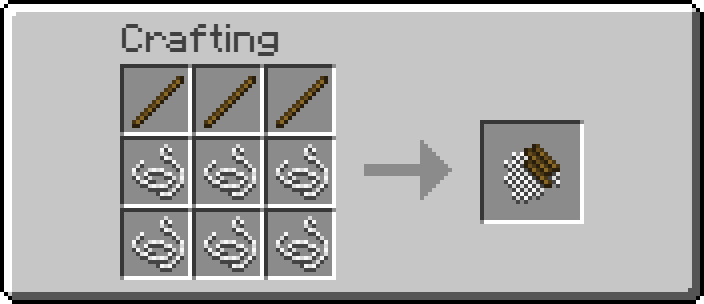
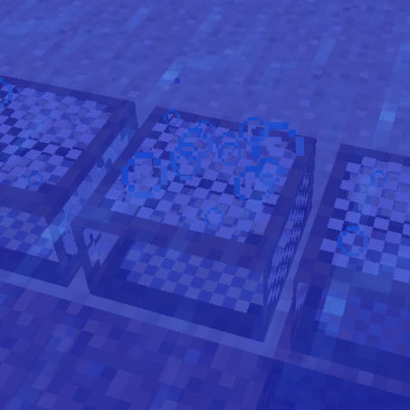
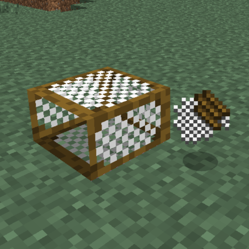

#### Muffled Boots

Muffled Boots are padded Hard Leather utility boots for quieter movement and easier sneaking around hostile mobs.

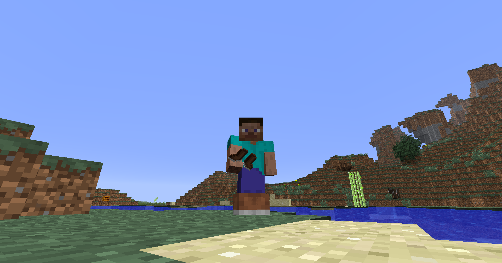

- Provide the same **1 armor point** as Leather Boots
- Have **105 durability**
- The recipe accepts any Wool color
- While sneaking, an ordinary hostile mob's 16-block detection range is reduced to **14 blocks**
- Use softened versions of the normal surface footstep sounds while worn
- The custom footsteps can be disabled with `Stealth Footsteps` in `Release+ Features` without changing the stealth effect
- Can be repaired with Hard Leather at an Anvil

Recipe

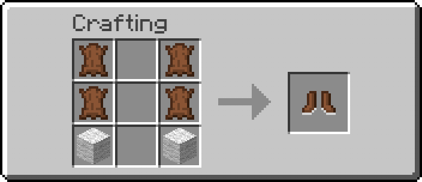

#### Ninja Boots

Ninja Boots are the Steel-reinforced upgrade to Muffled Boots, trading a little more material investment for stronger stealth and protection.

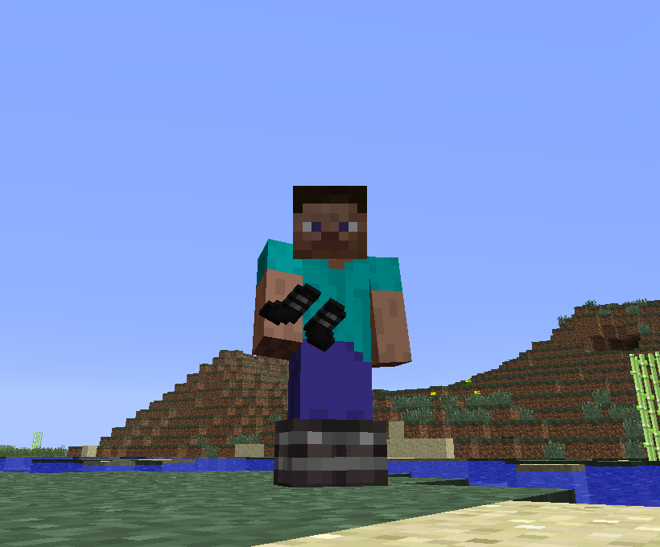

- Provide **2 armor points**
- Have **125 durability**
- While sneaking, an ordinary hostile mob's 16-block detection range is reduced to **10 blocks**
- Use a stronger softened footstep treatment than Muffled Boots
- Their custom footsteps use the same `Stealth Footsteps` setting
- Can be repaired with a Steel Ingot at an Anvil

Recipe

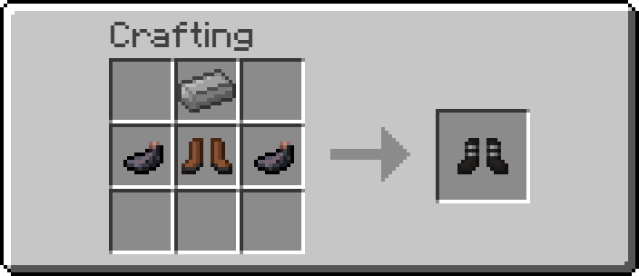

#### Belt

The Belt is a lightweight Hard Leather equipment piece that gives up some leg protection in exchange for one dedicated carried-item slot.

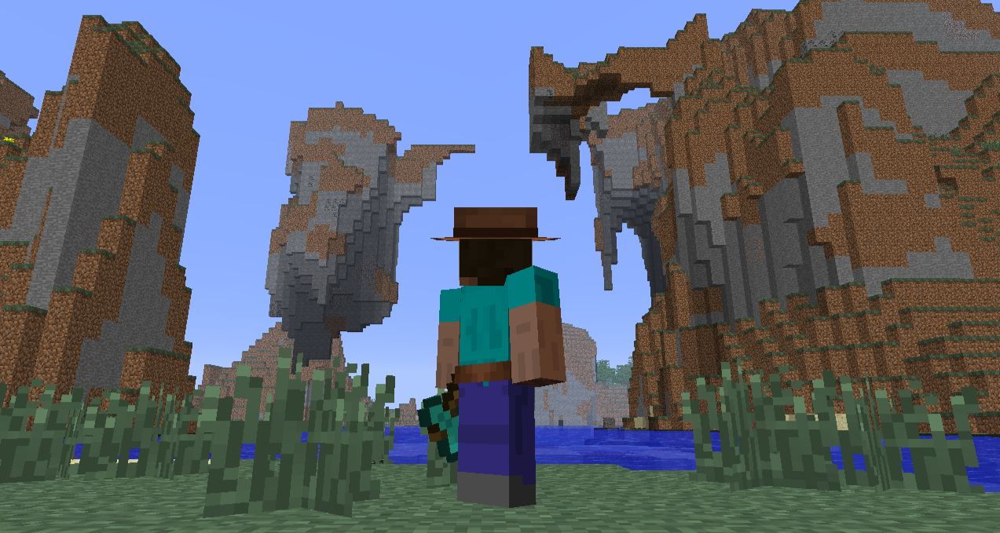

- Equips in the leggings armor slot and provides **1 armor point**
- Has **123 durability**
- Holds one Sword, Axe, Pickaxe, Shovel, Hoe, pair of Shears or Steel Hammer
- Its dedicated slot appears beside the player inventory and as a separate slot to the left of the hotbar while occupied
- Pressing the configurable Belt key (`B` by default) switches to the stored item; pressing it again returns to the previous hotbar slot
- A stowed item is visibly carried on the Belt in third person and disappears from the Belt while selected
- `Belt Item Display` in `Release+ Features` can hide the visible stowed item without changing Belt mechanics
- Normal item pickups do not automatically fill the Belt slot
- If the Belt is removed or breaks while carrying an item, the stored item drops into the world

Recipe and inventory

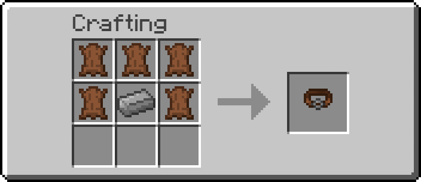
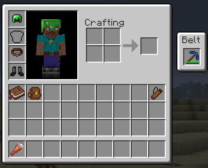
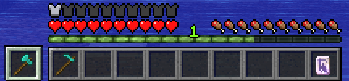

More worn Belt views

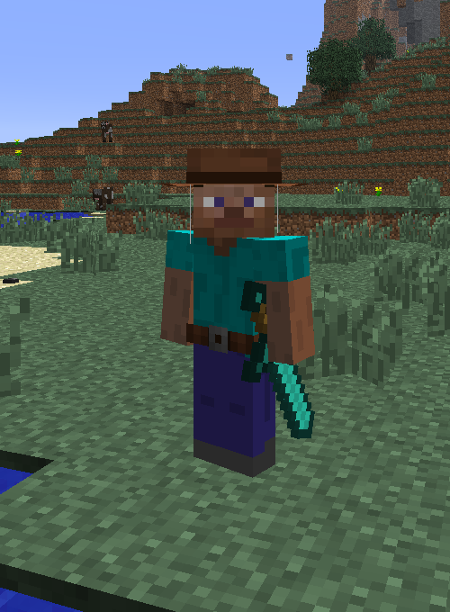
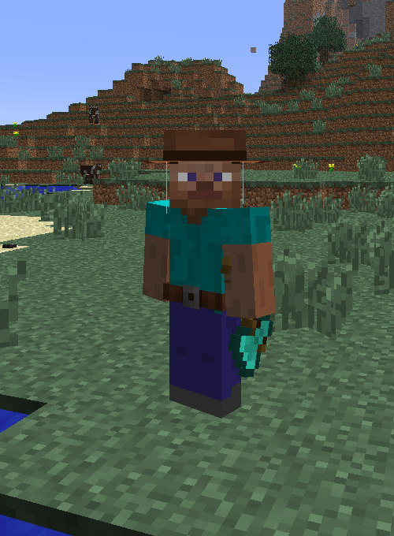
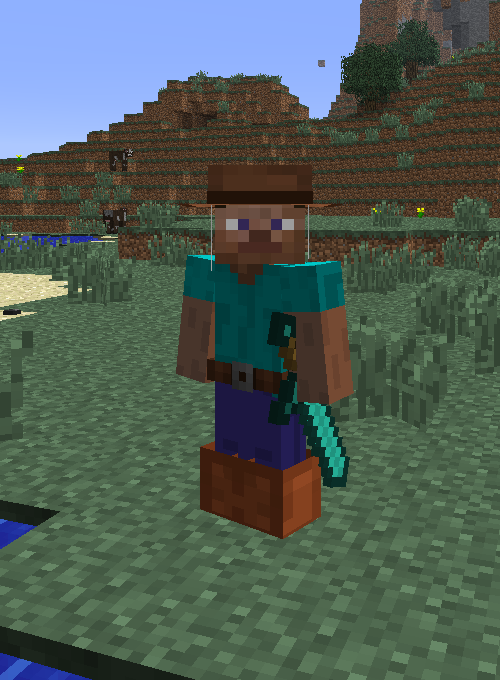
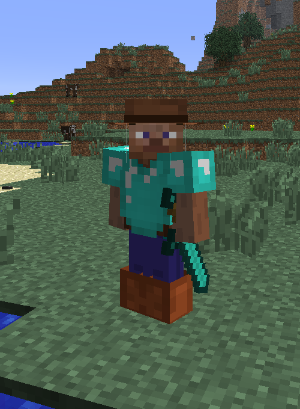

#### Backpack

A wearable and placeable nine-slot container built around a physical Backpack rather than a permanent inventory expansion.

- Equips in the chest armor slot and provides no armor protection
- Adds nine persistent storage slots while worn
- Worn storage appears as a separate 3×3 panel beside the normal player inventory
- If the normal inventory is full, item pickups can overflow into the worn Backpack
- Can be placed in the world and opened as a 3×3 container
- Placement follows the player's rotation
- The placed flap uses a chest-style opening and closing animation with custom bag sounds
- Breaking or dropping a filled Backpack preserves its contents, including across relogs
- Backpacks cannot contain other Backpacks

Recipe

##### Worn and placed

##### Inventory

The same nine slots stay with the Backpack whether it is worn, carried or placed.

More Backpack views

#### Quiver

The Quiver is a wearable nine-slot ammunition container built specifically for ranged combat.

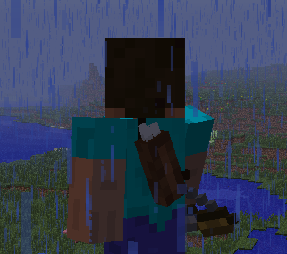

- Crafts from **8 Hard Leather** in a Chest-shaped recipe
- Equips in the chest armor slot and provides **0 armor points**, making it an alternative to chest armor or the Backpack
- Holds **9 stacks of arrow ammunition** and accepts only normal Arrows or Crystal Arrows
- While worn, its 3×3 inventory panel appears beside the normal player inventory
- Bows consume ammunition from the worn Quiver in slot order from **1 through 9**, then fall back to normal inventory ammunition
- Picked-up Arrows and Crystal Arrows prefer available space in the worn Quiver
- Right-clicking a held Quiver opens its contents without placing it in the world
- Filled Quivers keep their contents when carried, dropped, unequipped or reloaded
- The item sprite and worn model share three fullness states: empty, half-full and full

Recipe, inventory and fullness states

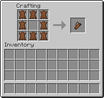
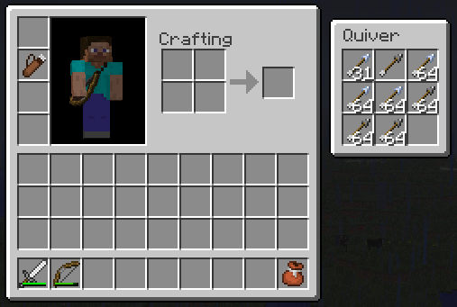

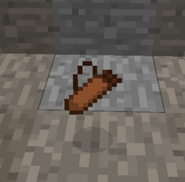
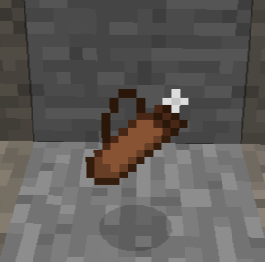
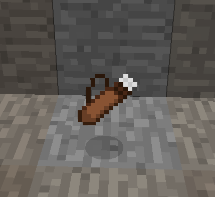

| Stored arrows | Fullness state | Visible model arrows |
| --- | --- | ---: |
| 0 | Empty | 0 |
| 1-288 | Half-full | 3 |
| 289-576 | Full | 6 |

#### Recipe Book

The Recipe Book is an early-game reference item for learning what items are and how they fit into the current crafting and smelting systems. Its design is heavily inspired by the Knowledge Book from Minecraft Infinite.

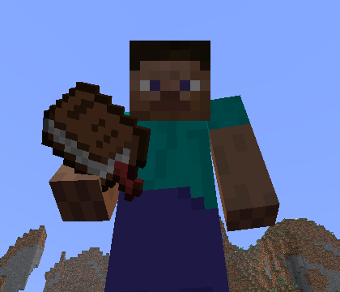
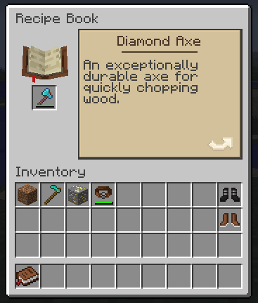

- Right-clicking the held book opens a dedicated Release 1.0-style book interface; it can also be placed on a Lectern and read there
- Placing an item into the inspection slot shows a short custom description on its About page
- The following pages show applicable **Smelting Recipes** and **Crafting Recipes**, including recipes that make the inspected item and recipes that use it
- Empty recipe categories are omitted
- Alternative ingredients and valid smelting fuels cycle in place; hovering pauses them and the mouse wheel can browse the available options
- The displayed recipes use the game's current recipe data, including supported interchangeable ingredient groups such as normal and End Wooden Planks
- Opening, closing and turning pages use dedicated book sounds

Recipe and GUI views

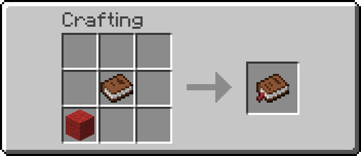
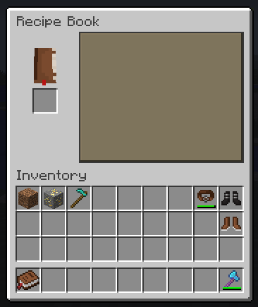
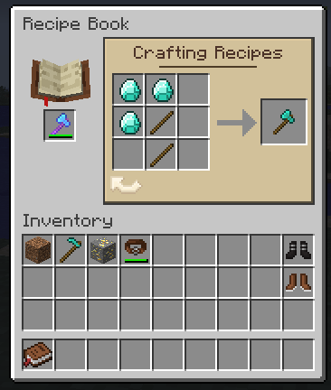
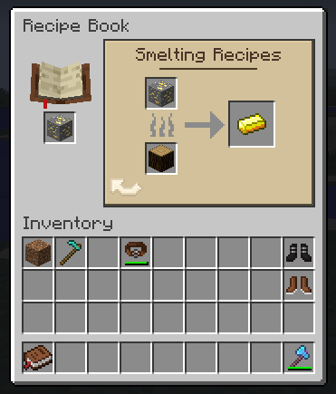
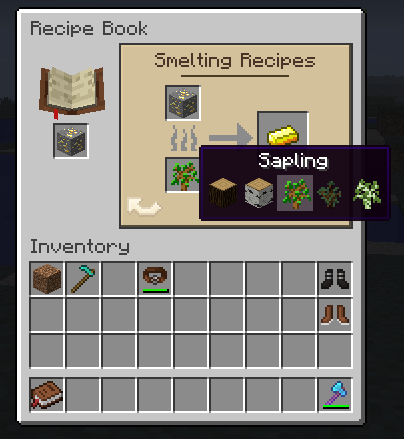

#### Recipe Compendium

The Recipe Compendium is a gilded upgrade to the Recipe Book that builds its own browsable index from items the player has inspected.

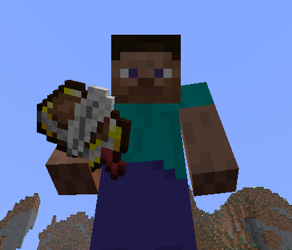
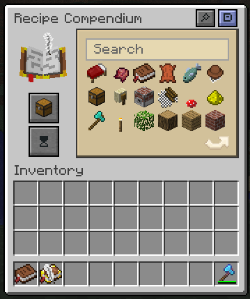

- The Compendium can only be opened while placed on a Lectern
- **Inspect** works like the Recipe Book: inserting an item opens its About and recipe pages and automatically records that item in that physical Compendium
- **Index** shows remembered items in a **6×3 grid**, with 18 entries per page
- The Index can be searched and filtered through **All, Natural, Building, Utility, Equipment, Food** and **Materials** categories
- Entries can be sorted by **Newest, Oldest, A-Z** or **Z-A**
- Selecting a remembered entry opens its About page first, followed by the same crafting and smelting pages used by Inspect
- Remembered entries are stored on the Compendium itself, so its index survives world saves and follows the book between Lecterns
- The physical Inspect item is returned when the interface closes; only the remembered entry remains in the Compendium

Recipe and GUI views

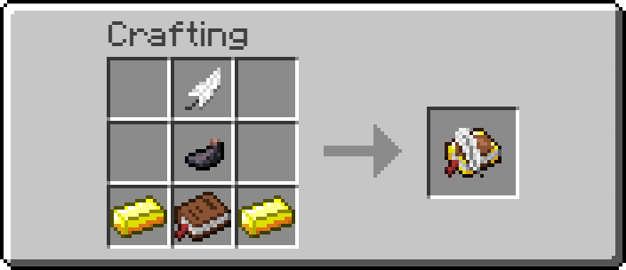
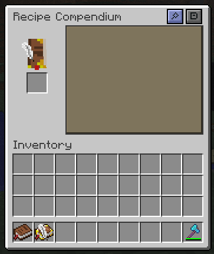
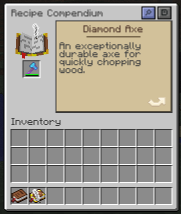
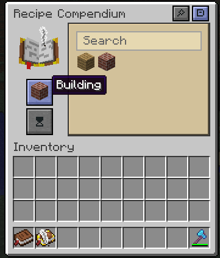

#### Lectern

The Lectern is a dedicated reading stand for the Recipe Book and the Recipe Compendium.

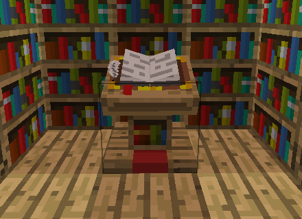

- Right-clicking an empty Lectern with a Recipe Book or Recipe Compendium places that exact book on the stand, including any Compendium index data
- Right-clicking an occupied Lectern opens the book resting on it
- Recipe Books remain usable by hand, while Recipe Compendiums require a Lectern
- The book is rendered physically on the sloped stand; opening the interface and moving forward or backward through pages visibly animates the placed book
- Closing the interface flips the book back toward its beginning
- Each page turn produces a short **2-tick redstone pulse** from the Lectern
- Punching an occupied Lectern knocks its book off toward the player, while breaking the Lectern drops the stored book normally
- The stored book and its data persist through world saves

Recipe and book states

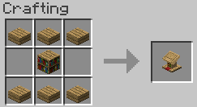
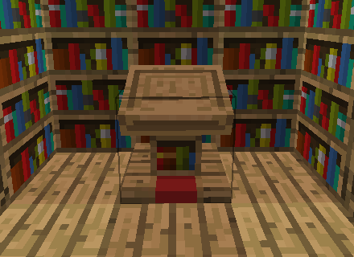
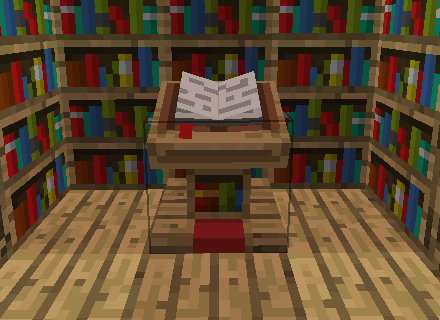

#### Stone of Return

The Stone of Return is an endgame utility item that turns Ender teleportation into a long-range way home.

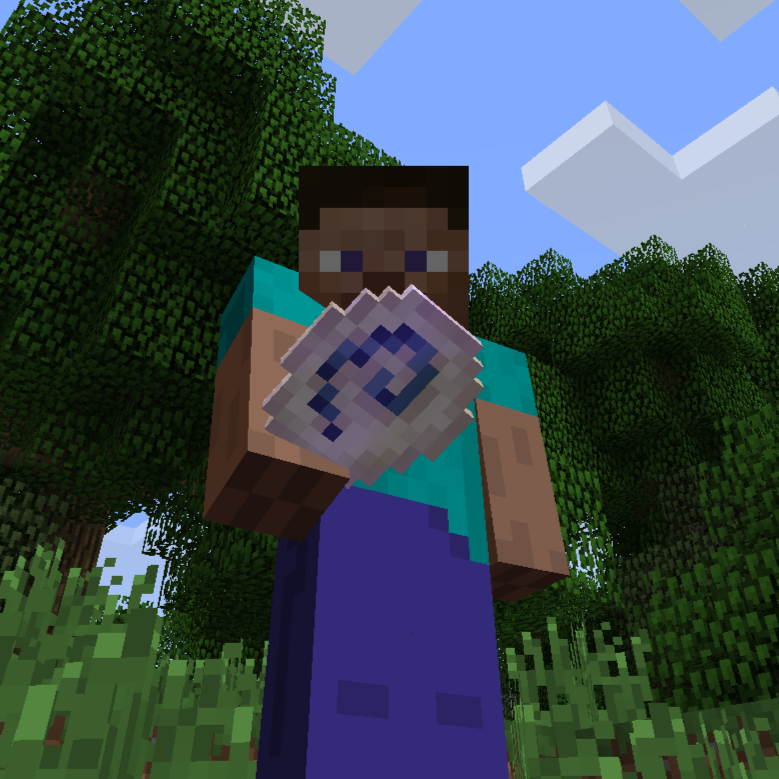

- Crafted from End Stone, Ender Pearls and an Eye of Ender
- The crafted stone is inert until it is calibrated at an Enchanting Table
- Calibration I, II and III cost 10, 20 and 30 levels and improve the accuracy of the return
- Using a calibrated stone instantly returns the player toward their current respawn point, with accuracy determined by its Calibration level
- Departure and arrival use Ender-style portal clouds and teleport sounds
- The teleport deals the same damage as an Ender Pearl
- Every calibrated Stone of Return is single-use
- If the player's bed is no longer valid, the return falls back to world spawn

Recipe

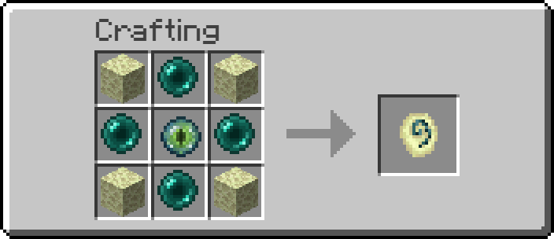

Calibration

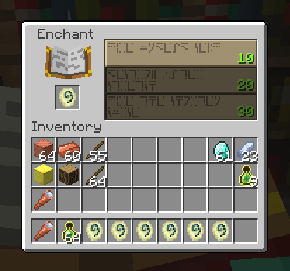

| Enchantment | Cost | Bookshelves | Return accuracy |
| --- | ---: | ---: | --- |
| Calibration I | 10 levels | 0 | Safe position within 256 blocks of the respawn point |
| Calibration II | 20 levels | 15 | Safe position within 64 blocks of the respawn point |
| Calibration III | 30 levels | 30 | Exact respawn point |

More Stone of Return views

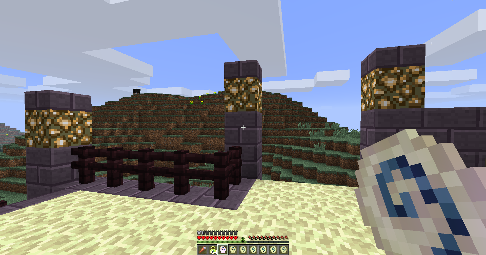

#### Bottle o' Enchanting

The Bottle o' Enchanting has also been backported as a throwable source of experience. It is currently Creative-only; a place in Survival progression has not been decided yet.

#### Rope

Rope is a placeable climbing tool that hangs downward from existing terrain.

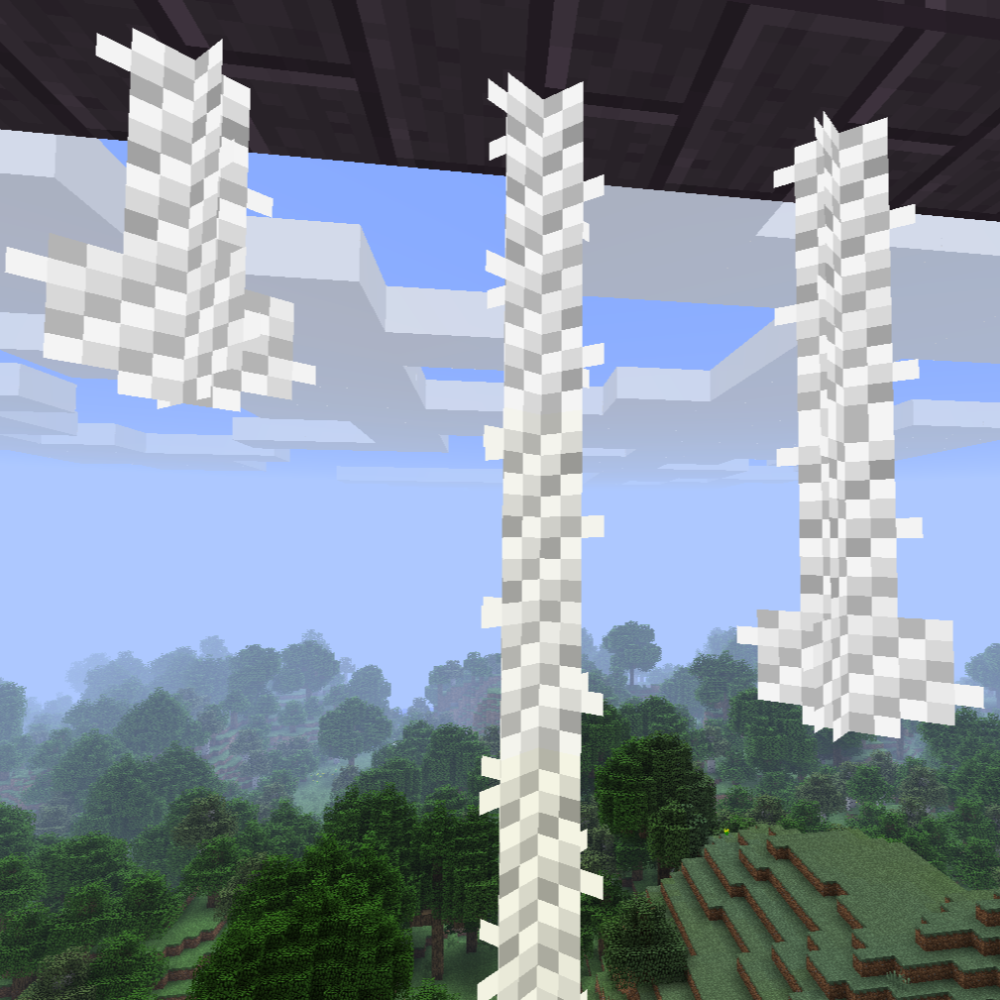

- Three String craft into two Rope
- Rope can hang from full blocks and bottom slabs
- Using its support or an existing Rope segment extends the line downward
- Rope can be climbed like a Ladder and uses cloth step sounds while climbing
- The lowest segment automatically uses a distinct loose-end texture
- Breaking its support drops the hanging Rope chain

Item and recipe

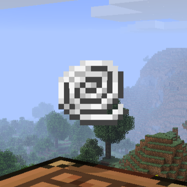
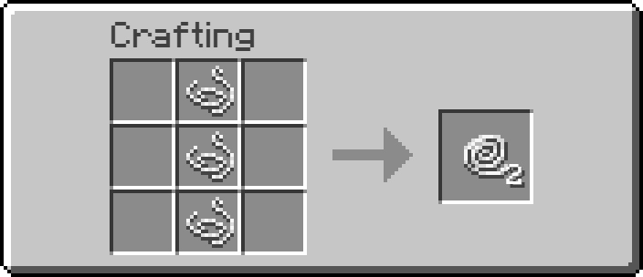

#### Tarot of Death

The Tarot of Death is my version/backport of the modern Totem of Undying, adapted for Release 1.0. It takes a fatal hit in the player's place.

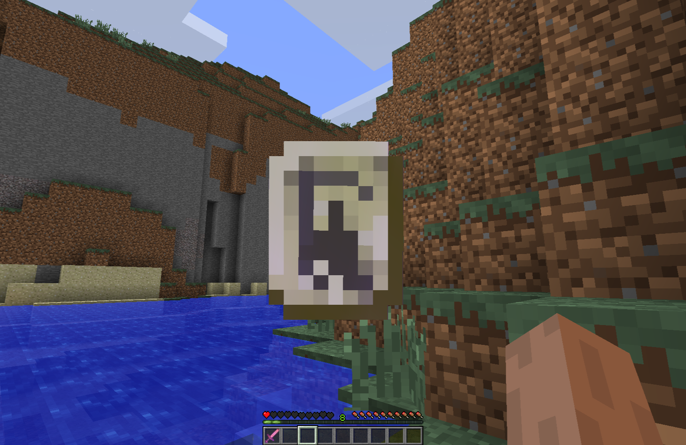

- Works from any of the nine hotbar slots, not only the currently held one
- On activation, one Tarot is consumed and the player survives at 1 health
- Clears current status effects and extinguishes the player
- Gives Regeneration II and Fire Resistance for 10 seconds
- Uses a dedicated activation animation rising from the hotbar, green and gold particles, and sound
- Does not protect against void damage

The Tarot of Death remains extremely rare in Survival. It can be found in Nether Dungeon and End Spire chests, and Ender Shades have a very small chance to drop one.

More Tarot of Death views

**Held**

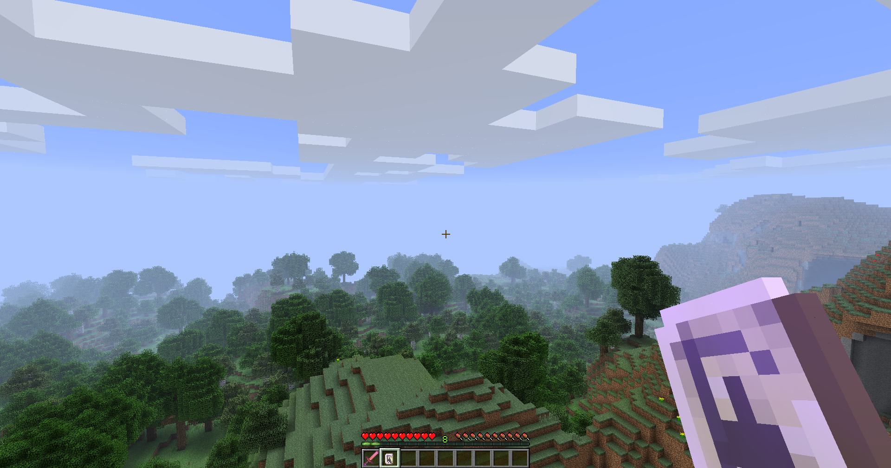
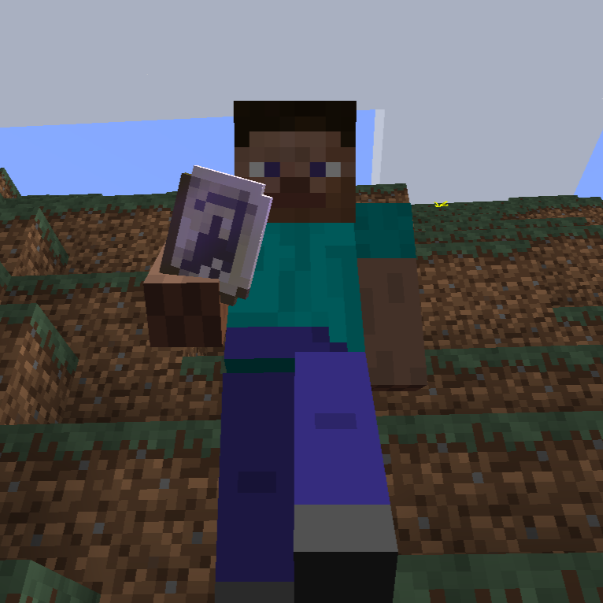

**Optional textures**

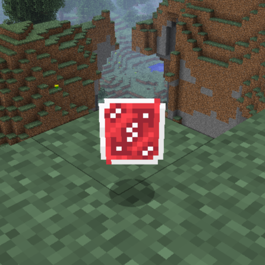
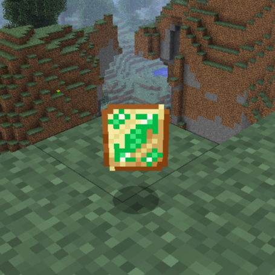

#### Part 3 achievements

Part 3 extends the existing Release 1.0 achievement tree with a small set of progression and gadget milestones rather than giving every new item its own achievement.

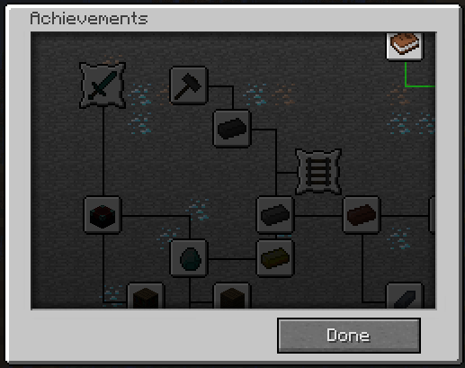
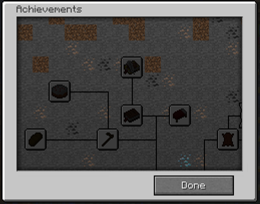

| Achievement | Parent | Unlock |
| --- | --- | --- |
| `Steel Yourself` | `Acquire Hardware` | Take a Steel Ingot from a Blast Furnace |
| `Hammer Time!` | `Steel Yourself` | Complete a successful Anvil operation using a Steel Hammer |
| `Crystal Clear` | `Copper Age` | Obtain a Crystal Shard |
| `A Closer Look` | `Crystal Clear` | Look through a Spyglass |
| `Pack Rat` | `Cow Tipper` | Craft a Backpack |
| `Bookworm` | `Benchmarking` | Inspect an item with a Recipe Book |
| `Remember 'em All!` | `Bookworm` | Remember a new item in a Recipe Compendium |
| `Homesick` | `The End?` | Successfully use a calibrated Stone of Return |

---

### Part 4

Ores Beyond reshapes the upper half of progression across the Overworld, Nether and End. Three rare regional gemstones form alternative steps between Iron and Diamond, the Nether introduces the durable post-Diamond Nethersteel path, and the End adds a brittle Amethyst alternative alongside extended terrain, ruins and a small native forest biome.

#### Regional Gemstones

Emerald, Ruby and Sapphire are three equal sibling materials between Iron and Diamond. None is intended to be rarer or higher-tier than the others; the region a player explores determines which route they are most likely to find first.

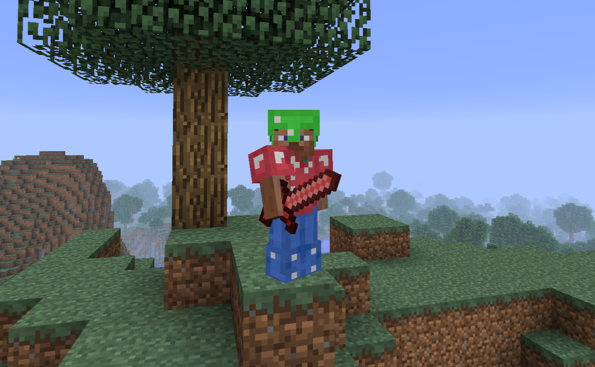

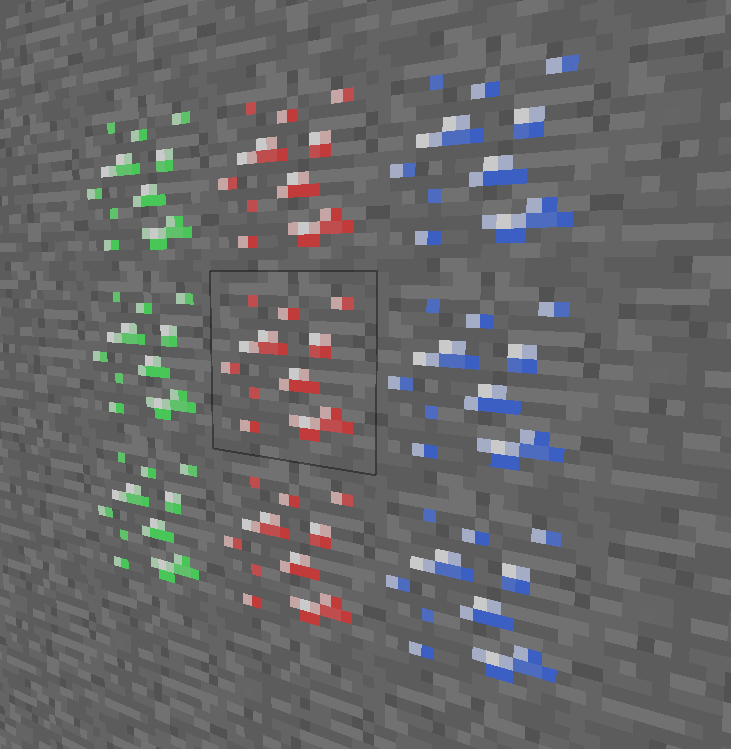

- **Emerald Ore** generates only beneath **Extreme Hills**
- **Ruby Ore** generates only beneath **Desert** terrain
- **Sapphire Ore** generates beneath **Taiga, Ice Plains and Ice Mountains**
- All three use the same local rarity: **one placement attempt per eligible chunk** between **Y 4 and Y 32**
- Finds are normally a single Ore block, with a **25% chance** to extend into one adjacent block when suitable Stone is available
- All three have hardness **3.0** and require an **Iron or Gold Pickaxe** or better
- Each Ore drops one matching gemstone; Fortune affects the drop and Silk Touch preserves the Ore block
- Nine gems craft into the matching storage block and each storage block can be split back into nine gems

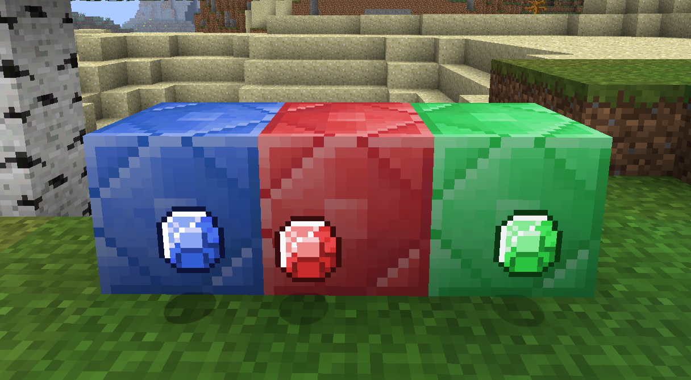

##### Gemstone tools

All three gemstones use the normal five tool recipes and share harvest level **4**, making any one of them the bridge from Iron to Diamond. Their identities come from ordinary Release 1.0 tool statistics rather than special effects.

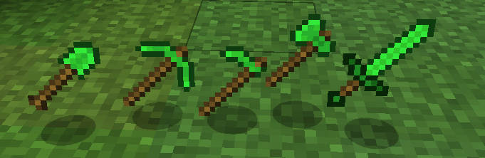
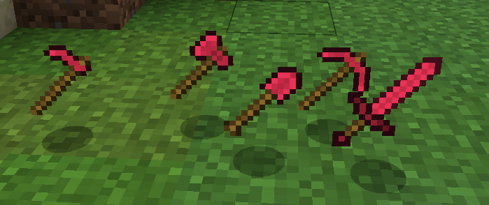
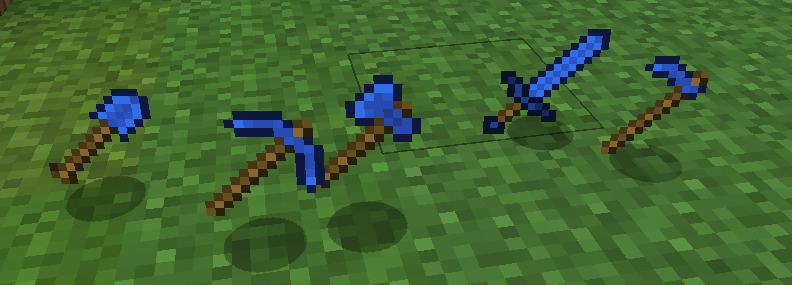

| Material | Uses | Mining speed | Material damage bonus | Enchantability |
| --- | ---: | ---: | ---: | ---: |
| Emerald | 400 | **8.0** | 2 | 12 |
| Ruby | **300** | 7.0 | **3** | 12 |
| Sapphire | **650** | 7.0 | 2 | 12 |

- **Emerald** is the speed-focused set, matching Diamond's mining speed while giving up Diamond's durability and damage
- **Ruby** is the power-focused set, matching Diamond's material damage bonus but wearing out fastest of the three
- **Sapphire** is the durability-focused set and lasts substantially longer than the other gemstones

##### Gemstone armor

The armor sets use the same standard recipes and form the same shared progression rung. Ruby favors protection, Sapphire favors longevity and Emerald sits between them.

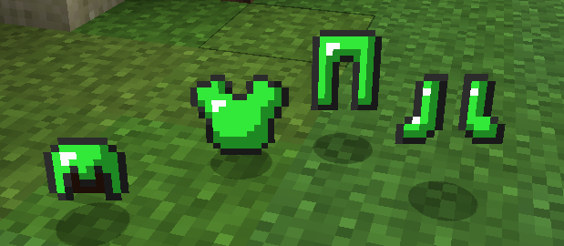
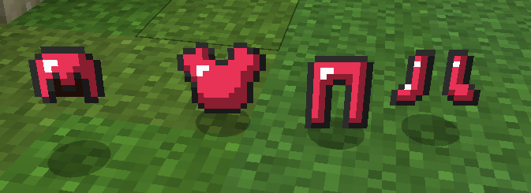
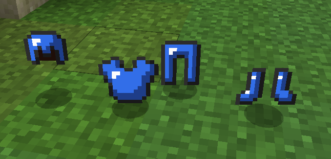

| Material | Full-set protection | Durability multiplier | Enchantability |
| --- | ---: | ---: | ---: |
| Emerald | **17** | 22 | 12 |
| Ruby | **18** | 18 | 12 |
| Sapphire | **16** | **28** | 12 |

Each gemstone repairs its own tools and armor at the Anvil using the normal material-repair rate.

Worn gemstone armor

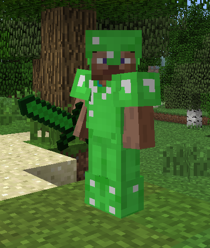
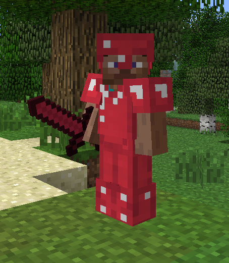
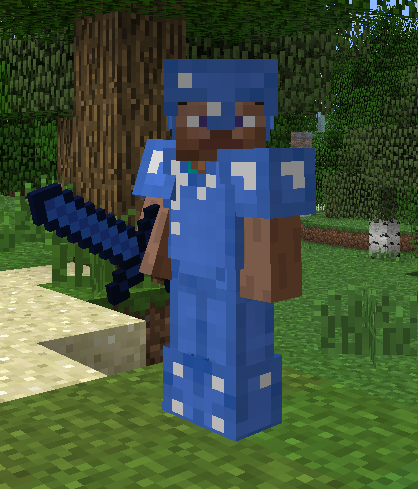

#### Nether Stone

Nether Stone gives the Nether a rough stone building family of its own instead of leaving Netherrack and Nether Brick as the only options down there.

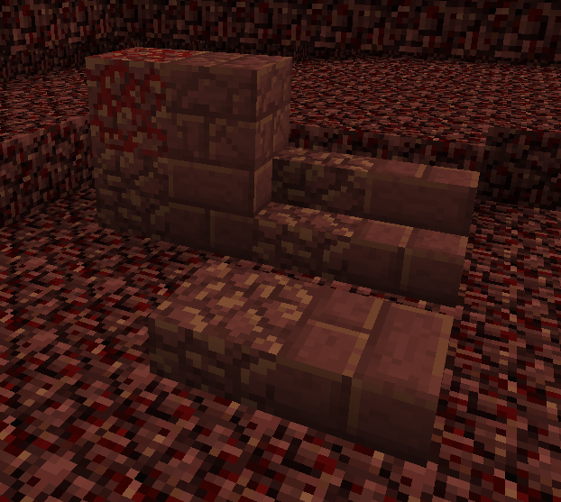

- **Nether Stone**, **Nether Moss Stone**, **Nether Stone Bricks** and **Cracked Nether Stone Bricks**
- Slabs for Nether Stone and Nether Stone Bricks
- Stairs for Nether Stone and Nether Stone Bricks
- Nether Stone can currently only be obtained in Survival by mining a Nether Dungeon

#### Ancient Scrap

Ancient Scrap is my take on the modern Ancient Debris. It is meant to be found rarely and worked slowly.

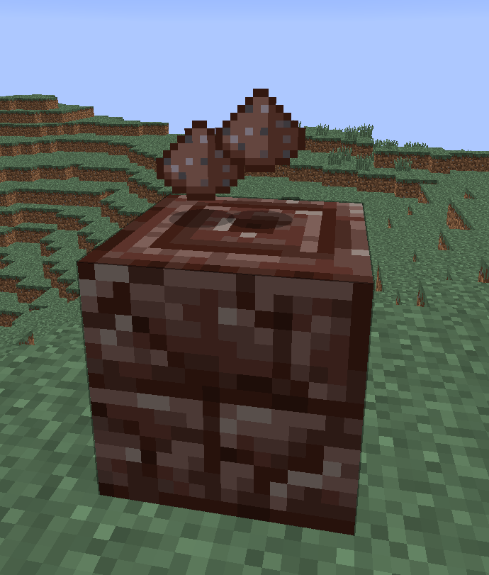

- Generates fully buried in Netherrack, never exposed to open air or lava
- Two passes per chunk: a denser low band around **Y 8-22** and a sparser one across **Y 8-119**
- Remnants are **1 to 3 blocks**, never a full vein
- Requires a **Diamond Pickaxe** or better
- Drops **3-5 Ancient Dust**, and Fortune applies
- Hardness **37.5**, so it is slow to break even with a Diamond Pickaxe

#### Nethersteel

Nethersteel is the first conventional tier above Diamond. Refining it is the slowest part of the chain. Ancient Dust only becomes metal in a Blast Furnace, and only while that furnace burns a fuel from the Nether.

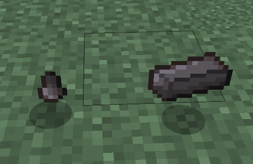
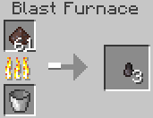

- Ancient Dust smelts into a **Nethersteel Nugget**, one nugget per dust
- This only works in a Blast Furnace, and only while it burns a **Blaze Rod** or a **Lava Bucket**; Charcoal is enough for Steel but not for Nethersteel
- Nine Nuggets craft into a Nethersteel Ingot, and an Ingot splits back into nine Nuggets
- Nine Ingots craft into a Block of Nethersteel and can be crafted back
- Dropped Nethersteel survives fire and lava and floats on the surface instead of burning away
- Ancient Dust is not fireproof, since it has not been through the furnace yet

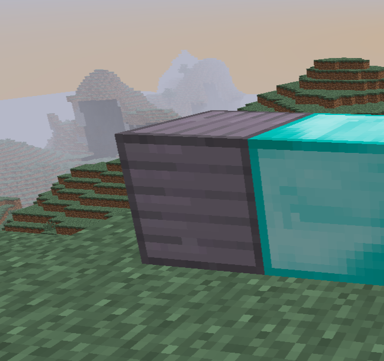

##### Nethersteel tools

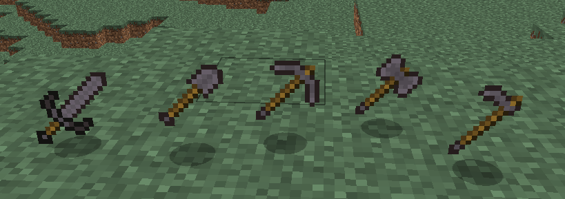

- Harvest level **6**, above Diamond's 5
- **2000 uses**, against Diamond's 1561
- Mining speed **10.0**, against Diamond's 8.0; Gold keeps its speed record at 12.0
- Deals **one more damage point** than the Diamond equivalent
- Enchantability stays at Diamond's **10**

##### Nethersteel armor

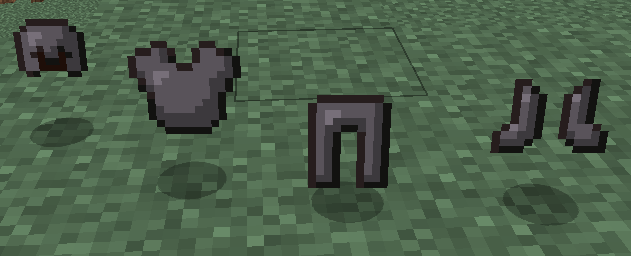
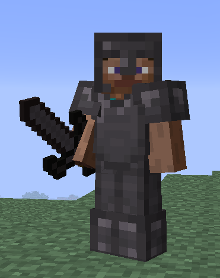

- Protection values are identical to Diamond; the tier shows in durability and resistance instead of armor points
- Durability multiplier **40**, against Diamond's 33
- Each piece worn gives **10% knockback resistance**, so a full set gives **40%**
- Knockback resistance applies to explosion knockback as well as melee

Optional textures

Nethersteel tools, armor and the worn set all have a Release+ design and a plainer vanilla-styled variant, switched with the `Texture Style` option.

**Tools**

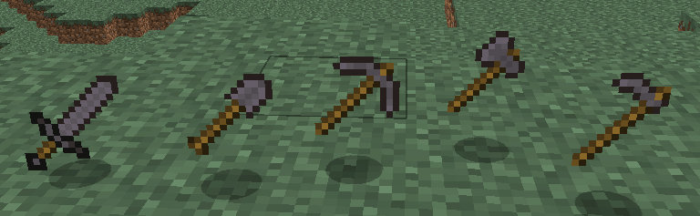

**Armor**

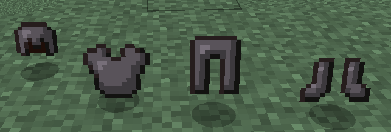
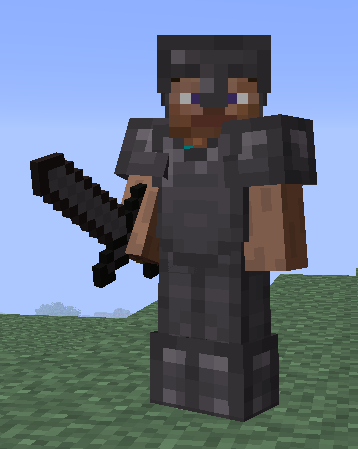

#### Nether Gold Ore

Gold in the Nether just makes sense, and gives Zombie Pigmen something to be protective of.

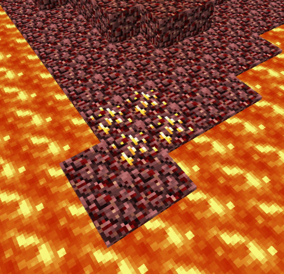

- **3 veins of up to 8** per chunk, between **Y 10 and Y 117**
- Requires an **Iron Pickaxe** or better, the same as Overworld Gold Ore
- Smelts into a Gold Ingot in a normal Furnace or a Blast Furnace
- Mining it angers every Zombie Pigman within **8 blocks**
- Wearing **any single piece of Gold armor** exempts you from that entirely

#### Netherskulls

The first mobs added by R+! The Nether Fortress previously held nothing but Blazes and wandering Pigmen. Netherskulls are my version of the Wither Skeletons and give it a garrison of its own.

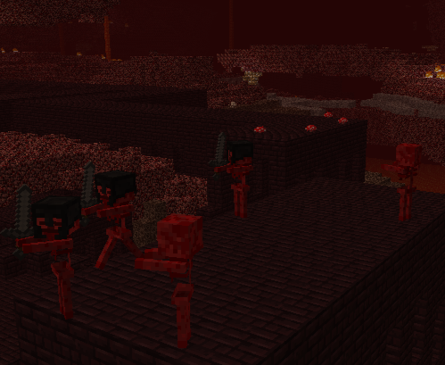

- Spawn in Nether Fortresses in packs and are immune to fire
- **20 health**, dealing **3 damage** unarmed
- Move at Skeleton speed
- Up to **8 can spawn per chunk** where most mobs allow 4, so a Fortress holds a real population
- Drop **0-2 Ash**, and Coal about a third of the time
- Count as undead, so Smite applies and healing potions harm them
- Use later vanilla Wither Skeleton-style idle, hurt and death sounds

More Netherskull views

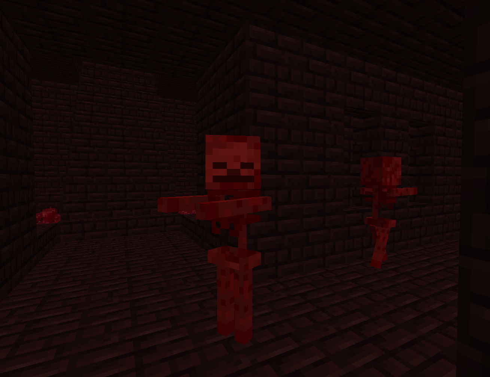

##### Netherskull Guard

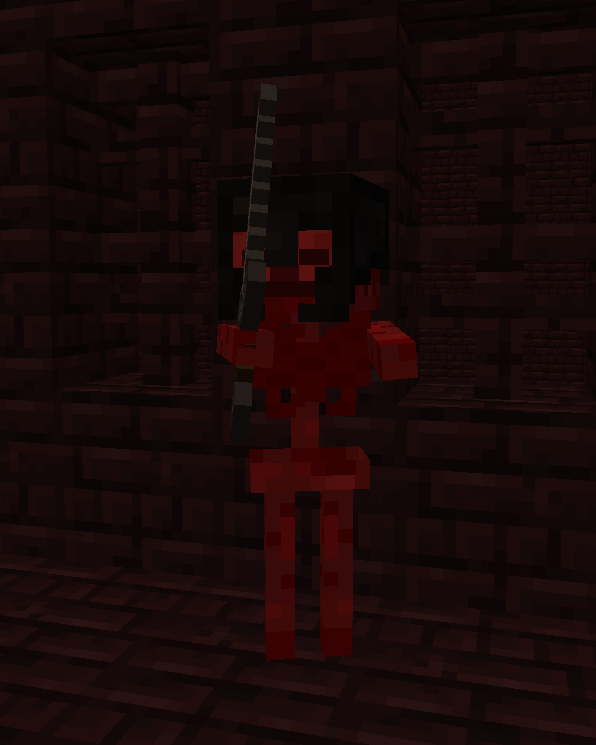
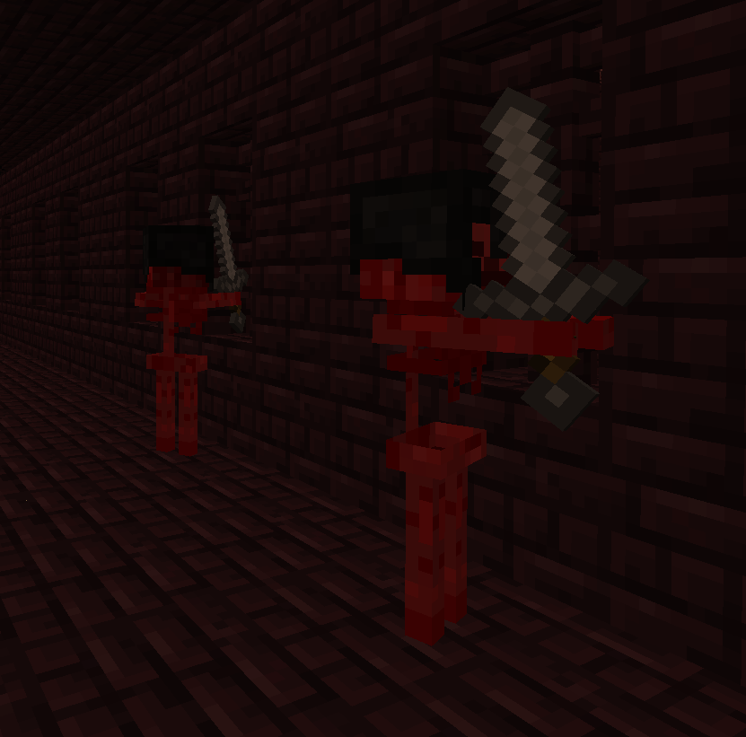

- An uncommon elite version that spawns in much smaller packs alongside ordinary Netherskulls
- Carries a **Stone Sword** and deals **5 damage** with it
- Has **4 points of natural armor**
- Worth **10 experience** instead of the usual 5
- Wears a helm, which it can rarely drop

##### Netherskull Helmet

The Guard's helm is the only piece of Netherskull equipment a player can wear, and the only way to make the Fortress stop treating you as an intruder.

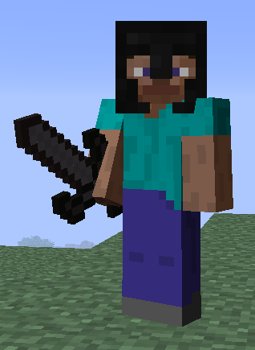

- Drops from a Netherskull Guard **roughly 1 time in 50**, and never intact; it arrives **30-60% worn**
- Gives the same **3 protection** as a Diamond Helmet
- Adds **15% knockback resistance** and reduces explosion damage by **15%**, which stacks with Nethersteel
- While it is worn, **Netherskulls stay neutral** until you strike one
- Striking a Netherskull angers every Netherskull within **16 blocks**, helm or not, though their anger does fade
- Has low durability. Two helms combine for a full repair, and a Nethersteel Ingot repairs **a tenth** of maximum durability per ingot instead of the usual quarter
- Enchantability **18**, above Diamond but below Gold and Amethyst

Optional texture

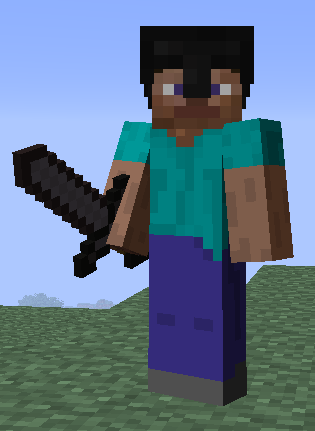

#### Ash

Ash is what a Netherskull leaves behind, and the Nether's own source of grey dye.

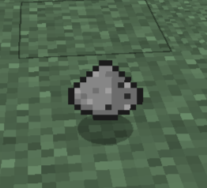

- Dropped by Netherskulls and found in Nether Dungeon chests
- One Ash crafts into **2 Grey Dye**, which previously required Bone Meal and Ink Sacs

#### Bone Bush

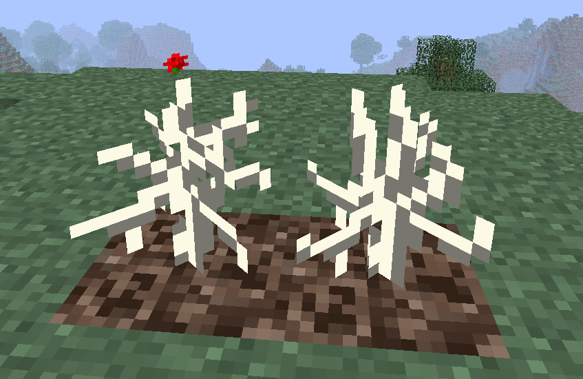

- A dry scrub that generates on Soul Sand, with two random variants
- Drops **0-1 Bone** when broken
- Unlike Dead Bush it has no light or sky requirement, so it survives anywhere in the Nether
- Bone Bushes currently do **not** spread or grow; natural world generation is their only source

#### Soul Torch

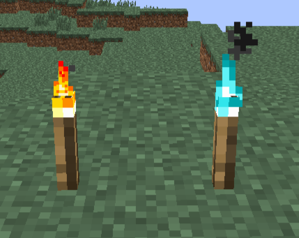

- Crafted from a Torch and a block of Soul Sand
- Burns with its own blue flame and particles, and gives **light level 10** against a normal Torch's 14
- **Blocks hostile Nether mobs from naturally spawning within 5 blocks**
- A Mob Spawner is sealed only by placing **five Soul Torches**: one on top and one on each of its four horizontal sides
- This gives Fortresses and Nether Dungeons a deliberate spawn-control tool without letting ordinary torchlight shut their spawners down

#### Nether Dungeon

Rather than add an entirely new structure, this reuses the Overworld dungeon layout and rebuilds it out of Nether materials.

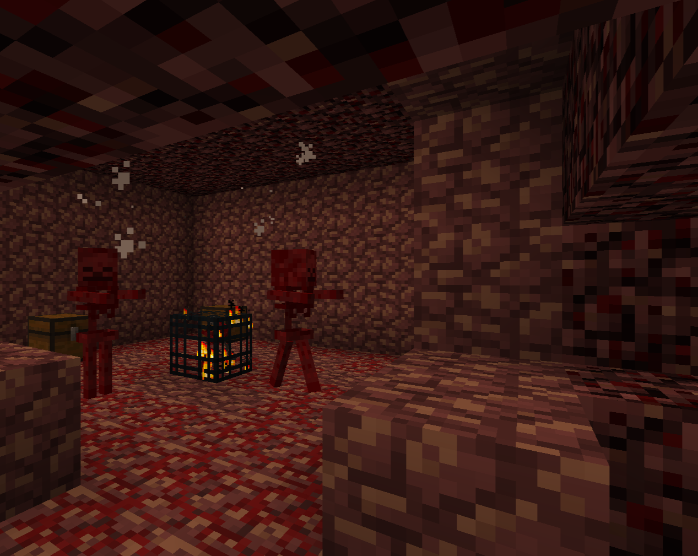
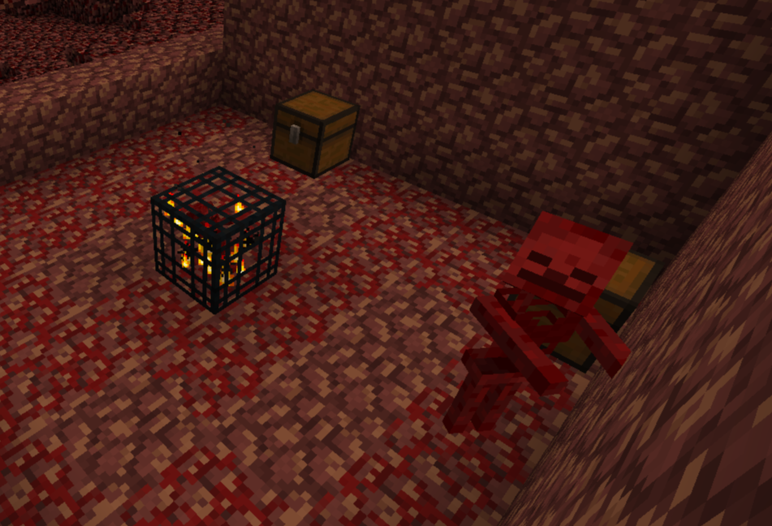

- Generates carved into Netherrack, with **8 attempts per chunk**
- Uses **Nether Stone walls** over a **Nether Moss Stone floor**, mirroring the Overworld dungeon's Cobblestone and Moss Stone layout
- It is currently the **only Survival source of Nether Stone**
- Always contains a **Netherskull spawner**, never a Guard spawner
- Contains up to **two chests**, the same as an Overworld dungeon
- Allows more open walls than an Overworld dungeon so it can generate beside the Nether's much larger caverns

Chest contents

Chests draw **8 times** from a **15-slot** table; many of the rarer slots can still roll empty.

| Contents | Notes |
| --- | --- |
| Ash | 1-3 |
| Bone, Rotten Flesh, Gunpowder | Standard dungeon fare |
| Gold Nuggets, Gold Ingots | Nether-native valuables |
| Coal, Glowstone Dust | Common Nether resources |
| Nether Wart | A second way to find the Nether's crop |
| Obsidian | 1-2, useful for emergency portal repair |
| Empty Bucket, Flint and Steel | Uncommon utility |
| Blaze Powder | Rare |
| Enchanted Gold equipment | Very rare |
| Tarot of Death | The rarest slot |

#### End terrain

The central dragon island remains the original Release 1.0 arena, but the End no longer stops at its coast. Beyond it, End Stone land continues in broad concentric rings separated by traversable void gaps.

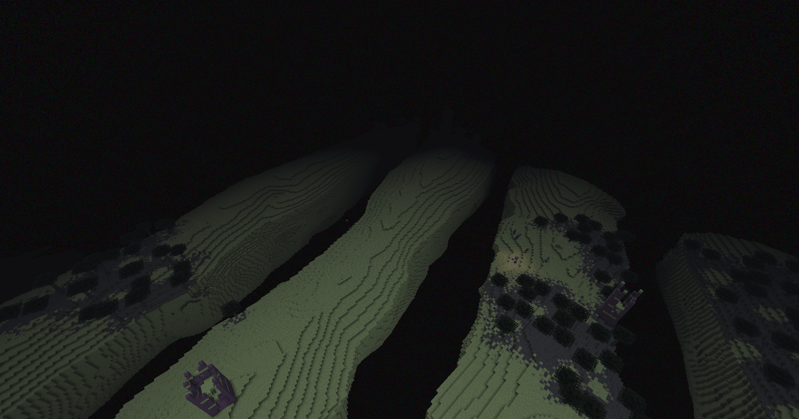

- The original central island remains unchanged as the Dragon arena
- The first gap beyond it is roughly **48 blocks** wide
- Outer land rings are roughly **64 blocks** wide, separated by **32-block void gaps**
- The gaps are deliberately sized around Ender Pearl travel rather than normal jumping
- Obsidian spikes and Ender Crystals remain restricted to the central island
- Outer terrain continues using the same old End density style rather than introducing modern End islands

#### Amethyst

Amethyst is the End's gem tier: a faster and far more enchantable cousin of Diamond that gives up most of Diamond's durability in return. It sits beside Nethersteel rather than above it.

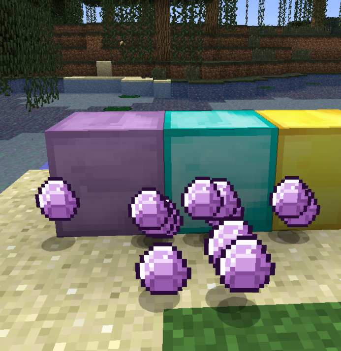
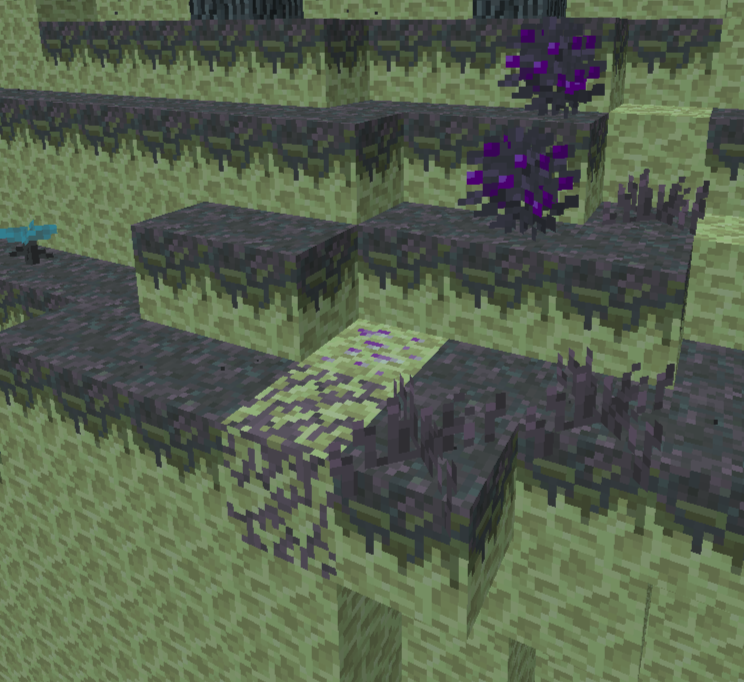

- Amethyst Ore replaces End Stone between roughly **Y 20 and Y 64**
- **5 generation attempts** per chunk, in veins of up to **5**; many attempts naturally miss because so much of the End is open air
- Requires a **Diamond Pickaxe** or better
- Drops one Amethyst, with Fortune applying like other gem ores
- Nine Amethysts craft into a Block of Amethyst and can be crafted back
- Amethyst Ore and the storage block have hardness **8.0**

##### Amethyst tools

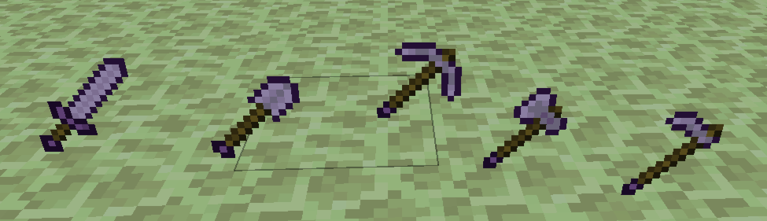

- Same harvest level and damage bonus as Diamond
- Only **300 uses**, against Diamond's 1561
- Mining speed **11.0**, faster than Diamond and Nethersteel but still below Gold's 12.0
- Enchantability **25**, matching Gold and far above Diamond's 10

##### Amethyst armor

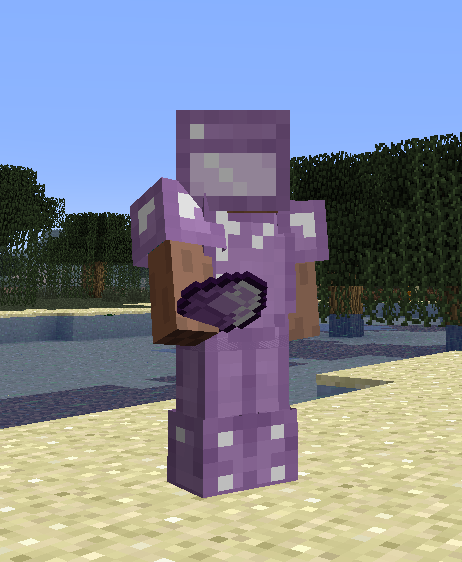

- Protection values are identical to Diamond
- Durability multiplier **20**, against Diamond's 33
- Enchantability **25**

Vanilla-styled Amethyst equipment

Amethyst tools and armor have both Release+ and plainer vanilla-styled variants under the same `Texture Style` option used by Nethersteel and the Netherskull Helmet.

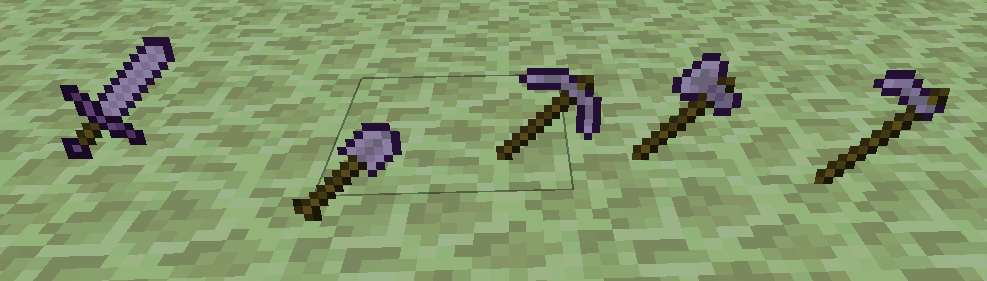
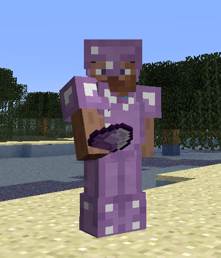

#### End Stone

The vanilla End Stone block now has the building family it never received in Release 1.0.

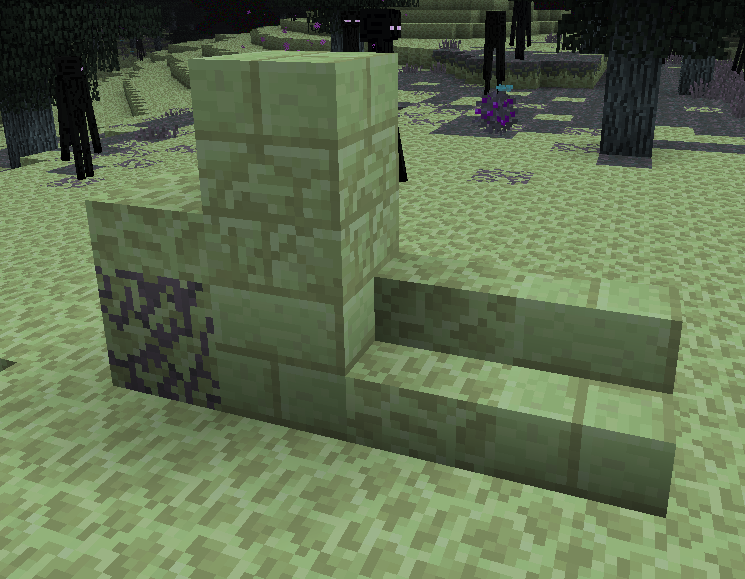

- **End Stone Bricks** and **Cracked End Stone Bricks**
- Slabs and stairs for both End Stone and End Stone Bricks
- The worked blocks keep End Stone's hardness and resistance

#### Purple Stone

Purple Stone is the masonry of the End Spires and currently exists only through those ruins.

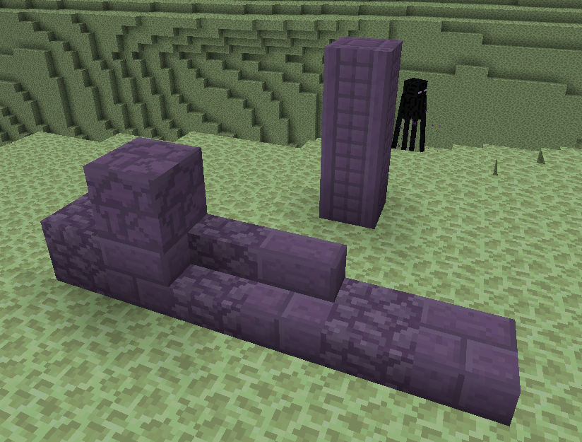

- **Purple Stone**, **Purple Stone Bricks** and **Cracked Purple Stone Bricks**
- Slabs and stairs for both raw Purple Stone and Purple Stone Bricks
- **Purple Stone Bricks Pillars** provide a vertical carved column block
- Purple Stone is currently obtained by mining End Spires rather than normal terrain

#### Voidstone

Voidstone is the End's counterpart to Glowstone: a full-strength light material tied to the Spires rather than another ore vein.

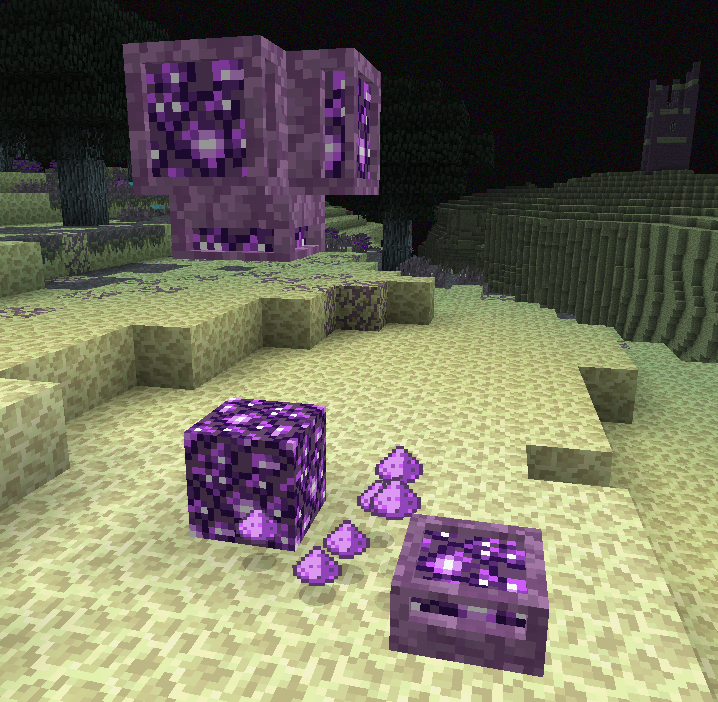

- Emits full light and has the same **0.3 hardness** as Glowstone
- Breaking Voidstone drops **2-4 Voidstone Dust**; Fortune can increase the amount up to 4
- Four Dust craft back into one Voidstone
- Voidstone Dust is also a brewing ingredient for **Leaping**
- **Voidstone Lamps** are shallow half-block lights made from Voidstone and Purple Stone Slabs
- Lamps can mount on floors, walls or ceilings and naturally light End Spires
- Voidstone Dust is found through End Spire loot; raw Voidstone does not generate as an ordinary End ore

#### End Spire

End Spires are ruined Purple Stone towers scattered across the outer End. They act as landmarks across the void as much as they do structures to loot.

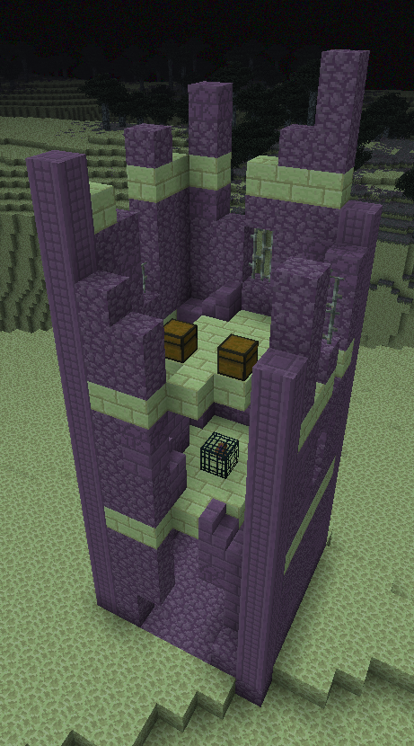

- Generate only beyond the central island and first void gap
- Use a region-based placement system so neighbouring towers cannot bunch together
- Roughly **18-30 blocks tall** with a **7×7** footprint
- Built from Purple Stone masonry with a continuous spiral stairway, damaged walls and eroded upper floors
- Voidstone Lamps hang beneath the surviving floors
- An **Ender Shade spawner** sits on the floor below the summit when the tower is tall enough
- The top floor contains **one or two loot chests**

Current Spire loot

Each chest makes eight draws. The table is intentionally sparse and can return empty slots.

- Ender Pearls
- Voidstone Dust
- Rare Amethyst
- Rare Bottles o' Enchanting
- Rare heavily worn Amethyst tools or armor
- Very rare Tarot of Death

#### Ender Shade

The Ender Shade is a flying ranged hostile mob found naturally in the outer End and in much greater numbers around Spire spawners. Its fight is built around distance and teleportation rather than melee.

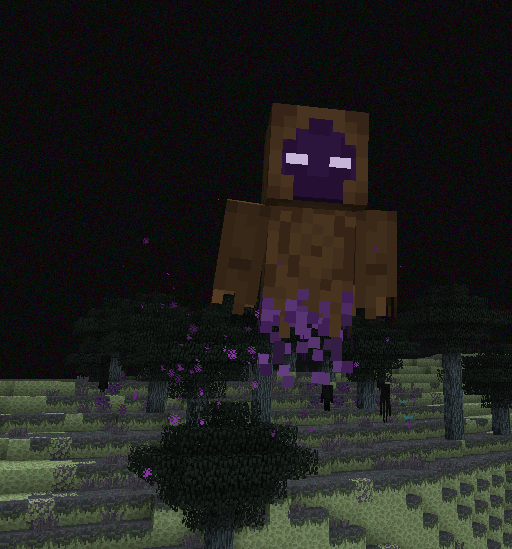

- **20 health**, with no melee attack
- Prefers to fight from roughly **10 blocks** away and teleports out when the player gets too close
- Can blink away from indirect attacks when its teleport cooldown is available
- Every shot has a visible **30-tick charge-up**, followed by a short period where the Shade cannot immediately blink away
- Its Ender Charge deals **2 damage**, does **not** knock the target backward, and applies **Levitation for 3 seconds**
- Ender Shades themselves ignore Levitation
- Natural End Shades spawn in ones and twos alongside Endermen; Spire-born Shades use a much shorter leash so the spawner's normal population limit still works
- Drops Ender Pearls and has a **1 in 200** chance to drop a Tarot of Death; Looting does not improve the Tarot chance

#### End Forest

End Forests are a small flavour biome on the outer rings: a sparse patch of life rather than a full modern End overhaul.

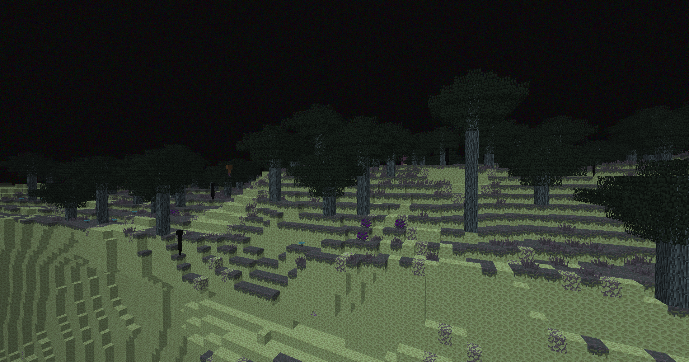

- Generate only across the outer End, never on the central Dragon island
- Use broad, seed-stable biome regions rather than chunk-by-chunk placement
- The living surface is **End Grass Block**, mixed into normal End Stone through **End Moss Stone** transition patches
- End Grass Block slowly spreads onto suitable exposed End Stone and returns End Stone when mined normally; Silk Touch preserves the Grass Block
- End Grass Blocks emit a subtle End-colored drifting particle effect
- Endermen and Ender Shades use the same spawn lists inside the biome as the normal End
- End Spires can still generate inside End Forests

##### End Wood

The forest's tree is an Amaranth-inspired tree translated into the old Minecraft tree system. Its living blocks reuse the fourth Wood/Leaves/Sapling metadata slot alongside Oak, Spruce and Birch.

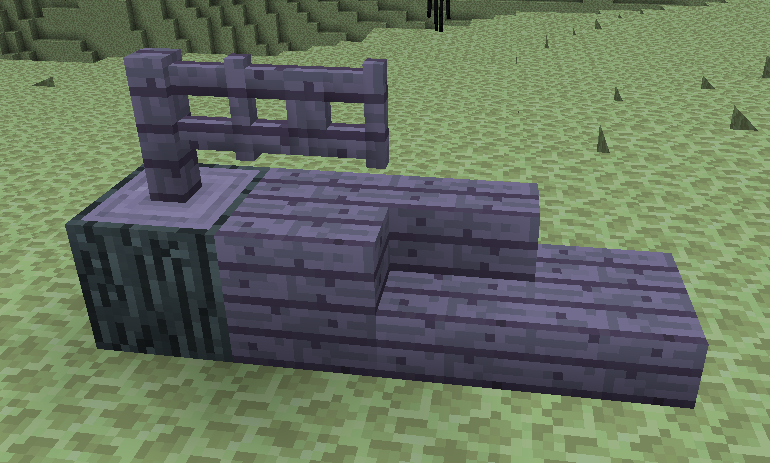
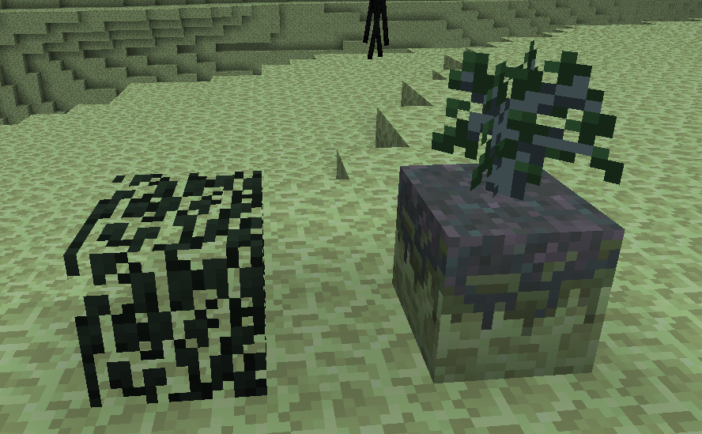

- Logs are named **End Wood**, with matching **End Leaves** and **End Saplings**
- End Leaves use the normal Leaves texture with their own washed-out dark green foliage tint
- End Saplings grow only on End Grass Block
- End Wood crafts into **End Wooden Planks**
- End Wooden Planks count as normal Wooden Planks in general crafting recipes
- Dedicated **End Wooden Slab**, **End Wooden Stairs**, **End Fence** and **End Fence Gate** complete the building set

##### End vegetation

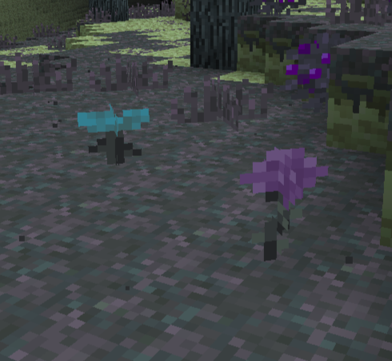

The forest floor stays intentionally simple instead of turning the End into a lush modern biome.

- **End Grass** is the short native grass variant and grows only on End Grass Block
- **End Rose** crafts into **2 Purple Dye**
- **End Flower** crafts into **2 Cyan Dye**
- Both flowers generate in small, independent scattered patches and grow only on End Grass Block
- Normal Overworld vegetation and End vegetation use their own ground types rather than growing interchangeably

##### Ender Berries

Ender Berries are the End Forest's crop, combining a modern berry-bush growth loop with the modern Chorus Fruit teleportation theme.

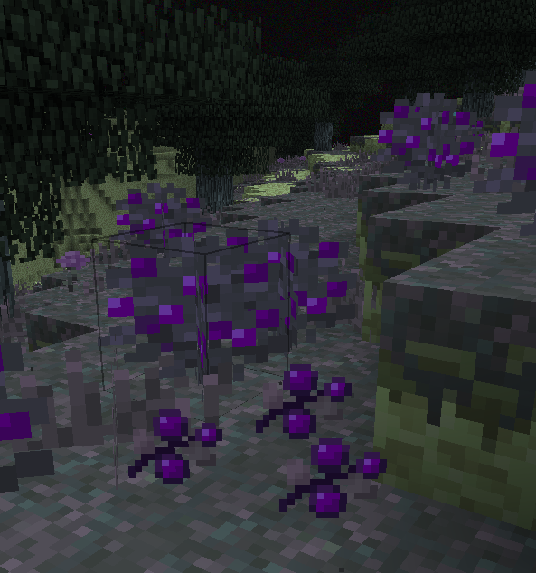

- Mature bushes generate in occasional natural patches inside End Forests
- Ender Berries plant a new age-0 bush on **End Grass Block**
- Bushes have **four growth stages**, grow through random ticks and can be advanced with Bone Meal
- Right-clicking a berry-bearing bush harvests it and returns it to an earlier growth stage
- Age 2 bushes give **1-2 berries**; fully grown bushes give **2-3**
- Bushes slow entities passing through them and grown bushes deal thorn damage to moving living entities
- Mob pathfinding treats the bushes as undesirable rather than completely impassable, so mobs normally route around them when a comparable path exists
- Ender Berries restore **2 hunger**, can be eaten even while full, and attempt a safe random teleport within roughly **8 blocks** without dealing Ender Pearl damage

#### Part 4 achievements

Part 4 adds a small set of progression and discovery achievements across the gemstones, Nether and End. Finding any one regional gemstone now advances the player toward Diamond.

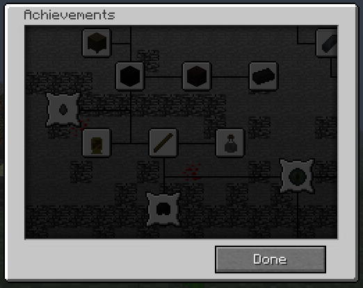
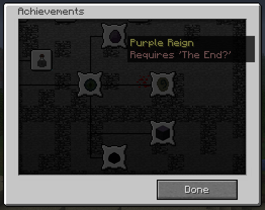

| Achievement | Parent | Unlock |
| --- | --- | --- |
| `Harder, Faster, Stronger` | `Acquire Hardware` | Obtain an Emerald, Ruby or Sapphire |
| `It's Triplets!` | `Harder, Faster, Stronger` | Obtain an Emerald, a Ruby and a Sapphire |
| `One Man's Trash...` | `We Need to Go Deeper` | Dig Ancient Scrap out of the Nether |
| `Hellforged` | `One Man's Trash...` | Refine a Nethersteel Ingot |
| `One of Us` | `Into Fire` | Take the helm from a Netherskull Guard |
| `Purple Reign` | `The End?` | Obtain an Amethyst |
| `Still Getting Wood` | `The End?` | Attack a tree in the End until a block of wood pops out |

---

## Credits

(Many Release+ backports and features adapt, recolor or rework visuals and sounds from vanilla Minecraft and later Minecraft versions)

- Copper armor item sprites are based on axy's Traditional Armour
- Copper ingot and block textures are based on artwork by JM140628
- Block of Steel texture is based on [this NovaSkin Steel Block texture](https://minecraft.novaskin.me/post/4893925167/steel-block)
- Blast Furnace, Anvil and Steel Hammer visuals are recolored/retextured vanilla Minecraft assets
- Grindstone model, GUI and sounds are adapted from later vanilla Minecraft assets, with its textures reworked/recolored for Release+
- Fishing Hat item sprite is based on the Angler's Hat from [Artifacts](https://modrinth.com/mod/artifacts)
- Fishing Trap catch sounds are edited variants of [Bubble in Water](https://pixabay.com/sound-effects/nature-bubble-in-water-422579/) on Pixabay
- Muffled Boots and Ninja Boots use recolored vanilla boot assets; their optional stealth footsteps are processed variants of vanilla footstep sounds
- Belt item sprite is heavily based on and recolored from [Tool Belt Retextured](https://www.curseforge.com/minecraft/texture-packs/tool-belt-retextured)
- Chain Links texture is inspired by [Better Than Adventure](https://www.betterthanadventure.net/)
- Crystal textures are based on artwork by [yptsh](https://x.com/yptsh/status/1623341389122510848)
- Pouch, Spyglass and Bottle o' Enchanting assets are based on assets from later Minecraft versions
- The Recipe Book system is heavily inspired by the Knowledge Book from Minecraft Infinite (formerly Infdev+), part of [Legacy+](https://legacy-plus.dejvoss.cz/) by Yoniko / VesuviusVenox
- Recipe Book GUI/book visuals are adapted from the vanilla Enchantment Table book, and its open/close/page sounds are adapted from later vanilla Minecraft assets
- The Lectern is adapted from the later vanilla Minecraft Lectern design and rendering behavior, with custom Release+ textures
- Tarot of Death uses an adapted Totem of Undying activation sound from later Minecraft versions
- Rope item texture is heavily based on and recolored from [Farmer's Delight](https://www.curseforge.com/minecraft/mc-mods/farmers-delight)
- Placed Rope texture is heavily based on and recolored from [this NovaSkin Rope texture](https://minecraft.novaskin.me/post/5166333130/rope)
- Stone of Return item sprite is inspired by [Hearthstone](https://www.curseforge.com/minecraft/mc-mods/hearthstone)
- Backpack item sprite was inspired by [Nemo's Backpacks](https://modrinth.com/mod/nemos-backpacks/gallery)
- Backpack open sound: [Open Bag Sound](https://pixabay.com/sound-effects/film-special-effects-open-bag-sound-39216/) on Pixabay
- Backpack close sound: [Bag Drop and Remove](https://pixabay.com/sound-effects/film-special-effects-bag-drop-and-remove-70142/) on Pixabay

- Quiver and Crystal Arrow visuals are recolored/retextured from existing Minecraft assets
- Netherskull and Netherskull Guard textures are heavily based on and inspired by [this NovaSkin skin](https://minecraft.novaskin.me/post/4644643339763712/gggggg) and [this NovaSkin skeleton](https://minecraft.novaskin.me/post/4625788724838400/skeleton-2), both by the same creator

- Emerald, Ruby and Sapphire ores, gems, storage blocks, tools and armor are recolored/retextured from vanilla Minecraft assets
- Ash, Nether Stone and Nethersteel visuals are recolored/retextured vanilla Minecraft assets
- Ender Berry Bush visuals and sounds are adapted/recolored from the later vanilla Minecraft Sweet Berry Bush
- Ender Shade texture is heavily based on and inspired by [this NovaSkin Ghost / Entity 303 skin](https://minecraft.novaskin.me/post/3524473209/ghost-entity-303)

If an original creator would prefer an inspired, adapted or recolored asset not be used here, I am happy to change or remove it.
