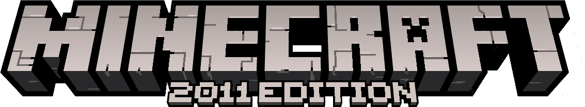
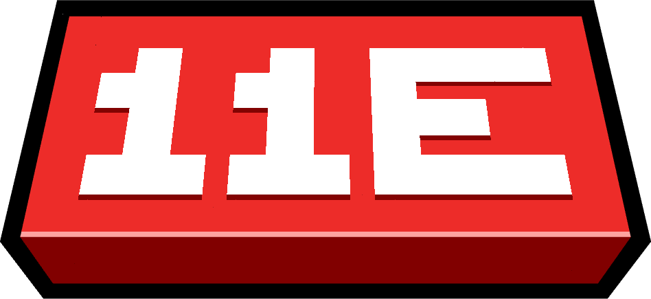

  

An unofficial alternative continuation of Minecraft Java Edition, built from Release 1.0.0.

## Status

Early development. No public build is available yet.

The first update, **Proper Progression Update**, is in development. Parts 1, 2, 3, 4, 5, 6 and 7 are feature-complete for now. Tested in singleplayer.

Current progress is tracked in [DEVLOG.md](DEVLOG.md).

## Repository

This repository contains the project files, assets and patches. It does not include Minecraft source code or a Minecraft JAR.
Some backported assets are based on assets from later versions of Minecraft.

## License

Licensed under the MIT License.

Minecraft is owned by Mojang Studios. This project is unofficial and is not affiliated with or endorsed by Mojang Studios or Microsoft.

  

Created by passo.
